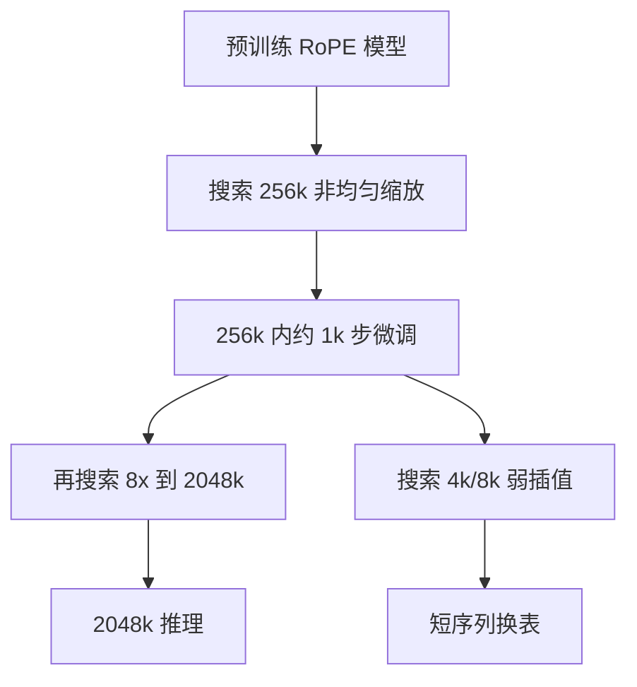

# LongRoPE

    
位置插值里有两种非均匀性：不同旋转维、以及序列开头的若干 token；把它们搜出来，再分阶段拉长，可以把窗口推过两百万。

    <footer>—— Ding 等，LongRoPE: Extending LLM Context Window Beyond 2 Million Tokens，ICML 2024</footer>

Chen 等人的线性位置插值把所有维、所有位置按同一个 $s$ 压缩，简单，但高频变挤、开头那些「几乎不该插值」的 token 也被一刀切。YaRN 按频率分三段，仍然是人手划的组。Microsoft 的 Yiran Ding、Li Lyna Zhang、Chengruidong Zhang、Yuanyuan Xu、Ning Shang、Jiahang Xu、Fan Yang 与 Mao Yang 在 ICML 2024 的 LongRoPE 里主张：插值压力在维与位置上都不均匀，应该用搜索找出每维的缩放，并让起始 token 少插值。方法把 LLaMA2、Mistral 推到 2048k，微调只在不超过 256k 的长度上做约一千步，短窗再用另一套缩放找回。Phi-3 后来把这条线写进产品。本篇按原文的三条创新写，不把 YaRN 的斜坡再讲一遍。

## 问题

2023–2024 年开源长窗大多停在约 128k。再往上有三只拦路虎。第一，从 4k 扩到百万级，新增位置占全部下标的九成以上，灾难值让微调难收敛。第二，百万字级的真实长文本稀缺，按目标长度做满序列微调既没有数据也付不起算力。第三，注意力在极长序列上被摊薄，原 4k 短窗质量下降。线性 PI、NTK、YaRN 都能把一部分新位置映回支撑集，但它们对「哪一维该少压、哪一段 token 不该压」只用规则，规则在新模型、新 $s$ 上不一定最优。

论文用简单搜索做了一张表：只给各 RoPE 维不同的 rescale，困惑度就比统一 $s$ 低一截。这说明非均匀性是真实的信息结构，不是调参传说。问题于是变成：搜索空间随目标倍率指数膨胀，如何搜；没有百万字语料，如何分阶段到达 2048k；短窗掉点如何在推理时按长度切换缩放。

### 两种非均匀性

第一种在维上。低频维（长波长）更接近外推，高频维（短波长）更应该保留局部分辨率，少插值。这与 YaRN 的分组同向，但 LongRoPE 不预设三段边界，而是让每维的 $\lambda_i$ 成为搜索变量。第二种在位置上。序列开头一小段 token 在预训练里承担汇点、指令、文档标题一类角色，对它们做与中段相同的强插值会伤短窗与「看开头」的行为。搜索因此允许一个位置阈值：阈值前少插值甚至不插值，阈值后用搜到的维缩放。

「起始 token 少插值」不是 StreamingLLM 的汇点掩码。位置仍全部可见，只是旋转角更接近原 RoPE。二者可以叠，但原文的短窗恢复靠的是另一套 rescale，不是丢掉中间键。

## 方法

把扩展比写成 $s=L'/L$。统一形式是：第 $i$ 维、位置 $n$ 的旋转角不再是 $n\theta_i$，而是按搜到的 $\lambda$ 重标定。线性 PI 相当于所有维 $\lambda=s$；NTK 相当于 $\lambda$ 随维号变；LongRoPE 的 $\lambda$ 由进化搜索给出，并与「前若干 token 保留更密的位置」耦合。

### 进化搜索给出微调初值

目标倍率一大，每维一个因子的组合空间无法穷举。论文用进化搜索，加了两条加速：缩小候选、用短序列困惑度当代理指标，使搜索负担得起。搜到的缩放既当作无微调时的 8 倍延窗方案，也当作 256k 微调的初始化——比从均匀 PI 出发更容易收敛。无微调 8 倍是后文「第二段不再训」的前提：若非均匀插值本身能撑住约 8 倍，就可以在 256k 检查点上再搜一次，把窗口乘到约 2048k。

### 两段式：先 256k 微调，再搜到 2048k

直接在 2048k 上微调既没有语料也放不进设备。LongRoPE 的渐进策略是：在预训练模型上搜索 256k 的缩放，于不超过 256k 的长度上微调约 1k 步；然后在这个已经会 256k 的检查点上，再搜一套把 256k 映到 2048k 的非均匀插值，**不再**做第二轮超长微调。第二段吃的是「非均匀插值允许约 8 倍无微调外推」这一经验事实。数据与算力卡在第一段的 256k，而不是卡在两百万。

短窗恢复是第三条。256k 微调会伤 4k/8k。论文在已扩展模型上再搜面向 4k 与 8k 的、插值更弱的 rescale；推理时若当前长度小于 8k，就换这套因子。同一套权重，按长度切两张 RoPE 表。

## 机制

非均匀插值要保住的是原 RoPE 里信息熵高的那些维与那些位置。统一除以 $s$ 等于把高熵维和低熵维一起挤进更窄的角域，「位置很挤」是 PI 在大 $s$ 下失败的几何原因。按维少压高频，等于把挤的压力丢给低频；按位置少压开头，等于把预训练里最常用的绝对几何留给标题与系统提示。搜索的目标函数是扩展长度上的困惑度（及检索类探针），所以它优化的是「少丢信息」，不是人类可读的频率故事。YaRN 的三段是这个搜索空间里的一个稀疏子流形。

进化搜索对代理集过拟合时，Books3 上的 PPL 好看，真实针测会在某一深度突然塌。搜完必须在 held-out 长文档与 passkey 上复验，不能把搜索损失当成产品指标。

### 为何第二段可以不微调

第一段微调让模型在「256k 尺度的非均匀 RoPE」上重新对齐投影。此时权重已经不是 4k 检查点。第二段再插值，相对的是这个新几何，而不是相对原始 4k。8 倍无微调是对**已经适应过一次扩展**的模型而言，不能理解成「随便一个 LLaMA2 不微调就能 32k」。把第二段搜到的表套回未微调权重，行为更接近普通 NTK 补丁，到不了 2048k。

## 边界与工程取舍

2048k 全注意力的 KV 与 prefill 仍然按长度二次/线性爆炸。论文证明的是位置通道与微调配方能把有效窗口写到两百万，并在 passkey 上报超过 90% 的准确率；它没有把 2048k 满窗生成变成便宜产品。部署上通常还要分页 KV、稀疏或检索。长文本稀缺意味着 256k 微调语料本身已经是拼出来的；质量差会让模型学会「位置能算、内容是浆糊」。

按长度切 RoPE 表时，KV 里已旋转的键与新表不一致。实现应在长度跨越 8k 阈值时重算缓存，或按请求锁定目标档位，避免 decode 中途换 $\lambda$。搜索超参（维因子范围、起始 token 数）换模型族要重跑，Phi-3 里的具体表不能当物理常数抄到别的隐藏维上。

LongRoPE 改的是 RoPE 的角，不是注意力图案。ALiBi、NoPE 没有可搜的 $\theta_i$。已经按目标长度从头预训练的模型，再套一层搜到的强插值可能是负优化。

### 评测不要只看能解码两百万

应分档报：4k/8k 短窗基准（切表是否找回）、256k 语言建模与针测（第一段是否训成）、2048k passkey（第二段插值是否还认针）。只报最大长度，无法区分「几何还在」和「softmax 已经随机」。标准 4k 基准上与原模型可比，是原文用来证明短窗恢复成立的部分，应当保留在复现表里。

## 小结

- LongRoPE 用进化搜索为每维、并按起始位置给出非均匀 RoPE 缩放，替代单一 $s$。
- 无微调约 8 倍延窗；再加 256k 内约 1k 步微调，第二段插值到 2048k。
- 短序列推理换弱插值表，以恢复原窗口质量。
- 架构仍是原 Transformer，只改位置嵌入，已有核可复用。
- 不解决 KV 体积；搜索表换模型要重做。
- 出处：Ding 等，*LongRoPE: Extending LLM Context Window Beyond 2 Million Tokens*，ICML 2024，arXiv:2402.13753。对照 Chen 等 PI（2023）、Peng 等 YaRN（2023）；产品侧见 Phi-3。
