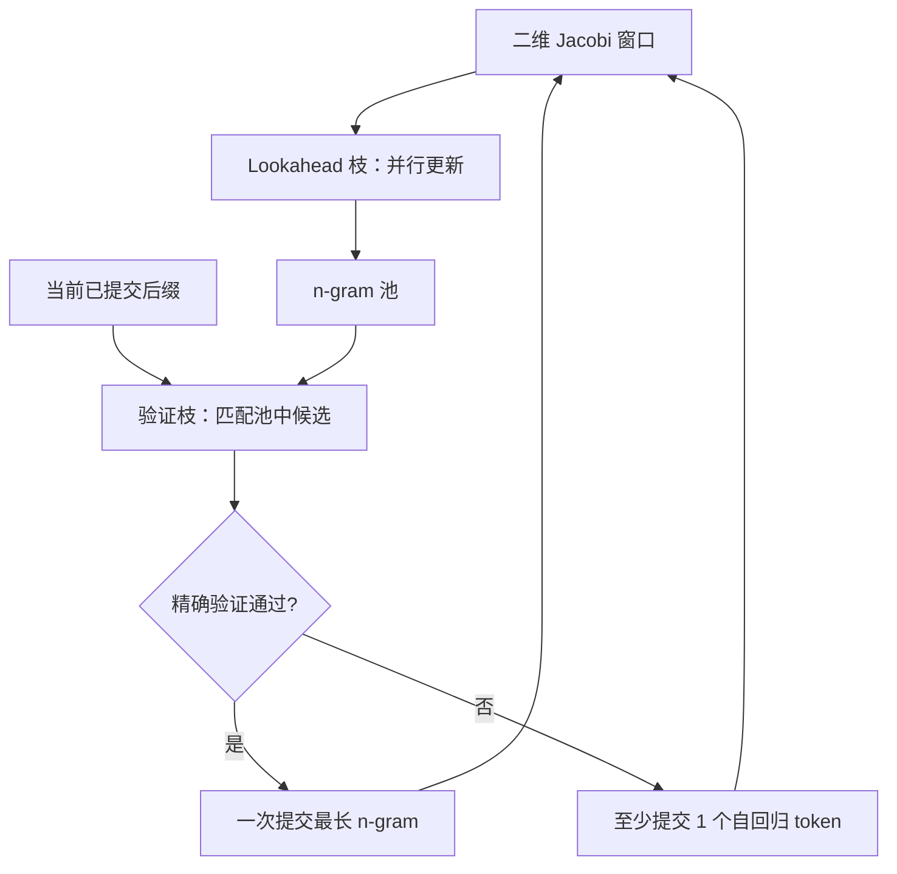

# Lookahead Decoding

    
不靠草稿模型，也不靠检索库：把自回归看成非线性方程，用 Jacobi 迭代并行吐出多段不相交的 n-gram，再在同一次前向里验证能接上的那些。

    <footer>—— Fu et al., Break the Sequential Dependency of LLM Inference Using Lookahead Decoding, 2024</footer>

投机解码的常见代价是「再养一个模型」。[Medusa](/llm/medusa) 把草稿收成头，[EAGLE](/llm/eagle) 收成特征外推层，仍然要训、要跟骨干对齐。Fu、Bailis、Stoica、Zhang 的 Lookahead Decoding 问的是：目标模型自己能不能既当草稿又当验证器？观察是：一次前向虽然不能合法地同时确定 $x_{t+1}$ 与 $x_{t+2}$（后者依赖前者），但可以同时更新**多段互不依赖的 n-gram 猜测**，并把历史上看起来像样的 n-gram 存进池子，等到当前后缀匹配时再验证。算法是精确的：接受规则保证输出分布与原自回归一致。本篇写 Jacobi 视角、二维窗口与验证枝，不把检索式投机或另训草稿写进来。

## 问题

自回归是 $x_{t+1}=f(x_{\le t})$。GPU 的矩阵单元可以一次算很多位置，但因果依赖强迫逐步。decode 因此带宽受限：每步搬完全部权重，只换一个 token。提高算术强度的正统办法是让一步里出现更多「有希望成为未来文本」的位置。草稿模型用另一套 $f_{\mathrm{draft}}$ 提供这些位置；没有草稿时，只能从 $f$ 自己身上榨并行。

Jacobi 迭代提供一个古典类比。把未知的未来 token 看成方程组的未知数，每次用上一轮的猜测并行更新所有未知数。朴素 Jacobi 解码几乎不会比自回归快，因为早期位置错了，后面全错，接受长度接近 1，还多付了平行位置的计算。Lookahead 要解决的不是「能不能并行猜」，而是「猜出来的碎片如何被缓存、如何被精确验证，使逐步依赖在期望上被打断」。

### 为什么不要辅助模型

小草稿难训、难跟、难进分布式，Lookahead 论文把这当成与 Medusa 相同的痛点，但给出的解不是接头，而是零额外参数。代价是：并行度必须花在目标模型自己的一次更宽的前向上，每步 FLOPs 上升。作者的主张是用 $\log(\mathrm{FLOPs})$ 量级的逐步变贵，换解码步数的线性下降，并且能与 FlashAttention 一类内存高效注意力共存。对单卡对话，加速通常小于带草稿的方法；对高算术强度还吃不满的设置，以及多卡把 lookahead 枝并行切开时，数字会好看很多。

Lookahead 的「精确」指与原模型贪心或采样分布一致，不是指 Jacobi 猜测本身每次都对。猜测可以全错，只要验证枝拒绝它们、回退到普通的一步自回归。加速全部来自池子里恰好能接上的 n-gram。

## 方法

算法维护一个二维窗口：一条轴是序列位置，一条轴是 Jacobi 迭代轮次。窗口宽度 $W$ 是 lookahead 宽度（并行猜多少个未来位置），$N$ 是 n-gram 大小。每一轮前向同时做两件事：**lookahead 枝**按 Jacobi 更新窗口里的 token，从轨迹上切下多段不相交 n-gram，写入 n-gram 池；**验证枝**用当前已提交后缀去池里找「以当前最后 token 开头」的候选 n-gram，用特制注意力掩码在同一次前向里验证。验证通过的最长前缀被提交，窗口滑动，未用上的 n-gram 留在池里等后面的后缀。

### Jacobi 窗口里的不相交 n-gram

Jacobi 更新不要求 $x_{t+k}$ 看见本轮刚刚写下的 $x_{t+k-1}$，只看见上一轮窗口。因此同一轮里 $(x_{t+1},\ldots,x_{t+N})$ 与更后面另一段可以同时被刷新。这些段在当前因果链上并不合法，但作为「未来可能出现的短语」是有信息的——尤其在代码补全里，标识符、常见 API 片段会反复出现。池子是一个以起始 token 为键的缓存，容量有限，用近期轨迹更新。没有外部检索语料，数据存储就是这只运行时池。

### 验证掩码与多卡并行

验证枝的注意力掩码保证每个候选只看见自己的前缀与已提交上下文，互不串视，从而一次前向可以验多条 n-gram。这与 Medusa / EAGLE 的树掩码同族，但节点来自池，不是来自草稿头的笛卡尔积。实现与 FlashAttention 兼容：掩码仍然是「哪些 query 能看哪些 key」，没有改 SDPA 公式。Lookahead parallelism 把窗口或候选切到多卡，用算力换更少的串行步；论文报告在代码补全上多 GPU 强扩展可达约 4 倍，MT-bench 上自回归相对加速约到 1.8 倍。数字随 $W$、$N$、模型与任务变，代码补全高于开放对话是预期中的——池子更命中。

## 机制

机制是「用浪费的算力生产可复用短语，再用精确验证把短语接回因果链」。Jacobi 保证每一步窗口更新是纯并行的；池保证短语的生命周期长于一次失败的猜测；验证保证对外可见的 token 流与原 $f$ 逐步解码不可区分。期望上，每当当前 token 是某个高质量 n-gram 的首词，一步可以前进 $N$ 个位置。$N$ 与 $W$ 增大，每步 FLOPs 与 KV 写入上升，步数下降。作者把这种交换写成可调的：不是固定加速比，而是一条用并行换延迟的曲线。

与草稿方法比，Lookahead 的接受率完全由「目标模型在相似上下文里是否反复说出同一 n-gram」决定，没有「草稿是否校准」这一项。低熵、高重复的领域（代码、填表、有模板的客服）池命中高；高熵开放生成池命中低，算法退化成略贵的自回归。这不是实现 bug，是零草稿方法的信息论边界：没有另一个模型提供额外预测，并行只能挖掘 $f$ 自己的相关结构。

池子不是 RAG。它不检索文档，只缓存本轮生成轨迹上 Jacobi 产生的短片段。换会话应清空；在连续批处理里，池按请求隔离，否则会把 A 的 n-gram 验证进 B 的上下文。

### 和投机采样的接口

对外仍是「提议—验证—提交」。提议器是 Jacobi+池，验证器是同一个 LLM。因此不存在草稿延迟 $c\gamma$ 那一项，取而代之的是目标模型每步更宽的序列。加速比公式不能直接套 Leviathan 的 $c$，应改成「每步 token 数（窗口+候选）/ 每步提交 token 数」。[接受率](/llm/spec-acceptance-rate) 仍有意义：定义为验证枝上候选 n-gram 被接受的比例，但它不再与独立草稿 $\alpha$ 是同一个统计量。

## 边界与工程取舍

Lookahead 不训练，接入成本低，适合不能改权重、不能另服草稿的场景。它不降低 KV 随长度的增长，窗口额外位置还会短暂加大注意力。$W$、$N$ 过大会让单步变成 compute-bound，在已经很大的 decode batch 上可能负加速。采样温度升高时，n-gram 可复用性下降，加速比通常不如贪心或低温度。多卡扩展依赖把 lookahead 枝切干净，通信模式与 [推理张量并行](/llm/infer-tp) 不同，不要把两种切法配在同一组卡上却共用一个 NCCL 域。

不要把 Jacobi 解码本身当成 Lookahead。没有池与验证枝，Jacobi 只是并行乱猜。也不要把 LMSYS 博客演示里的某个 7B 速度当成论文上限。引用时写 Fu et al.，arXiv:2402.02057，并区分 MT-bench 的约 1.8 倍与代码补全多卡的约 4 倍。

精确验证意味着拒绝采样或与贪心等价的逐步核对。若实现改成「池里有就直接用、不再过一遍目标 logits」，分布就坏了，延迟数字也会不可比。查代码时先看验证枝有没有真正算目标模型在候选位置上的条件概率。

## 小结

- Lookahead Decoding 用 Jacobi 迭代在目标模型上并行产生不相交 n-gram，缓存后再精确验证，无需草稿模型或外部库。
- 二维窗口的宽度 $W$ 与 n-gram 长度 $N$ 用逐步 FLOPs 换更少的串行步。
- 验证用特制掩码，可与 FlashAttention 一类内核共存；多卡可切 lookahead 枝。
- 加速强依赖文本可复用性：代码补全高于开放对话；论文报告约 1.8×（MT-bench）与多卡代码约 4×。
- 池必须按请求隔离；没有验证枝就不是该算法。
- 出处：Fu et al., *Break the Sequential Dependency of LLM Inference Using Lookahead Decoding*，arXiv:2402.02057，2024。
