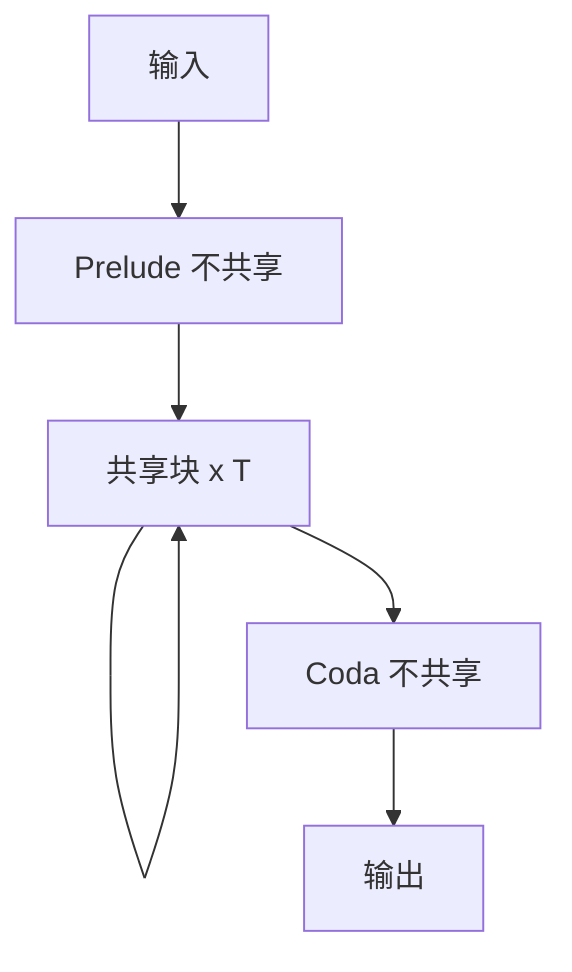

# 循环 Transformer

把同一 Transformer 块循环足够多次，可以模拟可编程的迭代算法；循环次数是测试时的计算旋钮。

<footer>—— Giannou et al., Looped Transformers as Programmable Computers, ICML 2023</footer>

[上一课](/llm/universal-transformer-recurrence)带 ACT 的共享块，停机门把课序弄复杂。现代工作常去掉自适应，改成**固定或测试时选择的循环次数 $T$**：训练用中等 $T$，推理对难题加大 $T$。这就是 looped Transformer。它接 Universal 的参数共享，但把计算预算从每位置门收到一个全局整数。下一课早退会把预算再按层或按 token 切开。

## 问题

ACT 的停机门难训，批内不同步。需要一种更硬的陈述：若 $F_\theta$ 足够表达，则 $F_\theta^{\circ T}$ 可以模拟多步算法（复制、计数、简单程序），$T$ 增大等于多给计算，而不改参数。缺口是把这件事写成与权重解耦的**测试时计算**，并标明它与「加不共享的层」在泛化上的差别。

Giannou 等人给出构造性结果：在理想化设定下，looped Transformer 可模拟计算机。后续经验工作用循环块做算术、长度外推、推理链。本课取机制，不把某篇竞赛级算术论文展开成词条。

循环次数 $T$ 不是序列长度 $n$。$n$ 仍由注意力二次项决定。$T$ 决定块应用多少次。长上下文与多步思考不是同一轴，尽管都贵。

## 方法

选 $k$ 层作为一个循环体（$k=1$ 最干净），前面可留若干不共享的 prelude 层写表示，后面可留 coda 层读结果。中间对循环体应用 $T$ 次，每次都带残差与归一化。训练对 $T\sim T_{\mathrm{train}}$ 或对 $T$ 做随机抽样，使模型习惯不同迭代深度。推理设 $T_{\mathrm{test}}\ge T_{\mathrm{train}}$，观察是否还能改进——这是「算力换准确」是否成立的检验。

输入可以每步重新注入（像 RNN 读 $x_t$，但这里 $x$ 是整段），也可以只在 $t=0$ 注入。重新注入有助于避免状态遗忘任务条件；只注入一次则更像对隐状态做独立迭代。

### 与加层的参数账

$L=kT$ 的不共享模型参数约 $T$ 倍于循环体。循环模型用一份参数换 $T$ 次计算。若任务真是同一规则迭代，循环更参数高效；若每层需要不同规则，循环会欠拟合，必须加大 $k$ 或放弃共享。

## 机制

每次循环，注意力看见的是上一轮混合后的整段状态，因此可以多步传播信息：第一步把局部证据写入某些位置，第二步远端查询再读这些位置。这与加深不共享模型类似，但强制每步用同一套路由参数，电路必须可复用。不能复用时，增大 $T$ 会振荡或饱和，而不是单调变好——这是诊断：若 $T_{\mathrm{test}}$ 加大立刻变差，说明训练没覆盖该预算，或任务根本不是迭代算法。

Prelude/coda 的存在承认「输入嵌入」和「输出解码」往往不应共享中间推理块的权重，这与 Universal Transformer 把一切塞进 $F_\theta$ 的极端设定不同。

梯度穿过 $T$ 次 $F_\theta$，与激活检查点一起决定能否训大 $T$。实践中 $T_{\mathrm{train}}$ 往往小于希望的 $T_{\mathrm{test}}$，外推计算步数并不自动成立。

## 边界

Looped 不是免费的推理时思考。每加一循环就加一整段注意力 FLOPs，延迟线性涨。对语言建模困惑度，共享循环常常弱于同样 FLOPs 的不共享深层模型，因为语言模型不是整齐的迭代算法。本课的适用边界是算法化、可多步改进的任务，以及参数极度受限时。下一课早退把「不必跑满 $T$」从全局整数改回按例决策。

## 小结

- Looped Transformer 用全局循环次数 $T$ 当测试时计算旋钮，去掉 ACT 的每位置门。
- 同一规则的迭代任务上，参数远少于同等深度的不共享栈。
- $T_{\mathrm{test}}>T_{\mathrm{train}}$ 不自动变好；振荡说明规则不可复用或预算没训到。
- 语言模型困惑度往往更吃不共享的深度。
- 出处：Giannou et al., ICML 2023。
