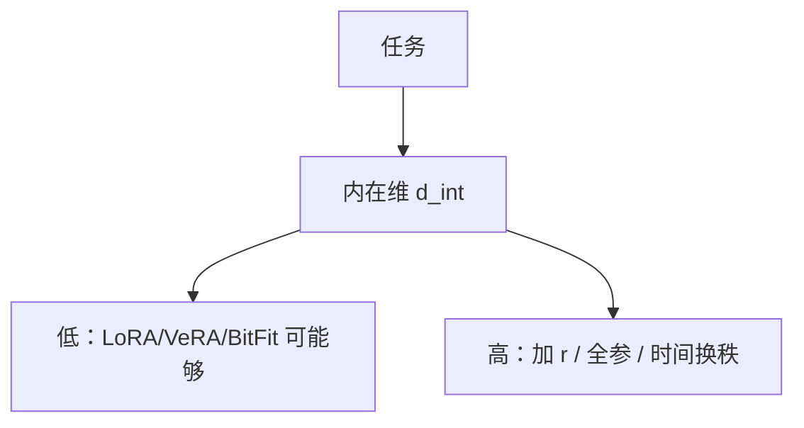

# LoRA 的内在秩

微调常常落在很低维的流形上；LoRA 能用，是因为更新的内在维数小，不是因为预训练权重本身可低秩分解。

<footer>—— Aghajanyan 等，Intrinsic Dimensionality Explains the Effectiveness of Language Model Fine-Tuning（ACL 2021）；Hu 等 LoRA（2021）；Biderman 等（2024）</footer>

从 [rsLoRA](/llm/rslora) 到 [MoE 上的 LoRA](/llm/lora-on-moe)，本单元改的是参数化与放置。收束课回答：**为什么 $r\ll d$ 经常够**。Aghajanyan 等人用随机子空间测微调的内在维数（intrinsic dimension），发现许多 NLP 适应只需几百维。Hu 等人把这一观察写成可部署的 $BA$。Biderman 等人则划出边界：够用时忘得少，不够用时学得少。下一单元不再加适配器，而是[改一处事实](/llm/rome-memit)。本课不把 ROME 当低秩方法。

## 问题

全参微调的参数空间是 $\mathbb{R}^P$，$P$ 以十亿计。若最优 $\Delta\theta$ 实际落在维数 $d_{\mathrm{int}}\ll P$ 的子空间，那么任意一张好的投影（LoRA 的因子、VeRA 的随机矩阵、GaLore 的梯度主成分）都能近似这条适应曲线。问题是测量：$d_{\mathrm{int}}$ 随任务变。风格与指令格式往往很低；从语言模型改成完全不同的目标、或注入大量新事实，则升高。用固定 $r=8$ 覆盖所有任务，是把测量偷换成信仰。

LoRA 原文强调：低秩的是**更新**，不是 $W_0$。对 $W_0$ 做 SVD 压缩是另一门课。混为一谈会得出「模型已经低秩所以 LoRA 无损」的错误定理。

### 名义 $r$、有效秩、内在维

名义 $r$ 是因子宽度。有效秩是 $BA$ 奇异值中不可忽略的个数，常小于 $r$（[AdaLoRA](/llm/adalora) 正是为此剪枝）。内在维是任务需要的最小维数，不可观，只能用表现–$r$ 曲线或随机子空间方法估计。三条对不上时：名义很大但有效很小，是优化没打开方向；有效很大仍欠拟合，是 $d_{\mathrm{int}}$ 超过预算。

Aghajanyan 等人在较小 Transformer 上用 Li 等的 intrinsic dimension 方法：在随机 $d$ 维子空间里微调，看能恢复多少全参性能。曲线的拐点给出操作意义下的 $d_{\mathrm{int}}$。

## 方法

画表现对 $r$ 的曲线，而不是只报一个 $r$。拐点之后加 $r$ 只加显存。用 [rsLoRA](/llm/rslora) 缩放，避免拐点被 $\alpha/r$ 假造。对学成的 $BA$ 做 SVD：若能量集中在前 2–3 个奇异值，$r=16$ 浪费。任务对比：指令遵循、领域术语、安全拒答各画一条，禁止用平均分选唯一 $r$。

若曲线不饱和，选项是：加 $r$、多插 FFN、全参、[GaLore](/llm/galore)/[ReLoRA](/llm/relora) 走高秩轨迹，而不是无限加大 $\eta$。VeRA 在 $d_{\mathrm{int}}$ 很小且与随机投影对齐时接近 LoRA；对不齐就应退回可训练因子。

SFT 工程契约仍在：曲线必须在正确[模板](/llm/chat-template)与[仅回复](/llm/response-only-loss)上画，否则拐点反映的是格式 bug。

## 机制

预训练把表示推到对自然语言有用的流形。下游适应常是在流形切空间里走一小段——切空间维数就是 $d_{\mathrm{int}}$ 的来源直觉。指令 SFT 主要改「如何说话」，切空间更低；[领域 DAPT](/llm/domain-adaptation-ft) 要移动流形本身，维数升高。这解释 LIMA 千条与 LoRA $r=8$ 经常同时成立：改接口，不改世界模型。也解释知识注入失败（下单元）：事实编辑需要的方向可能既局部又不满整个 LoRA 子空间，或相反地需要高秩改写许多层。

Biderman 等人的「学得少、忘得少」是同一几何的两面：走不出低维切空间，既碰不到新技能所需的方向，也碰不到摧毁旧技能的方向。

MoE 上每专家一个切空间，全局 $r$ 不是全局 $d_{\mathrm{int}}$。应按专家看 SVD。

## 边界与工程取舍

内在维测量昂贵，生产上用 $r$ 扫描代替。扫描必须稳住缩放与 $\eta$，否则不是测 $d_{\mathrm{int}}$。随机子空间方法依赖各向同性假设，Transformer 里各层宽度不同，数字只能比同一架构。不要把某篇 GLUE 上 $d_{\mathrm{int}}\approx 200$ 抄到 70B 工具调用上。

PEFT 单元到此：尺度（rsLoRA）、更少参数（VeRA）、低秩梯度（GaLore）、层抽样（LISA）、时间换秩（ReLoRA）、偏置（BitFit）、前缀（P-tuning v2）、合并冲突、MoE 放置、内在秩。下一课起，改的不是任务适配器，而是一条事实或一段不该再被生成的知识。

## 小结

- LoRA 有效，因为许多适应的更新内在维低，不是因为 $W_0$ 低秩。
- 用表现–$r$ 曲线与 $BA$ 的 SVD 估计是否够用；扫描时用稳定缩放。
- 格式与风格通常低维；领域改写与新目标升高维数。
- 学得少与忘得少是低维切空间的两面。
- $d_{\mathrm{int}}$ 超预算时加秩或改全参/时间换秩，不要只加学习率。
- 出处：Aghajanyan 等，ACL 2021；Hu 等，LoRA，2021；Biderman 等，LoRA Learns Less and Forgets Less，2024。
