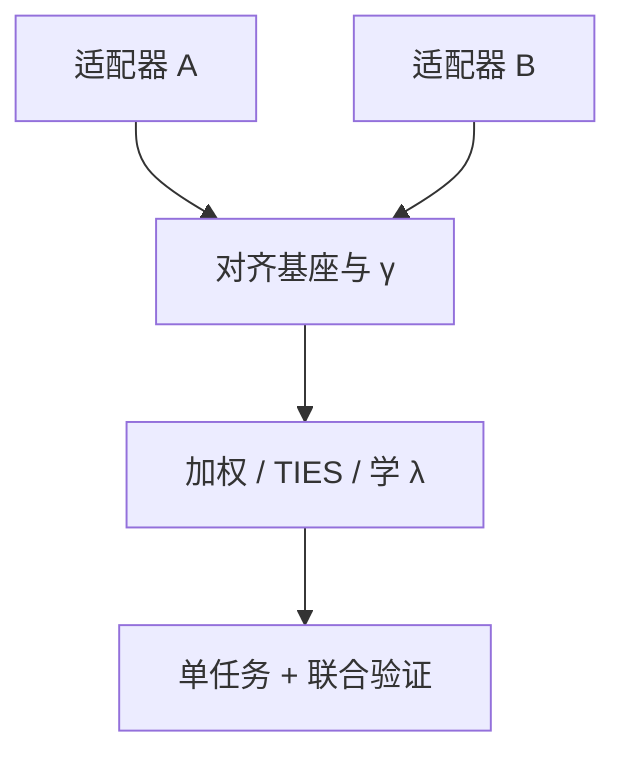

# LoRA 合并与冲突

两个适配器相加，秩至多相加，任务方向却可能互相抵消；线性合并是产品操作，不是 LoRA 原论文保证的交换律。

<footer>—— 承接 Hu 等 LoRA（2021）的单任务合并；冲突侧对照 Yadav 等 TIES-Merging（NeurIPS 2023）、Yu 等 DARE（ICML 2024）</footer>

[P-tuning v2](/llm/p-tuning-v2) 用切换前缀避免把任务写进 $W$。LoRA 服务常走另一条：把 $\Delta W_i=B_iA_i$ 加进同一份 $W_0$，希望同时会编程又会客服。[LoRA 课](/llm/lora)已警告多适配器相加无通用保证。本课把缺口展开：何时加法近似成立、符号冲突怎么消、以及为何[rsLoRA](/llm/rslora) 缩放不同的适配器不能裸加。下一课再谈 MoE 上插在哪里。

## 问题

单任务部署：算 $W=W_0+\gamma BA$，推理与稠密相同。多任务想免去切换 GEMM，就写

$$
W=W_0+\sum_i \lambda_i\gamma_i B_iA_i.
$$

若各 $\Delta W_i$ 作用在近似正交的子空间、且 $\lambda_i$ 小，表现像「技能并集」。若两个任务改同一批通道而符号相反（一个要更冗长、一个要更短），加法变成抵消或随机胜出。TIES-Merging（Yadav 等人，NeurIPS 2023）指出模型合并里的三类干扰：符号不一致、小幅度噪声、密度过高。LoRA 合并是模型合并的低秩特例。

不同 $r$、不同 $\gamma$（含 rsLoRA 与否）、不同插入位置，连矩阵形状都不共享，不能逐元素加。

### 合并不可逆，除非另存因子

加进 $W_0$ 后丢掉 $A,B$，无法拆回任务。要可逆，必须保存因子或保存合并前的 $W_0$。ReLoRA 训练期合并与此处产品合并是同一加法，目的相反：前者堆秩，后者堆任务。

Huang 等人的 LoRAHub 用少量样本学组合系数 $\lambda_i$。系数可学，说明裸 $\lambda_i=1$ 通常不是最优。DARE（Yu 等，ICML 2024）则先随机丢差分再缩放，减轻同源模型合并的干扰。

## 方法

先对齐：同一基座检查点、同一插入模块集合、同一[模板](/llm/chat-template)。然后选策略：（1）不合并，运行时切适配器；（2）加权和，扫 $\lambda$；（3）TIES 式：修剪小幅度、对冲突符号选举、再平均；（4）在验证集上学 $\lambda$（LoRAHub 类）。评测必须含单任务回归：合并后任务 A 不得默默掉到不可用。

缩放：先把每个适配器的 $\gamma BA$ 物化到同一表示再加。一个用 $\alpha/r$、一个用 $\alpha/\sqrt{r}$，直接加 $B,A$ 是 bug。

数据侧：两个 LoRA 若 SFT 谱系不同（FLAN 对 ShareGPT），合并等于混条件分布，[仅回复](/llm/response-only-loss)学到的结束符习惯会打架。优先在数据配比上混训一个适配器，而不是训两个再加。

## 机制

$\Delta W_1+\Delta W_2$ 的列空间是两者列空间的和，秩 $\le r_1+r_2$。干扰发生在重叠的奇异方向上：同向则加强（可能过饱和），反向则相消。TIES 的符号选举假设「多数任务同意的符号是真信号」——对同源、同目标的检查点较真，对「安全 LoRA + 越狱 LoRA」荒谬。DARE 假设差分里有大量冗余：随机丢弃仍能保留能力，再放大补偿。LoRA 很稀疏时 DARE 可能把仅有的 $r$ 个方向丢掉。

服务期不合并、只切 $A,B$，没有加法冲突，但有加载延迟与额外 GEMM。Punica 一类内核优化的是切适配器，不是让加法变合法。

BitFit 的 Δb 相加同样会冲突，只是诊断更容易：看通道符号。前缀 KV 应切换，平均前缀常得到无意义的键。

## 边界与工程取舍

没有通用的「把商店里的 LoRA 线性融合」。安全与能力适配器尤其不要裸加。同一数据不同随机种子的soup（模型汤）比异质任务相加更安全。合并后要做源域回归：加法可能意外放大遗忘。MoE 上还有专家路由与 LoRA 的位置冲突，下一课。

## 小结

- 单任务合并 $W_0+\gamma BA$ 是合法部署；多任务求和无交换律保证。
- 先对齐基座、插入位置与缩放，再谈 $\lambda$ 或 TIES。
- 符号冲突会相消；异质谱系优先混训而不是事后加。
- 可逆性要求保留因子或原 $W_0$。
- 运行时切换回避加法，付出额外 GEMM。
- 出处：Hu 等，LoRA，2021；Yadav 等，TIES-Merging，NeurIPS 2023；Yu 等，DARE，ICML 2024。
