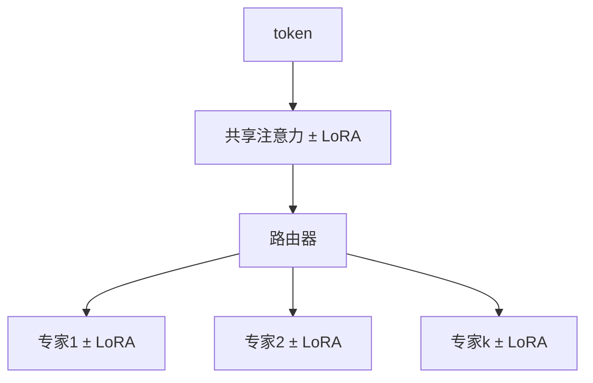

# MoE 上的 LoRA

专家已经是稀疏的容量；LoRA 插在共享注意力上还是插在每个专家上，决定你适应的是路由之后的技能，还是路由之前的公共通道。

<footer>—— 在 Mixtral / DeepSeek-MoE 一类稀疏 FFN 上放置适配器；对照 Dou 等 LoRAMoE（2024）用 MoE 式插件减遗忘</footer>

[上一课](/llm/lora-merge-conflict)处理多个 $\Delta W$ 加在同一稠密线性上。MoE 里 FFN 换成 $E$ 个专家，token 只进其中 $k$ 个。[LoRA](/llm/lora) 的插入点不再是「所有线性」一句话能说完：注意力通常共享，专家权重按 token 稀疏激活。缺口：适配器跟专家走，还是只挂共享层。Dou 等人的 LoRAMoE 还把 MoE 插件当作缓解世界知识遗忘的结构。本课写放置，不重写 MoE 路由算法。下一课收束到为何低秩够用。

## 问题

稠密 LLaMA 上，LoRA 打在 $W_q,W_v$ 是默认。Mixtral 一类模型里，参数量主要在专家 $W_{\mathrm{up}},W_{\mathrm{down}}$。只适应注意力：公共通道变了，专家技能几乎冻结——适合改口吻、不适合改代码专家内部的算法。每个专家一份 LoRA：参数乘 $E$，稀疏激活使多数专家的适配器在一步里收不到梯度，有的专家过拟合到偶然分到的那几条指令，有的从未更新。

路由本身若冻结，token 仍按预训练习惯进专家；领域 SFT 可能需要改路由，否则领域 token 进错专家，专家上的 LoRA 在修错误的函数。是否解冻路由器是独立开关。

### 稀疏梯度使「名义 $r$」骗人

同一 $r$，专家 LoRA 的有效更新次数 ≈ 该专家被选中的次数。长尾专家几乎是随机初始化的 $BA$。报表应打每专家的激活次数与适配器梯度范数，而不是只报全局 $r$。

LoRAMoE（Dou 等，2024）在冻结骨干上加 MoE 风格插件，把新任务分散到专家以保护旧知识。它是「用 MoE 做 PEFT」，与「在已有 MoE 上挂 LoRA」方向相反，但都说明：稀疏容量与遗忘绑定。

## 方法

放置菜单写成配方，禁止只写「MoE + LoRA」：

1. 仅共享注意力 / 共享 FFN（若有）：参数少，改风格与模板。
2. 仅专家线性：按专家存 $A,B$，可用较小 $r$，并设专家最小激活阈值或分组共享 LoRA（若干专家共用一份适配器）。
3. 两者都打：接近满容量，显存回升。
4. 路由器：默认冻；领域迁移再小学习率解冻，防崩。

学习率仍按适配器，[η 分叉](/llm/lora-vs-full-lr)。SFT 用[仅回复](/llm/response-only-loss)；注意打包后路由统计会被长包改变，不要与未打包混比。[rsLoRA](/llm/rslora) 缩放按每个专家矩阵自己的 $r$ 算。

合并：专家 LoRA 必须合并进对应专家权重；不能把专家适配器加到共享 $W$ 上。多任务合并冲突在专家级重演，且更难：同一专家可能被两任务用于相反技能。

## 机制

MoE 把输入空间划成区域。专家上的 LoRA 只在该区域内平移函数。注意力 LoRA 改的是进路由之前的表示，从而间接改路由分布——有时比直接解冻路由器更稳。若领域 token 仍被送进「通用闲聊」专家，你在代码专家上挂的 LoRA 永远看不到它们。

遗忘：只训少量专家时，未触达专家保持预训练知识，这是稀疏性带来的免费保护，类似 LISA 冻层。代价是那些专家也无法获得新技能。LoRAMoE 把这点变成设计目标：新知识进插件专家，旧知识留骨干。

推理期切适配器：必须与路由实现一致，按专家加载对应 A,B。全局一份 LoRA 打在错的模块上，是静默空转。

## 边界与工程取舍

专家数很大（DeepSeek-MoE 级）时，每专家 LoRA 的存储与「全参一个专家」相比仍省，但检查点管理变复杂。可分组或只对高频专家挂适配器。VeRA 的共享随机矩阵在专家间共享更激进，长尾专家更可能学不动。评测要分技能切片（代码 / 数学 / 闲聊），因为平均分会掩盖「某个专家适配器毁掉该专家原技能」。

## 小结

- MoE 上 LoRA 必须声明：共享层、专家内、是否动路由。
- 专家适配器的有效更新次数随路由稀疏变化，$r$ 不可直接与稠密模型比。
- 注意力 LoRA 可间接改路由；解冻路由器更猛、更险。
- 合并按专家对齐；跨任务冲突在专家级发生。
- 稀疏未更新专家既保护旧知识，也拒绝新技能。
- 出处：Hu 等，LoRA，2021；Dou 等，LoRAMoE，2024；放置原则针对 Mixtral 一类稀疏 FFN 架构。
