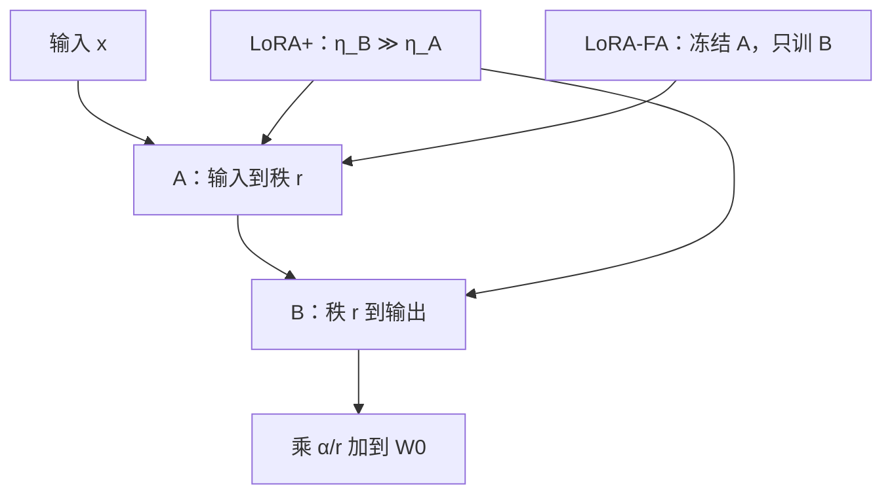

# LoRA+ / LoRA-FA

同一套 $A$ 与 $B$，不该共用一个学习率；$A$ 甚至可以冻结在随机投影上，只让 $B$ 去学如何组合这些方向。

<footer>—— Hayou 等，LoRA+，ICML 2024；Zhang 等，LoRA-FA，2023</footer>

标准 LoRA 给 $A$、$B$ 同一 $\eta$，并让二者都参与反向。这在实现上最省事，却把两个职责不同的矩阵绑在同一套步长上：$A$ 负责把输入映到 $r$ 维瓶颈，$B$ 负责把瓶颈映回输出空间。Hayou 等人从特征学习的尺度分析出发，主张 $B$ 的学习率应明显高于 $A$，称为 LoRA+。Zhang 等人走得更远：把 $A$ 冻在初始化的随机投影上，只训 $B$，称为 LoRA-FA（Frozen-A），用更少的激活与优化器状态换接近 LoRA 的效果。二者都针对「$A$ 与 $B$ 对称」这一默认，而不是改秩或改量化。

## 问题

前向是 $\Delta h = \frac{\alpha}{r} B(Ax)$。对固定的 $x$，先乘 $A$ 得到特征 $z=Ax$，再被 $B$ 线性组合。训练早期 $B$ 为零，梯度先打开 $B$ 的行，使随机的 $z$ 能影响损失；同时 $A$ 也在动，瓶颈里的特征本身在漂移。若 $\eta$ 相同，$A$ 的漂移与 $B$ 的组合学习抢同一时间尺度：要么 $A$ 动得太快，瓶颈尚未被 $B$ 读懂就已经转走；要么 $B$ 动得太慢，输出侧来不及形成对任务有用的读出。

无限宽或核极限的直觉是：要让隐藏特征真正被学习而不是冻在初始化核里，不同层、不同侧的学习率必须按宽度缩放。LoRA 的 $A$、$B$ 宽度一个是 $r\times k$、一个是 $d\times r$，再乘上 $\alpha/r$，尺度并不自动匹配。用同一个 $\eta$ 扫网格，看起来在调「LoRA 学习率」，其实是在错误的相对步长上折中。另一头，若 $A$ 的随机投影已经足够作为固定基，$B$ 的读出可能已经能逼近低秩更新，那么为 $A$ 存激活与 Adam 状态就是纯成本。

### 对称学习率掩盖的两种失败

失败甲：$A$ 过快，$z$ 的坐标每步都在换， $B$ 学的是移动靶，训练曲线抖。失败乙：$B$ 过慢，等效于长时间在随机特征上做线性探针，特征学习不足，后期抬 $r$ 也补不回。两种失败在验证集上都可以表现为「LoRA 弱于全参」，却指向相反的相对学习率。需要把 $\eta_A$ 与 $\eta_B$ 拆开，才能对症。

LoRA+ 的「+」不是更多参数，是不对称的学习率。把它理解成「再加一个适配器」是望文生义。LoRA-FA 的「FA」是 Frozen-A，与全参 Fine-tune 的缩写无关。

## 方法

LoRA+ 保持 $A$、$B$ 均可训练，但设

$$
\eta_B = \lambda\,\eta_A,\qquad \lambda \gg 1.
$$

Hayou 等人建议的 $\lambda$ 往往在十几到几十，随模型宽度与 $\alpha$ 的约定而变；实践上可从 $16$ 或 $32$ 起步，与 $\eta_A$ 的绝对大小分开扫。$\alpha/r$ 仍按原 LoRA 作用。实现就是参数组分两套学习率，不必改前向。

LoRA-FA 把 $A$ 在 Kaiming 或高斯初始化之后 `requires_grad=False`，只把 $B$ 交给优化器。前向仍是 $BAx$，但 $A$ 视为常数随机投影。节省来自两处：不为 $A$ 存 Adam 动量；反向不必为 $A$ 保留相应激活（输入 $x$ 对 $A$ 的梯度通路关掉）。$B$ 的梯度仍依赖 $z=Ax$，这一段激活还在。冻结不改变 $\alpha/r$，也不改变 $B$ 零初始化这一条——起步增量仍为零。

两条方法可以同方向理解：都认为 $B$ 这一侧更需要积极更新。LoRA+ 仍允许 $A$ 慢学；LoRA-FA 把慢学推到极限变成不学。

## 机制

### 为何 $B$ 该迈更大的步

$B$ 直接写进残差流的输出空间，其元素的微小变化立即改 logits。$A$ 改的是坐标系：同样的 $B$，换一套 $z$ 的基。特征学习理论里，读出层往往需要更大的有效步长才能在合理时间内对已提取特征做线性分离；特征提取层则需要更小、更稳的步长以免破坏已经有用的方向。LoRA 把提取压缩进 $A$、把读出压缩进 $B$，不对称学习率是把这一分层写进优化器。$\lambda$ 过大则 $B$ 先过拟合当前随机 $z$，之后 $A$ 再动时读出又失效；$\lambda$ 过小则退回对称 LoRA 的折中。

LoRA-FA 假设随机 $A$ 张成的 $r$ 维子空间，对任务更新而言已经是够好的固定基——这与随机特征、固定投影的老文献同类。$r$ 越大，随机子空间盖住真实 $\Delta W$ 行空间的机会越大，冻结越无害；$r$ 极小时，可训练的 $A$ 能把稀缺的轴对准任务，冻结的损失更明显。因此 FA 不是免费午餐：它用可能更高的 $r$ 或略差一点的上限，换显存与实现复杂度。

A 冻结时，改 $r$ 等于换一组随机基的维数，不能再靠训练把轴旋到最优。此时保持 $\alpha/r$ 稳定仍然重要，否则「加秩」会与有效学习率缠在一起，复盘时分不清是子空间变宽了还是步长变了。

### 显存账

对称 LoRA 为 $A$、$B$ 各存两份 Adam 状态。FA 砍掉 $A$ 的那一半优化器，参数量若 $d\approx k$，大约省四分之一到一半的适配器优化器显存（视 $d$ 与 $k$ 谁更大）。激活方面，省的是对 $A$ 的那条反传所需的输入重放；在梯度检查点已经很激进时，这笔可能不明显。LoRA+ 几乎不省显存，只改优化器分组。选 + 还是 FA，先看卡是被优化器撑满还是被「效果还差一截」卡住。

## 边界与工程取舍

LoRA+ 的 $\lambda$ 与宽度、$\alpha$、是否对 $A$ 使用缩放初始化耦合。把论文里某个 $\lambda$ 直接贴到另一套 PEFT 默认上，可能过大。应先固定 $\alpha/r$ 与 $\eta_A$，只扫 $\lambda$。有的框架不支持参数分组，会偷偷共用 $\eta$，配置写了也不生效——这是首先要核对的实现细节。

LoRA-FA 与 AdaLoRA 的动态秩有摩擦：FA 的 $A$ 不能再被奇异值剪裁所重写，分配只能发生在 $B$ 侧或根本不适用。与 DoRA 组合时，$A$ 冻结、幅度 $m$ 仍可训，几何分解还在，但方向的基被钉死。与 QLoRA 很合得来：基座 4-bit，$A$ 再冻住，可训练张量几乎只剩 $B$。

不要把 FA 理解成「A 不重要所以扔掉」。前向里 $A$ 仍在，$x$ 必须被投到那组随机轴上。扔掉 $A$、只留 $B$ 作用于原始 $x$，秩与形状都对不上，那是另一模型。

### 选型

需要贴近 LoRA 上限、显存还够：优先 LoRA+，只拆学习率。显存紧、任务与预训练较近、可以略增 $r$：LoRA-FA。已经在用很大的 $r$ 仍欠拟合：先怀疑目标模块与数据，而不是继续加大 $\lambda$。两条都不是全参微调的替代理论；它们只修正 LoRA 内部的优化不对称。

## 小结

- LoRA+ 给 $B$ 明显高于 $A$ 的学习率，使读出与瓶颈特征的时间尺度分开。
- 相对倍率 $\lambda$ 应在固定 $\alpha/r$ 与 $\eta_A$ 之后单独扫，不能直接套用另一宽度下的数字。
- LoRA-FA 冻结随机初始化的 $A$，只训 $B$，省优化器状态与部分激活。
- 冻结把 $A$ 变成固定随机基，$r$ 过小时上限损失更明显。
- 二者都打破「$A$、$B$ 对称」的默认，但不改 LoRA 前向公式本身。
- 与 QLoRA 叠用自然；与动态秩、幅度分解的组合要重新算可训练对象。
- 出处：Hayou 等，*LoRA+: Efficient Low Rank Adaptation of Large Models*，ICML 2024；Zhang 等，*LoRA-FA: Memory-efficient Low-rank Adaptation for Large Language Models Fine-tuning*，2023。
