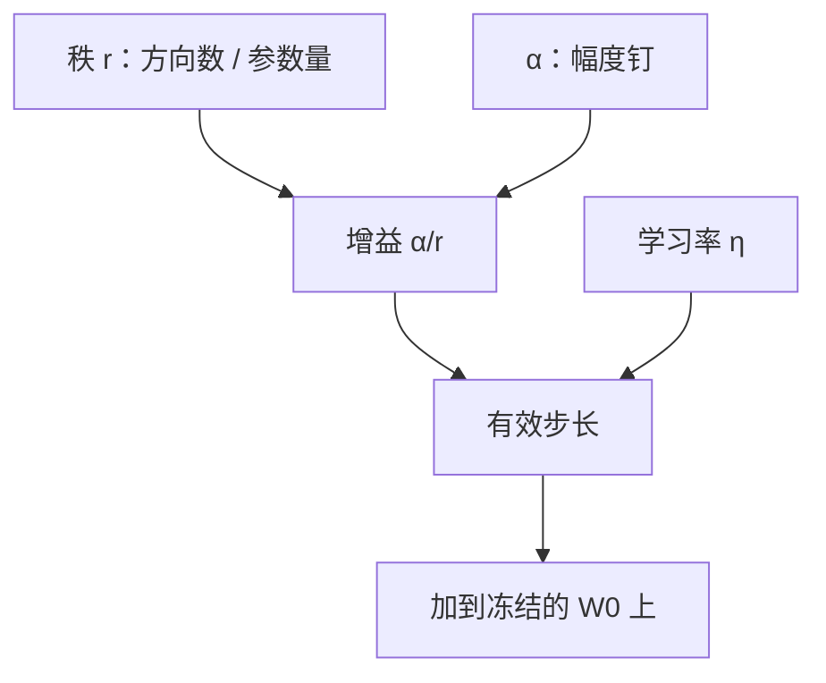

# LoRA 秩、α 与学习率

秩决定增量能占用多少方向，α 把这些方向的幅度钉在与秩解耦的尺度上；学习率则是在已经缩放过的增量上迈步。三者不是三个旋钮，而是同一有效步长的三个因子。

<footer>—— Hu 等，LoRA: Low-Rank Adaptation of Large Language Models，ICLR 2022</footer>

LoRA 把权重更新写成低秩乘积，前向是 $h = W_0 x + \frac{\alpha}{r} B A x$。工程配置里最常被改的三个数，正是公式里露出来的：$r$、$\alpha$、以及优化器学习率。很多人把它们当成互不相关的超参分别网格搜索，结果是「改了秩却等价于改了学习率」，或者「把 $\alpha$ 加倍后损失骤降，误以为容量变大」。本篇只讨论这三个量如何耦合、默认缩放从何而来、以及换秩时该动哪一个、不该动哪一个。基座冻结、只训 $A$ 与 $B$，是上一层方法已经选定的前提。

## 问题

全参微调里，有效步长大致就是学习率乘梯度。LoRA 多了一层显式缩放：增量先被 $\alpha/r$ 乘过，再进入残差。于是「优化器看到的参数」与「前向里真正加上去的 $\Delta W$」不是同一尺度。只盯学习率，会漏掉适配器内部的增益；只盯秩，会漏掉增益随 $r$ 自动变弱这一项。

设 $W_0\in\mathbb{R}^{d\times k}$，$B\in\mathbb{R}^{d\times r}$，$A\in\mathbb{R}^{r\times k}$。可训练参数量是 $r(d+k)$，随 $r$ 线性涨。容量直觉是：$r$ 越大，增量能张成的子空间越宽，越接近全参更新。数值直觉却相反：固定 $\alpha$ 时，每个秩一分量的系数是 $\alpha/r$，秩加倍则每条方向减半。Hu 等人把 $\alpha$ 设成第一次尝试的 $r$，之后改秩不再重调 $\alpha$，正是为了让「换秩」尽量只换方向数，不换整体幅度。问题于是成为：在 Adam 这类对尺度不敏感的优化器上，这个解耦是否成立；以及学习率还要不要单独再乘一截。

### 有效步长里的三个因子

把一次更新写成示意

$$
\Delta W \;\propto\; \eta\cdot\frac{\alpha}{r}\cdot \nabla_{B,A}.
$$

$\eta$ 是学习率，$\alpha/r$ 是 LoRA 的前向增益，梯度本身还依赖 $A$、$B$ 的初始化与当前范数。三者相乘才是权重空间里真正走的一步。任意两个固定、只扫第三个，网格里会出现大量等价配置：例如把 $\alpha$ 加倍再把 $\eta$ 减半，前向增量可以几乎不变。不先承认这种简并，搜索预算会浪费在同一条等值线上。

Hu 等人原文的说法是：用 Adam 时，调 $\alpha$ 与调学习率大致同类；因此他们把 $\alpha$ 钉死在首次选用的 $r$ 上，不再当超参扫。这不是「$\alpha$ 不重要」，而是「不要把同一自由度数两遍」。

## 方法

标准实现遵循原文的缩放与初始化。$A$ 用高斯或 Kaiming 初始化，$B$ 全零，于是训练第一步 $\Delta W=0$，基座行为不被随机增量打断。缩放放在乘完 $BA$ 之后，系数是 $\alpha/r$。Hugging Face PEFT 的默认是 $r=8$、$\alpha=16$，即增益为 $2$；这与「$\alpha$ 等于某次试用的 $r$」不必相同，但同属「用一个常数把增益从 $r$ 里拆出来」的家族。

改秩的推荐操作是：先选定增益 $s=\alpha/r$（或选定 $\alpha$ 与一个基准 $r$），再只改 $r$。若希望换秩时前向幅度不变，应保持 $s$ 不变，即 $\alpha$ 与 $r$ 同比例缩放。若保持 $\alpha$ 不变只加 $r$，等于在加方向的同时把每条方向拧小，常被误读成「更大的秩更稳」，其实是有效学习率在下降。

### 学习率相对全参微调为何更大

LoRA 的可训练张量比 $W_0$ 小两到三个数量级，且从零增量起步。用全参微调那种 $10^{-5}$ 量级的学习率，适配器往往欠更新，损失降得很慢。常见做法是把 LoRA 学习率放到 $10^{-4}$ 量级，比同一模型的全参 SFT 高约一个数量级。这不是因为低秩更「不怕大步」，而是因为 $\alpha/r$ 已经先把增量缩小，且 $B$ 的零初始化让早期梯度不会把基座推离预训练流形太远。把全参的小学习率与 LoRA 的大 $\alpha$ 叠在一起，或反过来，都会让有效步长偏离经验区。

## 机制

### 为何用 $\alpha/r$ 而不是裸的 $BA$

若不缩放，增大 $r$ 会同时增加方向与典型范数：$BA$ 的每条通路都是一次随机投影，项数变多则输出方差变大，优化器必须重调 $\eta$。除以 $r$ 把「多几个秩一矩阵相加」的方差增长压回去，使 $r$ 更接近纯容量旋钮。$\alpha$ 则把「压回去之后还剩多大幅度」暴露成常数，便于在不同宽度、不同层之间共用一套直觉。

后来有观察指出：当 $r$ 跨一个数量级变化时，$\alpha/r$ 可能把更新压得过小，特征学习变慢。一种修正是改用 $\alpha/\sqrt{r}$，使增益随秩的衰减更接近随机矩阵乘的标准差，而不是按项数线性衰减。这并不推翻原文的解耦意图，只是说「与 $r$ 解耦」的正确幂次不一定是 $1$。在未改实现的代码里，默认仍是 $\alpha/r$；换幂次等于换定义，必须同时重调 $\eta$。

PEFT 里把 <code>lora_alpha</code> 与 <code>r</code> 写成两个字段，容易让人以为它们是独立容量。把日志改成打印 <code>alpha/r</code> 这一项，比分别记录两个整数更不容易自欺。

### 秩本身何时真的不够

注意力投影上，$r=4$ 或 $8$ 在许多指令任务上已经能贴近全参；继续加到 $64$ 往往收益变薄，却把优化器状态与通信体积线性抬高。真正缺秩的信号通常不是损失降不下去，而是任务需要的更新明显不低秩：例如要改写大量 FFN 知识、或目标域与预训练差得很远。这时应先问「该不该把 LoRA 打到 FFN、打到更多投影」，而不是只加 $r$。目标模块选错时，把单一矩阵的秩加到与全参同阶，既失去低秩的省参意义，也不如直接全参更新来得干净。

Adam 对每个可训练标量存一阶、二阶动量。$r$ 加倍，优化器状态加倍，这是显存上比「多几个矩阵乘」更硬的约束。QLoRA 一类方法再叠 4-bit 基座时，适配器与优化器往往已经是训练显存的主项，$r$ 的选择同时是容量选择与显存选择。

## 边界与工程取舍

$\alpha$ 不是学习率，也不能替代对目标模块的选择。推理时若把适配器合并进 $W_0$，必须用与训练相同的 $\alpha/r$；漏掉缩放会表现为「训得很好、合并后变蠢」，那是实现 bug，不是秩选错。多适配器叠加时，每个适配器有自己的 $r$ 与 $\alpha$，相加前要先各自缩放到权重空间，不能把两个 $B A$ 直接加再统一除一次。

学习率预热、余弦衰减仍然有用，但日程应作用在已经包含 $\alpha/r$ 的有效步长上。换卡、换框架时先核对：有的实现把缩放融进 $B$ 的初始化，有的每步乘 $\alpha/r$，有的提供「不除 $r$」的开关。配置文件里两个整数看起来一样，前向可以差一倍。

不要用「验证集再涨 0.5 个点」单独证明更大的 $r$ 更好。先做一个对照：保持 $\alpha/r$ 与 $\eta$ 不变，只加 $r$。若对照无增益，原先的增益多半来自有效学习率变了，而不是子空间变宽了。

### 一套可执行的默认

对 7B 级解码器、指令数据：从 $r=8$、$\alpha=16$（增益 $2$）、学习率 $1\times 10^{-4}$ 起步，先只打注意力的 $q$、$v$ 投影。要加容量时优先加目标模块，其次保持增益不变地加 $r$。只有在确认欠拟合且显存仍有余量时，才把 $r$ 推到 $32$ 以上，并准备把学习率略降，以免有效步长随实现细节漂移。全参微调的学习率不要直接复用；反过来，LoRA 的大学习率也不要套到全参上。

## 小结

- LoRA 前向增量是 $\frac{\alpha}{r}BA$；有效步长是学习率、$\alpha/r$ 与适配器梯度的乘积。
- $r$ 控制子空间维数与参数量；固定 $\alpha$ 时加大 $r$ 会同时减小每条方向的系数。
- $\alpha$ 的设计目的是让改秩不必重调学习率；用 Adam 时它与 $\eta$ 高度简并，不应两个一起无约束地扫。
- 换秩若想保持幅度，应保持 $\alpha/r$ 不变，而不是只改其中一个整数。
- LoRA 常用比全参 SFT 更高的学习率，因为增量从零开始且已被 $\alpha/r$ 缩小。
- 缺容量时先检查目标模块，再加 $r$；把秩加到接近满秩会失去方法本身的意义。
- 出处：Hu 等，*LoRA: Low-Rank Adaptation of Large Language Models*，ICLR 2022。
