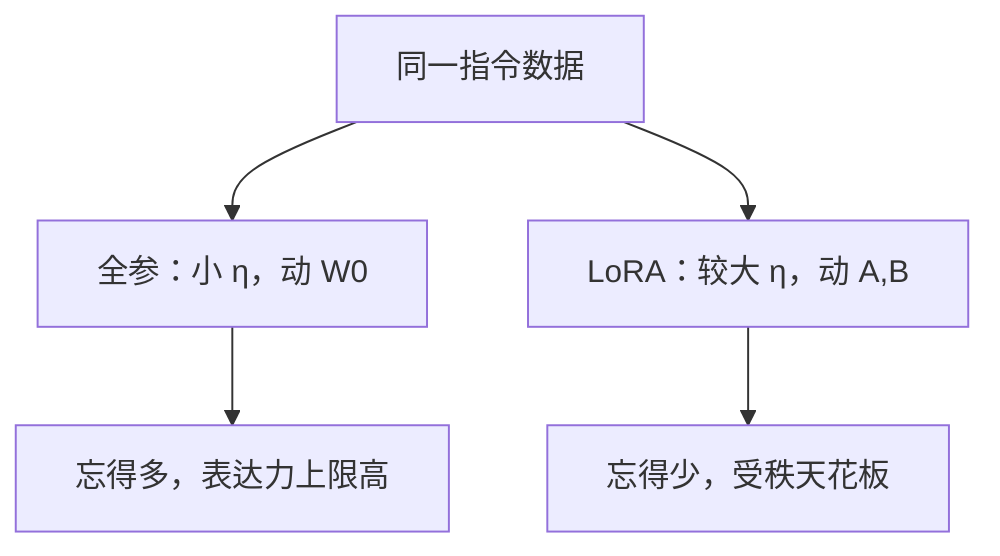

# 学习率：LoRA 对全参

同一套指令、同一个优化器，LoRA 常用 $10^{-4}$ 量级，全参常用 $10^{-5}$；把其中一个数字抄到另一种参数化上，是 SFT 最常见的事故。

<footer>—— 对照 Hu 等 LoRA（2021）与 Llama 2 / InstructGPT 的全参 SFT 实践；Biderman 等 LoRA Learns Less and Forgets Less（2024）给出遗忘差异</footer>

[NEFTune](/llm/neftune)是正则，不改变「能走多大步」。缺口在参数化：[LoRA](/llm/lora) 的 $\Delta W=BA$ 从零起步、还有 $\alpha/r$ 缩放；[全参 SFT](/llm/full-sft-hparams) 动已经学好的 $W_0$，步子必须小。工程上却经常共用一份 YAML。本课把两条学习率标成**不可互换的默认**，并说明为何 LoRA 忘得少、学得也少。不把长上下文显存（[下一课](/llm/long-context-finetune)）混进 $\eta$ 网格。

## 问题

全参更新是 $W\leftarrow W-\eta\nabla_W\mathcal{L}$，每一步直接改预训练特征。$\eta$ 取预训练峰值（常 $10^{-4}$）会在短指令上把底层投影打歪，指令损失很好、通用能力先掉——[全参课](/llm/full-sft-hparams)已写。LoRA 的可训练对象是 $A,B$，有效权重变化还乘 $\alpha/r$（或 rsLoRA 的 $1/\sqrt{r}$）。同一数值 $\eta$ 作用在不同对象上，位移的物理单位不同。

抄错有两种。把全参的 $2\times 10^{-5}$ 用在 LoRA：适配器几乎不动，看起来像数据不行。把 LoRA 的 $1\times 10^{-4}$ 到 $2\times 10^{-4}$ 用在全参：一轮即可过拟合并遗忘。QLoRA 冻结 4-bit 基座，学习率跟 LoRA 走，不跟全参走。

### 有效步长含缩放，不含「感觉」

LoRA 前向是 $y=W_0x+\frac{\alpha}{r}BAx$。对 $A$ 的梯度含 $B$ 与 $\alpha/r$，对 $B$ 的梯度含 $A$ 与 $\alpha/r$。$\eta$、$\alpha$、$r$ 三个旋钮乘在同一条增量上。只扫 $\eta$、把 $\alpha$ 当魔法常数，网格不可迁。全参没有 $\alpha$，只有 $\eta$ 与调度。

Biderman 等人 2024 年比较 LoRA 与全参：LoRA 在指令上往往学得不足，同时在源域上忘得也少。学习率不能单独「补上」学得不足——加大 $\eta$ 会先破坏低秩子空间的稳定性，而不是变成全参轨迹。

## 方法

两条出发点分开写进配方。

全参：峰值 $\eta$ 约预训练的 $1/10$–$1/20$，7B–70B 常见 $1\times 10^{-5}$–$5\times 10^{-5}$；短预热、余弦；有效批次按 token 做大；1–3 epoch。详见[全参超参](/llm/full-sft-hparams)。

LoRA：$\eta$ 常见 $1\times 10^{-4}$–$3\times 10^{-4}$（视 $\alpha/r$ 而定）；嵌入与 LM head 若全参训练则用更小的 $\eta$ 或单独分组；适配器 dropout 可选。$r$ 增大时若仍用 $\alpha/r$，有效更新变小，有人提高 $\eta$ 补偿，有人改缩放（[rsLoRA](/llm/rslora) 课）。不要用全参的线性缩放规则去乘 LoRA 的 $\eta$。

分组学习率：同一模型里 LoRA 模块与解冻的范数/头可以不同 $\eta$。混用时日志分别打梯度范数。数据谱系不改变分叉：ShareGPT 与 FLAN 都要选对参数化对应的 $\eta$，脏数据时全参更危险。

## 机制

LoRA 初始化 $BA=0$，早期梯度只在低秩因子上积累。大学习率把因子拉到有用的子空间，而不直接旋转 $W_0$ 的主轴，所以源域特征更稳。全参没有这条「从零增量」的缓冲，小 $\eta$ 是在限制 $\|\Delta W\|$ 的每步幅度。

遗忘与学习率的关系因此不对称。全参大学习率沿高秩方向改表示，灾难性遗忘显著。LoRA 再大，更新仍落在 $r$ 维里，忘不了那么多，也改不了那么多——这是表达力，不是免费正则。任务需要满秩更新时，应加 $r$ 或改全参，而不是把 LoRA 的 $\eta$ 加到发散。

[chat template](/llm/chat-template) 与仅回复掩码错误时，两种参数化都会「变傻」。先排除格式，再比较 η。用错误掩码扫出的「最优学习率」不可用。

## 边界与工程取舍

DoRA、AdaLoRA 有自己的几何与秩分配，默认 $\eta$ 不能从本课直接抄，但「适配器大于全参」的方向仍在。嵌入层若解冻，应对齐全参量级，否则词表漂移。长上下文 SFT 有效批次更小，应先补累积，再动 $\eta$，见[下一课](/llm/long-context-finetune)。

验证两张表：指令遵循与源域保持。LoRA 选点常在「源域几乎不掉、指令略欠」；全参选点常在「指令更满、源域开始掉」。没有一张表上的单一最优 $\eta$。

## 小结

- LoRA 与全参的学习率默认差约一个数量级，不可共用一份配置。
- LoRA 的有效步长还含 $\alpha/r$；改 $r$ 必须重看 $\eta$。
- 全参步子过大导致遗忘；LoRA 步子过小导致学不动，过大则过拟合适配器。
- Biderman 等：LoRA 往往学得少、忘得少；加大 $\eta$ 不能把它变成全参。
- QLoRA 跟 LoRA 的 $\eta$，不跟全参。
- 出处：Hu 等，LoRA，2021；Touvron 等，Llama 2，2023；Biderman 等，LoRA Learns Less and Forgets Less，2024。
