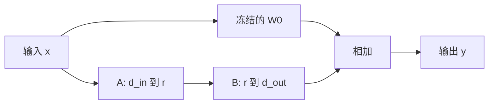

# LoRA

    
冻结预训练权重，只学一个低秩的增量。适应下游时不必再存一份完整模型，推理还可以把增量合并回去。

    <footer>—— Hu et al., LoRA: Low-Rank Adaptation of Large Language Models, 2021</footer>

全量微调把预训练矩阵 $W_0$ 的每一个元素都当成可学习参数，一份下游任务就复制一份与基座同大的权重。Hu 等人 2021 年的 LoRA 把更新限制在低秩分解上：$\Delta W=BA$，其中 $B$ 的列数与 $A$ 的行数等于很小的秩 $r$。训练只优化 $A$ 与 $B$，基座冻结；部署时可以算 $W=W_0+BA$ 再丢掉适配器，推理延迟与全量模型相同。也可以不合并，按任务切换不同的 $B,A$。本篇讲这条参数高效适应的基本形式，不把 QLoRA、AdaLoRA 或服务期多适配器调度展开成全文。

## 问题

下游任务通常没有预训练那么多数据，也不需要改动全部能力。全量微调有三笔账：显存要为 Adam 状态再付两到三份参数量；存储要为每个任务存完整权重；灾难性遗忘风险上升，因为 $W_0$ 里已经学好的方向可以被大步更新改掉。Adapter 层在残差旁插入小 MLP，能减参数，却改变计算图，推理时多一层，也不便与基座内核融合。

若假设适应发生在一个低维子空间里——即 $\Delta W$ 的秩远小于全矩阵——就可以在不改前向结构的前提下，只学那个子空间。问题是：这个假设对 Transformer 的哪些矩阵足够好？秩要多小？以及如何初始化才不会在训练初期把基座打歪。

### 低秩增量而不是低秩权重

LoRA 并不宣称 $W_0$ 本身低秩。预训练权重可以满秩、表达力完整；它宣称的是**更新** $\Delta W$ 在许多适应任务上可以被低秩矩阵逼近。这与「用低秩因子分解去压缩已经训好的模型」不是同一件事。压缩针对 $W_0$，LoRA 针对 $W-W_0$。若任务其实需要满秩更新（例如从语言模型改成完全不同的目标、或要改动很大的输出空间），$r$ 会成为天花板：损失降到某一水平就不动。这时应加 $r$、改更多矩阵，或回到全量微调，而不是只把学习率加大。

## 方法

对线性层 $y=W_0x$，LoRA 写成

$$
y=W_0x+BAx=\bigl(W_0+BA\bigr)x,
$$

其中 $W_0\in\mathbb{R}^{d_{\mathrm{out}}\times d_{\mathrm{in}}}$ 冻结，$A\in\mathbb{R}^{r\times d_{\mathrm{in}}}$，$B\in\mathbb{R}^{d_{\mathrm{out}}\times r}$，$r\ll \min(d_{\mathrm{in}},d_{\mathrm{out}})$。可训练参数从 $d_{\mathrm{out}}d_{\mathrm{in}}$ 降到 $r(d_{\mathrm{in}}+d_{\mathrm{out}})$。论文常用的初始化是：$A$ 高斯随机，$B$ 全零，从而训练开始时 $BA=0$，前向与基座完全一致。缩放系数 $\alpha/r$ 乘在 $BA$ 上，使改 $r$ 时有效步长不必完全重调。

Hu 等人主要把 LoRA 插在自注意力的投影矩阵上，尤其是 $W_q$ 与 $W_v$；后续实践常扩展到 $W_k$、$W_o$ 以及 FFN 的门控线性。插得越多，表达力越强，显存与存储越接近全量微调。默认配方是：先只动注意力投影，不够再动 FFN。

### 合并与不合并

推理若只服务一个适配器，把 $BA$ 加进 $W_0$ 得到新的稠密矩阵，后续 GEMM 与基座相同，没有额外延迟。多任务切换时不合并，前向多一次小矩阵乘，任务之间只换 $A,B$。合并是一次加法，不可逆地丢掉「纯基座」除非另存 $W_0$。训练过程中不合并，以便用小参数做优化器状态。

秩 $r$ 是主超参。过小则欠拟合下游；过大则参数与显存回升，低秩假设变弱。$\alpha$ 与学习率耦合：许多实现把 $\alpha$ 固定、用学习率调有效步长。同一组 $(r,\alpha)$ 换到不同基座宽度上，有效更新幅度会变，需要重新扫。

## 机制

反向只对 $A,B$ 求梯度。$W_0$ 不进 Adam，优化器状态与适配器同阶而不是与基座同阶，这是显存节省的主要来源。梯度路径是：输出误差对 $B$ 的梯度经 $Ax$，对 $A$ 的梯度经 $B^\top$ 再与 $x$ 外积。$r$ 很小的 GEMM 在训练里往往不是吞吐瓶颈，瓶颈仍在冻结的大矩阵乘——那一部分与基座前向相同。

零初始化 $B$ 保证初始函数不变，避免随机 $\Delta W$ 在第一步就破坏预训练特征。若 $A,B$ 都随机，初始扰动的尺度随 $r$ 变，学习率难迁。$\alpha/r$ 则试图让不同 $r$ 下 $BA$ 的 Frobenius 尺度可比。这些是优化稳定性上的选择，不是低秩定理的一部分。LoRA 与「只训最后一层」或「只训偏置」相比，改的是每一层内部的子空间，而不是只改头部。头部微调几乎不碰表示；LoRA 允许表示沿低秩方向移动。任务需要新的特征组合时，这是它比线性探针强的原因，也是它仍可能弱于全量微调的原因。

### 与全量更新的函数差距

全量微调的 $\Delta W$ 可以有任意秩。LoRA 把 $\Delta W$ 限制在 $B$ 的列空间与 $A$ 的行空间里。若下游最优更新恰好近似低秩——许多适应任务上经验如此——差距小；若最优更新需要许多正交方向同时动，差距大。这解释了为什么指令微调、风格适应上 LoRA 经常够用，而要从头改目标分布时不够用。加大 $r$ 是在连续谱上靠近全量微调，并不是突然变成另一种算法。

## 边界与工程取舍

LoRA 不减少基座推理的 FLOPs，除非你用它去适应一个已经更小的模型。它减的是训练参数、优化器显存和每任务存储。把 LoRA 说成「压缩模型」是错的；合并后权重体积与 $W_0$ 相同。真正与量化结合的训练（QLoRA）把 $W_0$ 以 4-bit 驻留，那是后一篇的主题。

学习率通常明显大于全量微调，因为可训练参数少、且 $\Delta W$ 从零开始。过小则学不动，过大则适配器过拟合短数据。Dropout 可以加在 $A$ 与 $B$ 之间。数据很少时，LoRA 仍会过拟合，低秩不是正则的替代，只是参数量本身带一点隐式限制。服务多个 LoRA 时，不能假设它们可以随意线性叠加。两个 $\Delta W$ 相加对应秩至多 $r_1+r_2$ 的更新，任务之间可能冲突。合并多个适配器是产品策略，不是 LoRA 原论文保证的性质。单任务、可合并，是这条方法最干净的部署路径。

Hu 等人在 GPT-2 / GPT-3 级模型与若干 NLG 任务上验证了低秩适应。后来的指令微调、扩散模型、ViT 都在用同一公式，但最优插入位置和 $r$ 随架构变。写配方时应写清：插在哪些矩阵、 $r$、$\alpha$、是否合并，而不是只写「用了 LoRA」。

## 小结

- LoRA 冻结 $W_0$，学习 $\Delta W=BA$ 的低秩增量，前向为 $y=(W_0+BA)x$。
- $A$ 随机、$B$ 为零，使训练起点与基座重合；$\alpha/r$ 用来在不同秩之间缩放。
- 省的是可训练参数、优化器状态和每任务存储，合并后推理成本与稠密基座相同。
- 假设针对的是更新低秩，不是预训练权重低秩。
- 秩过小会碰到表达力天花板；任务差异很大时应加 $r$ 或改回全量微调。
- 多适配器切换可以不合并；多适配器相加没有通用保证。
- 出处：Hu et al., *LoRA: Low-Rank Adaptation of Large Language Models*, 2021。
