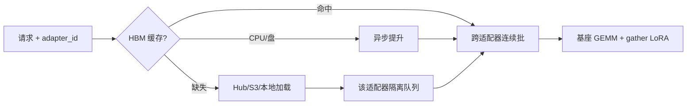

# LoRAX

    
基座常驻，适配器按请求从 Hub、对象存储或本地盘即时装上；加载不得堵住别人的连续批，缓存按 GPU、CPU、盘分层淘汰。

    <footer>—— Predibase，LoRAX（LoRA eXchange）开源多适配器推理服务</footer>

Punica 给出跨 LoRA 的背景批核，S-LoRA 给出 KV 与适配器的统一分页，dLoRA 给出合并与迁移。工程上还缺一层可运维的服务器：谁去 Hugging Face 拉适配器、显存不够时谁被换到 CPU、请求里如何声明 `adapter_id`、失败时如何 4xx 而不是静默落到基座。Predibase 的 LoRAX（LoRA eXchange）把这条产品化：一份基座服务成百上千个微调，动态加载、分层权重缓存、跨适配器的连续批，并提供 Docker / Helm 与 [OpenAI 兼容](/llm/openai-compat-api) 入口。本篇写这套服务形态，不把某一发行版的 CLI 旗标写成标准，也不把营销里的「一张卡 100 个模型」当成物理定律。

## 问题

内部平台的典型形状是：基座两三个，适配器按团队、客户、任务爆炸。若每个微调起一个 vLLM 副本，GPU 账单按适配器数线性涨，其中 90% 的卡在等长尾。若把适配器预先全部装进 HBM，工作集一过 KV 池就被挤死。若请求到来再同步 `from_pretrained`，第一次调用的 TTFT 会含一次网络下载与反序列化，同卡上正在 decode 的流式用户被 Python 阻塞打断。

还缺契约。HTTP 上 `model` 字段在兼容层常是路由键；多 LoRA 时真正的键是「基座 + 适配器 + 版本」。Hub 上的仓库名会移动、文件会更新，服务若在热路径下载，就在生产里执行了一次不可复现的训练工件获取。需要一个加载器：异步、可缓存、可鉴权、失败可见。

### 加载必须与连续批解耦

[连续批](/llm/continuous-batching) 的合同是：迭代边界可以加入新请求。若「加入」包含一次同步加载，该迭代的墙钟从数十毫秒变成数秒，同批所有 [ITL](/llm/tpot-itl) 被打穿。LoRAX 把未命中的适配器放进**按适配器隔离的等待队列**：别人继续用已在 GPU 上的适配器跑批，加载在旁路完成后再把排队请求编进后续迭代。这与「一个全局大锁，加载期间整引擎停」是两种产品。

即时加载不是免费的弹性。Hub 限流、鉴权失败、秩与基座不匹配、缺 `adapter_config.json`，都应在加载队列里变成该请求的 4xx，而不要让整张卡的批处理跟着重试。成功路径才进 HBM 缓存。

## 方法

LoRAX 的三块积木可以分开理解。

**动态加载。** 请求携带适配器标识与来源（Hub、Predibase、S3、本地目录）。路由器查注册表：HBM 已有则直接进连续批；只有 CPU 或盘则异步提升；都没有则拉取、校验与基座的层名、秩、精度是否可服务，再插入缓存。同一适配器的并发未命中应合并成一次加载（singleflight），避免惊群把网卡与 CPU 打满。合并适配器（一次请求叠多个 LoRA）是可选能力：把多个 $\Delta W$ 在低秩或已合并域里相加，契约上要声明叠加顺序与缩放，失败则整请求失败，不要部分生效。

**分层权重缓存。** 适配器工作集超过 HBM 预留时，按 LRU 或频率把冷 $A,B$ 卸到主机内存，再冷则落到盘。预留比例是显式旋钮：提高适配器份额就缩小 KV 池，最大批与上下文长度一起降。LoRAX 用 `adapter_memory_fraction` 一类参数表达「留多少给适配器」——它与 cuda 内存比例不是同一标尺，要对着 KV 上限一起算。预加载列表可以把启动时必热的租户钉在 GPU 上，代价是这部分容量不再给长尾。

**跨适配器连续批。** 基座 GEMM 对整批做一次，LoRA 走 Punica 系 gather 核（SGMV 或后继实现），使不同类型请求共享 decode 步。调度仍应尽量让同一适配器相邻，见 [Punica 背景批](/llm/punica)；公平上要防止热适配器占满运行集，这与 [dLoRA](/llm/dlora) 的信用批是同一类问题，产品可用租户配额近似。

### 与 OpenAI 信封的对接

路径仍是 `/v1/chat/completions` 或引擎自己的 `/generate`。适配器 id 放在扩展字段或把 `model` 写成「基座别名 + 适配器别名」。未声明时走纯基座或默认适配器，必须写进契约，否则租户会静默落到彼此的风格上。[KV 感知路由](/llm/kv-aware-routing) 的指纹必须包含适配器 id 与版本：KV 是过了该 LoRA 之后的键值。加载失败返回 4xx，不要 200 加基座。流式首 token 计时应包含排队加载，见 [TTFT](/llm/ttft)；把加载藏进「kernel 启动之后」会让看板假绿。

## 机制

密度来自参数形状。LoRA 增加的参数是 $r(d_{\mathrm{in}}+d_{\mathrm{out}})$，相对满秩层是 $r/d$ 量级。于是「一张卡上的适配器个数」上限大致是：HBM 减去基座减去 KV 池，除以单适配器字节。宣称的「成百上千」隐含：秩小、只插注意力投影、多数冷备在 CPU/盘、同时**热**的适配器只有几十。热工作集一旦涨到与 KV 抢内存，连续批的批大小先掉，吞吐按 decode 屋顶线回落——这不是框架失效，是容量公式。

### 热工作集而不是目录里的个数

分层缓存的命中率由访问偏斜决定。Zipf 很陡时，CPU 层几乎看不见；偏斜变平（每个客户一个适配器、流量均匀）时，提升与换出变成主税，TTFT 双峰：命中走纯前填，未命中走加载+前填。报表必须分列，否则 P99 被未命中峰决定，却被平均命中率粉饰。

LoRAX 能从 Hub 拉适配器，不意味着生产应允许任意 URL。来源应白名单、校验哈希、与基座的 `architectures` 对齐。任意租户注入一份形状碰巧能 load 的 $A,B$，是一条模型侧信道，不是「动态」的特性。

## 边界与工程取舍

量化基座（bitsandbytes、GPTQ、AWQ）与 LoRA 数值域要对齐，否则 $BAx$ 在反量化后的 $W_0x$ 旁被淹没。支持的基座架构以当时文档为准：Llama、Mistral、Qwen 等常见解码器优先，自定义层、MoE、多模态投影不要假设 gather 核开箱可用。张量并行下，适配器切片要跟基座 TP 一致，通信应叠在基座 All-Reduce 上的小增量，而不是为 $BA$ 再付一次满秩集合通信。

与 [适配器热更新](/llm/adapter-hot-swap) 的交接：Hub 上的「latest」不是版本。生产应钉 commit / 文件哈希；热更新是推一个新 id，旧 id 的在途请求钉住旧页。与 [多 LoRA 服务](/llm/multi-lora-serving) 的关系：LoRAX 是可部署实现，Punica/S-LoRA/dLoRA 是算法论文；核与调度以发行说明为准，不要把论文表格里的 12× 抄到 LoRAX 的 SLA。

Apache-2 许可证让你可以商用二进制，但不保证 Hub 上的适配器许可证允许你代为托管。服务端拉取等于分发，要过 [代码许可闸](/llm/code-license-gate) 一类的工件审查，而不是只过形状检查。

## 小结

- LoRAX 把多 LoRA 服务做成可运维栈：动态加载、GPU/CPU/盘分层缓存、跨适配器连续批。
- 加载必须异步且按适配器隔离排队，不能堵住他人的 decode 迭代。
- 适配器预留显存与 KV 池此消彼长；「一张卡上千适配器」统计的是冷备，不是同时热运行集。
- HTTP 的适配器 id 与版本进入路由与 KV 键；失败 4xx，禁止静默回落基座。
- 来源要白名单与哈希；量化、TP、多模态都是核与数值的额外假设。
- 出处：Predibase LoRAX（https://github.com/predibase/lorax）；核思想对照 Chen 等 Punica、Sheng 等 S-LoRA。
