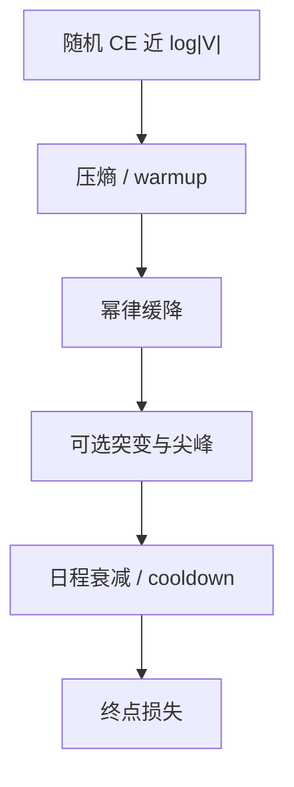

# 损失曲线的阶段

学习曲线很少是一条光滑幂律；同一张图上叠着快速压熵、记局部模式、以及偶发的尖峰，必须按阶段读，不能只读终点。

<footer>—— 幂律背景见 Kaplan et al., 2020；双下降见 Nakkiran et al., ICLR 2020；训练动态里的回路形成见 Olsson et al., Induction Heads, 2022</footer>

[上一课](/llm/perplexity-bpb)把纵轴单位钉成 token CE / PPL。缺口是横轴上的**形状**。主干的 [Kaplan](/llm/kaplan-scaling) 与 [Chinchilla](/llm/chinchilla) 描述的是终点损失对 $N,D,C$ 的幂律，不描述训练过程内部何时在压 unigram、何时出现 induction、何时尖峰。本课把一条预训练曲线分成可操作的阶段，作为「反传与初始化」单元的收束：后面「训练为什么会炸」默认你会区分「还在正常降」和「已经离开可工作盆地」。

## 问题

随机初始化的 CE 靠近 $\log|V|$。前几千 step（含 warmup）通常陡降：模型先学空格、标点、高频 token 的边际分布，PPL 从词表大小掉到三位数。这段斜率对架构不敏感，对学习率是否炸却敏感——若这里就不降，是初始化或 $\eta$ 错了，不是数据不够。

随后进入长时间的缓降，近似 Kaplan 说的幂律段：对数损失对对数 token 近线性。中间会插入若干突变：Olsson 等人在小模型上看到 induction head 形成时损失阶跃下降；大模型上同一机制被摊在更多层里，曲线更平滑，但不表示没有回路在形成。Nakkiran 等人的双下降提醒：插值附近测试损失可能先升后降，不要把验证 CE 的一次回升自动判为过拟合终止。

尖峰是第三种形状：若干 step 内训练 CE 竖起，再掉回或掉不回。主干 [梯度裁剪](/llm/grad-clip-loss-spike) 已经说裁剪挡住爆炸、不解释尖峰。本课只要你在日志里给尖峰打标，不要把它们平均进幂律拟合。

把整条曲线拟合一条 $L=aC^{-b}$ 时，若把 warmup 段和尖峰段算进去，$b$ 会被污染。拟合课会展开；这里先规定：阶段边界是拟合之前的标注工作。

## 方法

读曲线时至少切四段（边界用 token 数而不是 wall-clock）：

1. **Warmup / 压熵。** $\eta$ 从近 0 升到峰值。验收：CE 单调降、grad norm 不长期贴 clip、max logit 仍 $O(10)$ 量级。
2. **幂律降。** 峰值 $\eta$ 或 WSD 稳定段。验收：对数-对数斜率稳定；数据配比若切换，允许斜率改变，应在日志打事件。
3. **突变 / 回路。** 局部陡降或平台后的再降。应对照下游探针（induction、复制、简单算术），不要只看 CE。
4. **衰减段。** 余弦尾或 cooldown。CE 再降一截是日程效果；若反升，检查权重衰减与 $\eta$ 是否把参数拉离盆地。

每段记录：token CE、grad norm 分位数、注意力 logit 分位数、输出 LSE。后四项是下一单元的传感器，本课只要求开始记，不解释阈值。

## 机制

压熵段主要改输出头与嵌入：unigram 统计进 $W_{\mathrm{out}}$ 与 $E$。幂律段才是残差流上的特征学习。因此在压熵段做架构消融（改深度、改头数）往往看不出差别——差别被输出层的快速拟合盖住。小模型代理实验应把评测放在幂律段之后，或报告「同等 token 下的斜率」，而不是只比 1B token 的终点。

Grokking（Power 等）在小算法任务上显示：训练 CE 已近 0 之后，验证准确率才突然升。预训练几乎看不到干净的 grokking，但同一教训适用：终点训练 CE 不能单独当「已经学会」。阶段 3 的下游探针是为这个服务的。

## 边界

本课不诊断尖峰原因（坏 batch、$\beta_2$、logit 增长），那是下一单元。也不把双下降、grokking、induction 合成一条普遍时间表：它们出现的 token 数随宽度与数据变。Chinchilla 的计算最优点是终点预算，不是「必须在阶段 2 结束时停」——过度训练进阶段 4 对推理部署常常更优，缩放单元会写。

## 小结

- 预训练曲线至少分压熵、幂律、突变/尖峰、衰减四段，用 token 对齐。
- 压熵段验初始化与 $\eta$；幂律段才适合架构消融；尖峰不要拟合进幂律。
- 终点训练 CE 不等于已学会；下游探针补在突变段。
- 传感器（grad、注意力 logit、LSE）从此课开始记，解释留给稳定性单元。
- 出处：Kaplan et al., 2020；Nakkiran et al., ICLR 2020；Olsson et al., 2022。
