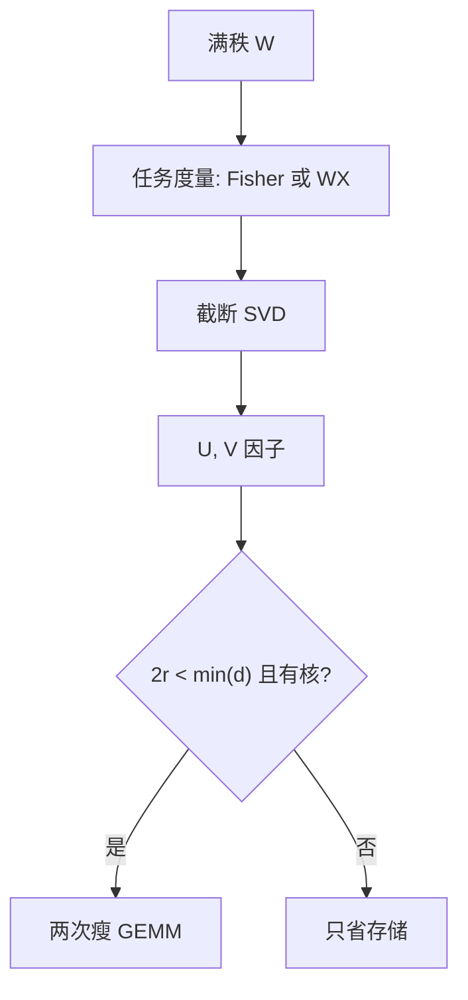

# 低秩分解

把已经训好的 $W$ 写成 $UV$，推理变成两次瘦矩阵乘。这压缩的是 $W_0$ 的秩，不是 LoRA 那种只学 $\Delta W$ 的增量。

<footer>—— Hsu et al., Language Model Compression with Weighted Low-Rank Factorization, ICLR 2022；对照 Eckart–Young 的截断 SVD</footer>

[上一课](/llm/attention-head-pruning) 删的是整头。本课形状还在，秩下降：每层 $W\approx UV$，参数从 $d_{\mathrm{out}}d_{\mathrm{in}}$ 降到 $(d_{\mathrm{out}}+d_{\mathrm{in}})r$。缺口是与 [LoRA](/llm/lora) 划清：**LoRA 冻结 $W_0$、学低秩更新；本课分解 $W_0$ 本身。** 后课把矩阵换成更高阶张量。不重导 GPTQ 的格子。

## 问题

截断 SVD 对 Frobenius 最优，却不是对层输出 $\|WX-\hat W X\|$ 最优。Hsu 等人的 FWSVD 用 Fisher / 梯度信息给行加权再分解，让重建对准损失敏感方向。激活感知的 SVD 同类：用校准 $X$ 把「能量大的输入方向」留到前 $r$ 个奇异成分里。问题与 AdaRound / GPTQ 平行——度量必须是任务几何，不是权重 MSE。

$r$ 太小，一层的表达力掉到无法被残差补回，长链推理先死，短 PPL 后动。$r$ 接近 $\min(d_{\mathrm{in}},d_{\mathrm{out}})$ 则不压缩。混精思想在这里变成混秩：敏感层留满秩，迟钝层狠压。

分解后两次 GEMM 是否加速，取决于 $r$ 是否小到让 $UV$ 的 FLOPs 低于原 $W$，以及核是否融合。只省参数、两次乘更慢，是常见失败。

## 方法

逐层：取 $W$，可选先按校准或 Fisher 加权，截断 SVD 得 $U\Sigma V^\top$，把 $\Sigma$ 吸进 $U$ 或 $V$，存两个因子。可再短微调或 LoRA 修残差。与量化联合：先低秩再 [GPTQ](/llm/gptq)，校准走 $UVx$。lm_head 与 embedding 往往更怕低秩，优先保护，与混精手工先验相同。

不要把 QLoRA 的 NF4 基座再做一遍 SVD 当「双压缩」而不重测：量化噪声改变奇异谱，秩的最优点会移。

## 机制

$W$ 的有效秩低，当输出主要落在少数输入方向上——校准域越窄，看起来越低秩，换域越崩。这是校准过拟合的低秩版。加权 SVD 把损失 Hessian 的主轴对齐到前 $r$ 个成分，换的是域内 PPL，不是普遍可逆压缩。

与 LoRA 同时存在时：推理若合并 $W_0+BA$ 再 SVD，秩预算要覆盖适配器撑开的方向；若保持 $UV+BA$，三因子，实现复杂，通常先合并再压。

## 边界与工程取舍

不要对每一层同一 $r$。不要在 $r$ 不够小时指望继续预训练像 Sheared 那样愈合——低秩约束还在，愈合天花板更低。下一课张量分解：把 $W$ 看成更高阶，秩的概念换成 TT/Tucker 秩，核更差。

## 小结

- 低秩分解压 $W_0$；LoRA 压 $\Delta W$。检查点语义不同。
- 截断应对准 $WX$ 或 Fisher，而不是 $\|W-\hat W\|$。
- 两次 GEMM 只有在 $r$ 足够小且实现融合时才加速。
- 敏感层混秩，头与 embed 优先保护。
- 出处：Hsu et al., ICLR 2022；Eckart–Young 作为 SVD 基线。
