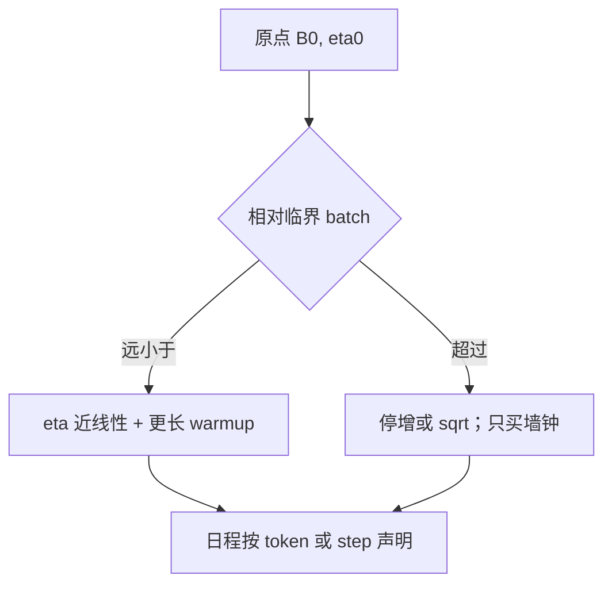

# 学习率与批次缩放律

线性规则把 $\eta$ 随 batch 放大，是小 batch 一侧的可用起点；越过临界 batch 之后，再线性加 $\eta$ 只买墙钟，不买 token 效率。

<footer>—— Goyal et al., Accurate, Large Minibatch SGD, 2017；Shallue et al., Measuring the Effects of Data Parallelism on Neural Network Training, JMLR 2019</footer>

[上一课](/llm/vocab-scaling-law)说明 $B$ 若按 token 计，词表会改同样字节对应的 $B$。缺口转到：主干 [批次与学习率](/llm/batch-vs-lr) 已写线性 / $\sqrt{B}$ 分层，本课不重推临界 batch 的公式，把它放进**缩放实践**：形状与词表已定之后，数据并行把全局 token batch 从 $B_0$ 拉到 $B$，日程峰值 $\eta$ 怎么走。Shallue 等人系统测了数据并行对步数与数据效率的影响；Goyal 等人给出带 warmup 的线性规则。下一课才把临界点写成可测的梯度噪声尺度。

## 问题

SGD 噪声方差 $\sim 1/B$。$\eta\propto B$ 保持「噪声 × 步长」一类温度，使不同 $B$ 在看过同等数据后接近。Goyal 强调大 $\eta$ 必须配更长 warmup，否则起步即炸——这与 Post-LN 预热课同方向，但对象是 batch 而不是 LN 位置。Shallue 等人显示：收益在临界规模附近饱和，再加大 $B$ 减少的是 step 数，达到同等损失所需的 **样本数** 不再下降。

AdamW 不是 SGD：$v$ 随 $B$ 变，大 batch 的 $v$ 更稳，同样 $\eta$ 的有效步长更大，纯线性比 SGD 更险。因此 LLM 常用 $\sqrt{B}$ 或更保守。μP 管宽度，不管 $B$；把 $\eta$ 按 μP 迁到宽模型后，再改 $B$ 仍要走本课的规则，两张表相乘，不要用一张吃掉另一张。

$B=$ 数据并行 × 微 batch × 序列长 × 累积。改序列长度却沿用旧 $\eta$，等于悄悄改了 $B$。序列长度预热课会再碰到；这里先把定义钉死。

## 方法

给定已稳的原点 $(B_0,\eta_0)$：

- $B\ll B_{\mathrm{crit}}$：$\eta\approx\eta_0\cdot B/B_0$ 或略保守；加长 warmup（按 token）。
- $B\sim B_{\mathrm{crit}}$：改 $\sqrt{B}$ 或不增加 $\eta$；目标从 token 效率改为利用率。
- 日程按 **token** 对齐还是按 **step** 对齐必须声明：加大 $B$ 时，按 token 对齐会让余弦更快走完高峰。

原点必须带模型、词表、优化器、稳定件。从论文抄 3e-4 再按你的 4M token 线性放大，没有 $B_0$，是无量纲口号。换 $|V|$ 后 $B_0$ 的字节含义变了，应重新标定原点，不要跨词表继承线性系数。

## 机制

大 $B$ 降噪，更新更接近真梯度；过小噪声减少逃离尖鞍的机会，最终损失有时略差——Shallue 的饱和区包含这种质量代价。线性加 $\eta$ 是在饱和区之前补偿「每步看更多、每步应走更远」。Adam 的 $v$ 额外放大有效步长，所以 LLM 在尚未测 $B_{\mathrm{crit}}$ 时宁可 $\sqrt{B}$。触顶率（梯度范数课）是实践中的饱和传感器：线性加 $\eta$ 之后若持续贴顶，你已经越过临界或稳定件不够。

## 边界

本课不测 $B_{\mathrm{crit}}$ 的公式，下一课用噪声尺度测。也不处理序列长度课程学习以外的「动态 $B$」。MoE 专家看见的有效 batch 因 drop 变小，专家参数的 $B_{\mathrm{crit}}$ 可以与稠密层不同，不要共用一个线性系数。

梯度累积改变的是 $B$ 的实现，不是另一条定律：累积满了才更新时，公式里的 $B$ 用累积后的全局 token 数。日志若只写 per-GPU micro-batch，换卡数之后线性规则会对错原点。

## 小结

- 线性规则只在临界 batch 之下是 token 效率工具；之上只换墙钟。
- AdamW 上 $\sqrt{B}$ 往往比纯线性更稳；$v$ 随 $B$ 构成额外放大。
- μP 与 batch 规则相乘，原点必须含词表与稳定件。
- $B$ 的定义含序列长；改 $n$ 即改 $B$。
- 累积步计入 $B$；只写 micro-batch 会把线性规则的原点写错。
- 出处：Goyal et al., 2017；Shallue et al., JMLR 2019。
