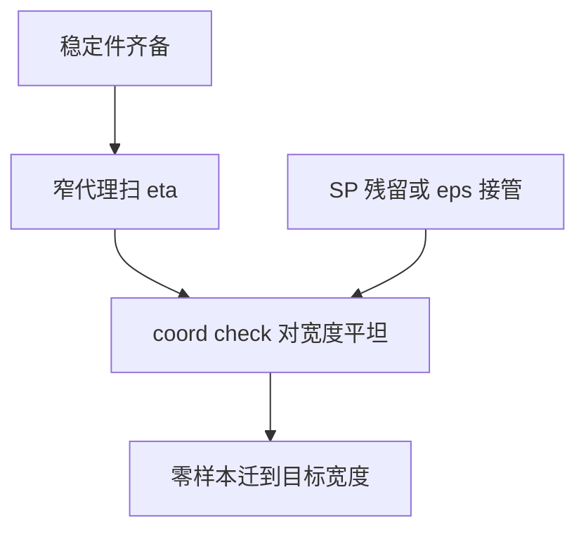

# 学习率敏感度与 μP 实践

标准参数化下最优学习率随宽度漂；μP 让每层特征更新在宽度极限仍为 $\Theta(1)$，于是窄模型上扫到的 $\eta$ 可以零样本迁移——前提是分母、深度与嵌入分组没有先把假设打破。

<footer>—— Yang, Hu 等，Tensor Programs V: Tuning Large Neural Networks via Zero-Shot Hyperparameter Transfer</footer>

[上一课](/llm/adam-beta2-spikes)与 $\varepsilon$ 课指出：Adam 分母一旦被地板或滞后接管，自适应尺度不再是 μP 假设的那个。缺口是把主干 [μP](/llm/mup) 从「宽度定标表」收成**可运行的实践清单**。本课不重推 abc 规则，只写：在已经处理 logit 增长、clip、$\varepsilon$、$\beta_2$ 之后，如何扫 $\eta$、如何做 coord check、哪些轴**不要**假装已经 μP 化。后课的权重衰减豁免是清单上的下一项。

## 问题

SP 下加宽后最优 $\eta$ 移动：窄的能学、宽的要么炸要么不动。μP 的承诺是最优 $\eta$ 对宽度近乎常数。Wortsman 等人的小代理恰恰说明：不稳模式可以在小模型上用大学习率复现。于是实践问题变成两层——（1）目标模型必须真的是 μP，而不是 SP 网络外面乘了一个 $1/d$；（2）扫 $\eta$ 的代理必须已经打开与大模型相同的稳定件（QK-Norm 或 cap、同样的 $\beta_2$、同样的 $\varepsilon$ 分组），否则代理的最优 $\eta$ 落在大模型会炸的区里。

Tensor Programs V 对宽度是定理级，对深度、batch、序列长度是经验附录。把四者捆成「全部 μP」会在深度变 2 倍、batch 变 8 倍时静默失败。本课把敏感度写成：**先固定深度与数据配方，只扫宽度轴；其它轴用各自的课**（深度缩放、批次定律）。

coord check 不是看损失。损失可以对宽度碰巧都降，而某层更新幅度随 $d$ 线性涨——那种涨会在真正的目标宽度上变成 NaN。必须画 $|\Delta\mathrm{activation}|$ 对宽度是否平坦。

## 方法

实践顺序：

1. 实现 infshape：输入、隐藏、输出三列乘数与初始化分开，注意力 $1/\sqrt{d_k}$ 保留。
2. 打开与目标相同的稳定件（本单元已讲的那些），再在窄代理上扫 $\eta$。
3. coord check：加宽若干档，前向激活更新幅度平坦才迁移。
4. 迁移后**不要**再把 $\eta$ 按 SP 习惯除以 $\sqrt{d}$。

敏感度图：在代理上画最终 CE 对 $\eta$ 的 U 形。μP 下 U 形的谷底位置随宽度应重叠。若宽模型的谷底左移，检查是否 SP 残留（某层学习率没乘表）、是否 $\varepsilon$ 在宽词表上接管、是否残差没按深度缩放。谷底变窄（更敏感）通常是稳定性不够，不是 μP 失效——先加 cap / 降 $\beta_2$，再谈迁移。

与主干 [权重衰减与 μP](/llm/weight-decay-mup) 对齐：$\lambda$ 的单位是 $\eta\lambda$，改 $\eta$ 等于改衰减率。扫 $\eta$ 时 $\lambda$ 要么跟着定义成无量纲组合，要么明确「$\lambda$ 固定、衰减率变」。两种合法，混用使 U 形不可读。

## 机制

μP 让隐藏层的特征更新对宽度 $O(1)$。学习率敏感度来自：太小则困在核体制（只训最后一层），太大则一步破坏已学特征。稳定件改变的是「太大」这一侧的悬崖位置，所以必须先装护栏再扫。小代理加大学习率能复现大模型不稳，意思是：**悬崖可以在小模型上找**，不是可以在小模型上用 SP 扫完再希望 μP 魔法把它搬走。

## 边界

本课不给一张可抄的乘数表——表在库与论文附录，抄错列比不用 μP 更糟。词表、层数、上下文不是宽度，下一单元分别有定律。MoE 专家内部宽度与路由维是否标成 infshape，必须显式；错标一个专家线性层，只有专家在加宽时爆炸。

代理与目标的稳定件集合必须逐项打勾，不能口头说「都是 AdamW」就算对齐。下一课处理衰减豁免：哪些参数根本不应进入 $\eta\lambda$ 这一乘。

## 小结

- μP 迁移的前提是目标真是 μP，且代理与目标共享稳定件。
- coord check 看更新幅度对宽度，不看损失是否碰巧都降。
- 深度、batch、序列长度不享受与宽度同等的定理；敏感度谷变窄优先查稳定性。
- 扫 $\eta$ 时声明 $\lambda$ 是固定还是跟 $\eta$ 走。
- 出处：Yang 等，Tensor Programs V；Wortsman et al., ICLR 2024 对小代理复现不稳。
