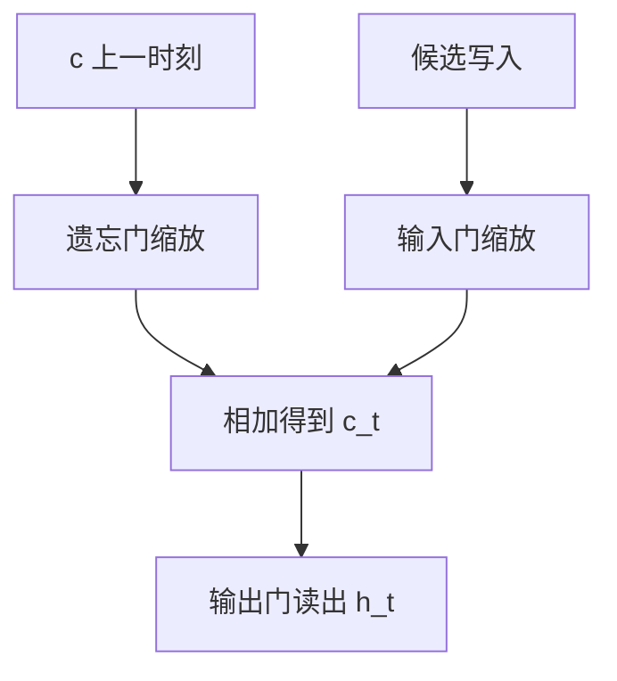

# LSTM 门控

把状态拆成可以逐维加的细胞，再用门控制写入、读出与遗忘；加法路径让时间轴上的增益可以接近 $1$。

<footer>—— 据 Hochreiter &amp; Schmidhuber, Long Short-Term Memory, Neural Computation, 1997 整理</footer>

[RNN 与长程依赖](/llm/rnn-long-range)把长程收成 $\rho^k$。本课不重推 BPTT。缺口是：普通 $h_t=\tanh(W_h h_{t-1}+\cdots)$ 的转移是乘法式的，很难把 $\rho$ 锁在 $1$。方法是 LSTM：细胞 $c_t$ 以加法和逐维门更新，$h_t$ 由 $c_t$ 经输出门读出。GRU 是下一课的简化。本课不把门写成注意力权重，也不对全体过去做一次内容寻址。

## 问题

残差课在深度上引入加法旁路。时间轴上需要类似结构：让 $c_t$ 可以选择「把 $c_{t-1}$ 几乎原样留下」。普通 RNN 没有这条加法。LSTM 引入三个门——遗忘 $f_t$、输入 $i_t$、输出 $o_t$——取值在 $(0,1)$，由当前 $x_t$ 与 $h_{t-1}$ 经 sigmoid 产生。细胞

$$
c_t=f_t\odot c_{t-1}+i_t\odot\tilde c_t,
$$

$\tilde c_t$ 是候选写入。若 $f_t\approx 1$、$i_t\approx 0$，则 $c_t\approx c_{t-1}$，反向 $\partial c_t/\partial c_{t-1}\approx 1$（在那些维上）。缺口是这条**可学习的恒等**，不是更多层 tanh。

门是逐维的，不是对整个向量一个标量。模型可以在某些坐标上长期记忆，在另一些上快速改写。这与 LayerNorm 的逐特征复位不同：门决定**是否传递过去**，LN 决定**当前尺度**。

### 门不是 softmax 注意力

三个门各自对细胞的坐标做缩放，不在时间维上归一化，也不去读任意过去的 $h_s$。信息要进入 $c$，必须在当时通过输入门；漏掉的时间步没有事后「回头去查」。把 LSTM 理解成「已经有了注意力」，后课 Bahdanau 会变成重复。本课的记忆是一条递推的细胞，寻址仍是时间顺序的。

原始 LSTM 用常数误差转盘描述加法路径。后来的遗忘门（Gers 等）让细胞能主动清空，否则 $c$ 会无限累积。本课取带遗忘门的通行写法。

## 方法

每步从 $(h_{t-1},x_t)$ 算出 $f_t,i_t,o_t,\tilde c_t$，更新 $c_t$，再 $h_t=o_t\odot\tanh(c_t)$。参数是若干张仿射（可拼成一块矩阵乘）。反向沿 $c$ 的加法路径回传，同时每步加上门对参数的局部导数。梯度裁剪仍常用，因为门与候选仍可能在短程上放大。初始化遗忘门偏置为正，使早期更倾向「记住」，是常见技巧。

## 机制

长程依赖变成「遗忘门长期接近 $1$ 的那些维」。这比强迫 $\|W_h\|_2=1$ 更容易优化，因为是否传递由数据决定，不必全局谱半径精确为 $1$。短程仍走候选与门的非线性，表达力不丢。代价是每步参数与状态大约是简单 RNN 的四倍量级，且仍不能沿时间并行。

细胞与隐状态分开，使「记得」不必等于「对外露出」：输出门可以关掉， $c$ 仍在。这在需要长时间计数或开关的模式上有用。代价是多一份要保存的状态，BPTT 的内存按 $2n$ 而不是 $n$ 涨（粗算）。初始化与裁剪仍然需要：门在 $0/1$ 两端饱和时，$\sigma'$ 接近 $0$，短程路径也会消失。

失败模式：遗忘门学成总是 $1$，细胞饱和；或总是 $0$，退化为短程网络。正则与截断 BPTT 仍会影响能学到多远。LSTM 是结构上的缓解，不是无限记忆定理。

## 边界

本课不对照 GRU 的两个门，不写 seq2seq。下一课[GRU 对照](/llm/gru-vs-lstm)用更少的门做同一件加法记忆。后课默认：需要跨许多步的状态时，用门控 RNN 而不是朴素 tanh 递推；记忆仍是一条细胞，不是对过去全体的读取。

## 小结

- LSTM 用加法更新细胞，遗忘门接近 $1$ 时时间轴增益接近 $1$。
- 三个门逐维控制遗忘、写入、读出；不是时间维上的 softmax。
- 漏掉的时间步不能事后随机访问。
- 参数与状态更贵，递推仍串行。
- 出处：Hochreiter &amp; Schmidhuber, Neural Computation, 1997。
