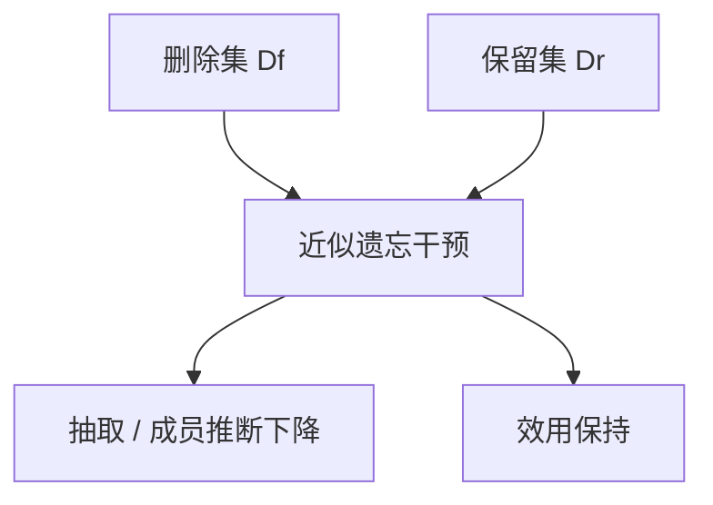

# 机器遗忘

遗忘要求模型在需删除的样本上表现得像从未见过，同时在其余分布上几乎不变；微调「再训一遍相反句子」通常两头都不满足。

<footer>—— Bourtoule 等，Machine Unlearning（IEEE S&P 2021）的 SISA 框架；LLM 侧对照 Jang 等 Knowledge Unlearning（ACL 2023）、Maini 等 TOFU（2024）</footer>

[知识注入的限度](/llm/knowledge-injection-limits)说明写入不可靠，且写入后难撤回。法规与隐私把对偶问题推上台面：用户或文档要被**删除**。Bourtoule 等人 2021 年的 Machine Unlearning 把目标形式化，并提出 SISA：分片训练以便丢弃一片再重训。LLM 不能按 SISA 原样重来——预训练太贵。Jang 等人针对语言模型做知识遗忘；Maini 等人的 TOFU 用虚构传记把「忘没忘掉」变成可测任务。本课写目标与粗方法，下一课专讲 [RMU 与 WMDP](/llm/rmu-wmdp)。

## 问题

精确遗忘（exact unlearning）要求遗忘后的模型与「从未用过删除集 $D_f$ 训练」的模型不可区分。SISA 靠分片与检查点做到近似精确。LLM 预训练没有这种分片，只能**近似遗忘**：在 $D_f$ 相关查询上降低可提取性，在保留集 $D_r$ 上保持效用。失败有两极：没忘掉（还能背出 $D_f$），和忘太多（通用能力塌，像一次破坏性全参 SFT）。

「再训相反事实」不是遗忘：ROME 式改写会留下新的错误客体，且反向探针仍可能漏出旧客体。负样本 SFT（「不要说出 X」）常变成拒绝模板，一换问法又漏。需要针对表示或针对似然的目标，而不是只改口吻。

### 遗忘对象要声明

对象可以是：某文档、某类危险能力、某个人的 PII、某一任务技能。度量完全不同。文档级看抽取与成员推断；能力级看基准是否下降而邻近能力是否保持。混用「unlearning」一词无法设计方法。

Cao 与 Yang 2015 年较早讨论使系统遗忘。现代 LLM 文献从隐私与危险能力两条线汇合。本课不涉及如何获取危险数据；只讨论已在权重里的内容如何削弱。

## 方法

粗分类，供后课展开：

1. 数据分片预留（SISA 类）：只有你从一开始分片训练才可用；对已发布基座无效。
2. 继续训练：在 $D_r$ 上复训、或对 $D_f$ 做梯度上升 / 反向 KL，需极小步长与强效用约束。
3. 表示干预：在隐藏态上把 $D_f$ 相关方向推开（RMU 属此类）。
4. 定位编辑：对事实类 $D_f$ 用 ROME 改槽——忘的是客体，不是「从未见过」的行为。
5. 任务向量相减：后课[负任务向量](/llm/negative-task-vector)。

LLM 实用流程：定义 $D_f$ 与保留评测 → 选干预 → 用抽取、成员推断、效用三栏验收 → 假设攻击者会释义与越狱式提问。SFT 工程契约仍在：对话模型要在[模板](/llm/chat-template)下测提取，不能只测补全。

学习率：梯度上升极易毁模型，应按小于[全参 SFT](/llm/full-sft-hparams) 的步子，并早停在效用悬崖前。[LoRA](/llm/lora) 遗忘只改适配器，基座里的 $D_f$ 还在——若知识在预训练里，必须动骨干或接受失败。

## 机制

成员推断与抽取利用的是模型在 $D_f$ 上的异常低损失或可复现字符串。遗忘要抬高这些字符串的损失，同时不抬高 $D_r$。全局梯度上升不区分二者。分片、表示定向、约束编辑，都是在缩小更新的支持集。这与 ROME 的局部性同一精神，对象从「一条事实槽」变成「一个文档子空间」。

近似遗忘没有密码学保证。攻击者换模板、换语言、要模型「只输出空格分隔的原文」，都可能绕过表面拒答。验收必须含这类提示，否则只是教会了礼貌拒绝。

TOFU 用虚构作者，使「真忘了」可对对照模型（从未见过该传记）比较。真实传记无法构造完美对照，度量更脏，后课[遗忘的度量](/llm/forgetting-metrics)专写。

## 边界与工程取舍

不能承诺已部署模型满足被遗忘权的数学定义。能承诺的是：在声明的攻击集上提取下降、效用不低于阈值。危险能力遗忘（WMDP）与隐私遗忘的数据与伦理约束不同，方法下节分开。回放 $D_r$ 几乎总是需要的，否则就是灾难性遗忘冒充成功。

## 小结

- 精确遗忘对已预训练 LLM 通常不可及；目标是近似：提取降、效用留。
- 声明遗忘对象（文档 / PII / 能力 / 任务），度量随之而变。
- 相反事实 SFT 与口头拒绝不是遗忘。
- 预训练里的知识不能只靠遗忘 LoRA 去掉。
- 验收须含释义与提取攻击，不只含安全套话。
- 出处：Bourtoule 等，IEEE S&P 2021；Jang 等，ACL 2023；Maini 等，TOFU，2024。
