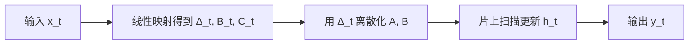

# Mamba

把历史压进固定大小的状态，并让这段动力学随输入选择该记什么。

<footer>Gu &amp; Dao，Mamba，2023</footer>

## 问题

Transformer 的自注意力把过去写成一张键值表：每一步对所有先前位置做点积，训练和预训练期的计算随序列长度平方增长，推理时的 KV 缓存随长度线性增长。长上下文、长音频、百万级 token 的扫描，都会先撞上这张表，而不是先撞上模型容量。

状态空间模型（SSM）走另一条路。连续时间里它写成

$$
h'(t) = A h(t) + B x(t),\qquad y(t) = C h(t),
$$

离散化之后每一步只拿当前输入更新一份固定大小的隐状态。序列再长，状态宽度也不涨，解码是常数状态、线性时间。S4 及其对角化变体已经证明：只要 $A$ 的结构选对（HiPPO 一类的长程记忆先验），线性 SSM 可以在长程依赖上接近注意力。

缺的是选择。线性时不变的 SSM 对所有 token 用同一套 $(\Delta, B, C)$。它无法按内容决定「这个 token 该写入状态还是该被滤掉」。语言模型的关键操作——忽略噪声、记住一个变量名、在几百步之后把它取回来——恰恰要求内容相关的记忆。注意力用 softmax 门控做到了这一点；当时的 SSM 做不到。Mamba 的问题因此非常具体：在保住线性时间和常数状态的前提下，给 SSM 装上随输入变化的选择。选择发生在时间尺度 $\Delta$ 上，不是另做一次 softmax。状态宽度仍与长度无关。

### 时不变 SSM 记不住该忘的东西

S4 把 $A$ 做成结构化、可对角化的矩阵，把卷积核预计算出来，训练时当长卷积用。它对均匀采样的信号（音频、物理轨迹）很合适，对离散、语义稀疏的语言并不合适。语言里绝大多数 token 不该进长期状态；极少数 token 必须几乎无损地活过整个上下文。固定 $\Delta$ 给出固定的时间尺度，做不到这种门控。

## 方法

Mamba 的方法是**选择性 SSM**：让离散步长 $\Delta$、输入矩阵 $B$ 和输出矩阵 $C$ 都成为当前输入 $x_t$ 的函数，同时把 $A$ 保持为与输入无关的结构化参数。选择发生在时间尺度上，而不是另起一套注意力。

### 输入门控的 $\Delta$

离散化把连续系统变成

$$
\bar A = \exp(\Delta A),\qquad \bar B = (\Delta A)^{-1}\bigl(\exp(\Delta A)-I\bigr)\,\Delta B.
$$

$\Delta$ 是步长。$\Delta$ 大，状态被当前输入强烈改写，接近「重置」；$\Delta$ 小，状态几乎沿 $A$ 的衰减滑过去，接近「跳过」。Mamba 用一层线性映射加非线性把 $\Delta_t$ 从 $x_t$ 里读出来：

$$
\Delta_t = \tau\bigl(W_\Delta x_t\bigr),
$$

其中 $\tau$ 是 softplus 一类保证正步长的函数。$B_t$、$C_t$ 同样由 $x_t$ 线性得到。于是每一步的离散系统 $(\bar A_t, \bar B_t, \bar C_t)$ 都随内容而变。这就是「随输入门控 $\Delta$」：门不在 softmax 上，而在 SSM 的时间常数上。

$A$ 仍是对角或分块对角的可学习参数，不随 $t$ 变。把 $A$ 也做成输入相关会破坏扫描的结构化，也没有被证明有必要。选择集中在 $\Delta, B, C$ 上，是容量和可实现性之间的切口。$\Delta$ 大则当前输入改写状态，$\Delta$ 小则跳过。门控的是步长，不是注意力权重。

### 不再写成卷积

时不变 SSM 等价于一条与输入无关的卷积核，可以 FFT。一旦 $\Delta_t, B_t$ 随 $t$ 变，卷积核不再共享，FFT 路径断了。剩下的算法是**线性扫描**：

$$
h_t = \bar A_t h_{t-1} + \bar B_t x_t,\qquad y_t = C_t h_t.
$$

扫描是串行的，但每步是矩阵–向量，状态宽度与序列长度无关。这正是用选择换掉卷积加速之后，必须重新设计的计算图。

## 机制

### 硬件感知扫描

朴素扫描会把形状为 $(B, L, D, N)$ 的完整状态写进 HBM，带宽先炸。Mamba 的实现把扫描做在 SRAM 里：按块读入 $(x, \Delta, B, C)$，在片上完成离散化与扫描，只把 $y$ 写回。中间状态不落全局内存。这不是新的数值方法，是把 SSM 的常数状态优势真的映射到 GPU 的存储层次上。没有这一步，选择性 SSM 在墙上时钟上打不过注意力的 FlashAttention。线性时间是算法复杂度；墙上时钟还取决于是否把状态留在片上。两者经常被混为一谈。

训练仍是 $O(LDN)$，对长度 $L$ 线性；推理时每生成一个 token 只更新一份状态，KV 缓存不随已生成长度增长。状态大小是 $D \times N$（模型宽 × SSM 状态宽），与上下文长度脱钩。

### 选择在语言模型里做什么

门控 $\Delta$ 的经验图像是：空格、标点、低信息 token 对应很小的 $\Delta$，状态几乎不更新；罕见专名、括号配对、需要长程拷贝的 token 对应大 $\Delta$，被写进状态。$B_t$ 决定写入方向，$C_t$ 决定读出。这与注意力的「对哪些键分配质量」同类，但压缩进了固定宽度的状态，而不是保留全部键值。

代价立刻清楚：状态是有损压缩。需要精确拷贝很长一段原文、或在上下文里做任意位置的 associative recall 时，固定宽度会丢细节。Mamba 用较大的 $N$ 和更深的堆叠缓解，但不能在信息论上等价于全量 KV。

## 边界与工程取舍

Mamba 解决的是**序列层的复杂度形态**，不是语言模型的全部。它在信息密集、需要精确检索的任务上，仍可能输给同规模的 Transformer。工程上常见的取舍包括：状态宽 $N$ 与通道宽 $D$ 的乘积决定显存，不能无代价加大；扫描的并行度不如 GEMM，短序列上未必更快；与 MoE、局部注意力混用时，收益来自「把全局精确检索留给少数注意力层」，而不是 SSM 单层取代一切。

实现层面，离散化的数值要稳定，$\Delta$ 的下界不能到零，否则梯度消失。推理时状态必须和训练时同一套离散化，否则长生成会漂。这些是把论文里的扫描变成可训练层时就会碰到的细节，不是架构之外的附录。

另一条边界是评测口径。线性时间只在足够长的 $L$ 上相对注意力有意义；短上下文、大 batch 的训练，瓶颈往往在 MLP 和通信，不在注意力。用 Mamba 替换 Transformer，要先问上下文是否真的长、KV 是否真的是墙。

## 小结

Mamba（Gu & Dao，2023）给 SSM 装上随输入变化的 $\Delta, B, C$，用内容选择代替时不变卷积，再用硬件感知扫描保住线性时间和常数状态。它把「该记什么」从 softmax 搬到了时间尺度上；它没有把精确的随机访问搬进固定宽度的状态。后续的 Mamba-2、Griffin、Jamba，都是在这条选择与压缩的轴上继续切，而不是回到二次注意力本身。
