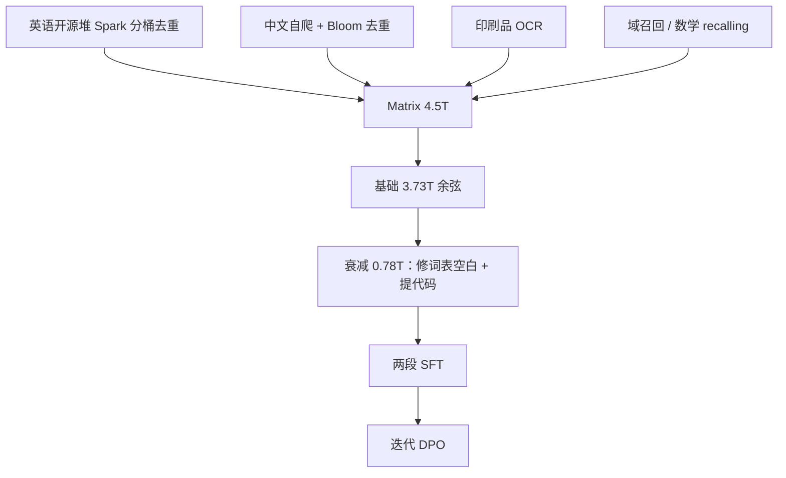

# MAP-Neo 报告

Chinchilla 拟合在多样高质量语料、数据量到数 T 时偏平；我们给损失加一项 $-d\log D$，用来指导 7B 的配比，而不是宣布推翻 Hoffmann 曲线。

<footer>—— Zhang 等，MAP-Neo，arXiv:2405.19327</footer>

[MAP-Neo](/llm/map-neo) 已经交代 7B/2B、4.5T Matrix、8192 与透明度主张。技术报告的后半才是可复现手册：Spark 清洗、OCR、数学 recalling、**基础阶段约 3.73T + 衰减阶段约 0.78T**、以及用 250M/460M/980M 拟合出来的 **NEO Scaling Law**。本篇写这些附录级选择，不重复系列定位。

## 问题

透明英语 7B（Pythia、Amber、[OLMo](/llm/olmo-paper)）在 HumanEval、GSM8K、MMLU、C-EVAL 上仍明显落后工业开权重。MAP-Neo 要把双语、代码与数学拉到可引用对照，必须回答两件 Chinchilla 回答不了的事：异构语料上损失随 $D$ 的形状，以及「基础阶段学通顺、衰减阶段补代码」会不会把已经学到的中文知识冲掉。

分词器是另一条事故链。SentencePiece 默认 `remove extra whitespaces=True` 会把缩进塌成单空格。基础阶段若没关，推理与数学仍可涨、代码指标抖动——这不是宽度能补的。报告把修复放在衰减阶段换固定版词表，而不是推倒重来 4.5T。

### Matrix：网页过半、代码约两成、中英分桶去重

Matrix 发布时自称最大的透明预训练堆之一（约 4.5T / 卡片写 4690B token）。英语侧是对 RedPajama-V2、Dolma CC、CulturaX、Amber/RefinedWeb、SlimPajama 等的再过滤：精确文档去重、MinHash LSH、段落与超长子串。因内存不够，Spark 把文本分桶再逐桶去重。中文约 80% 自爬，其余 CCI、ChineseWebText、万卷、Yayi、SkyPile；Spark 难部署时改用 Bloom Filter（假阳率 0.001）做精确去重。另有印刷品 OCR：Pix2Text/TrOCR 公式、PP-OCRv4 文字、SLANet 表；页眉页脚丢弃。主题召回跟 DeepSeek-Math 式 recalling，从网页里把高教育价值域捞回来。

MinHash 与 $k=50$ 子串会误删法律条款、许可证头一类合法重复。Bloom Filter 假阳会丢掉本应保留的中文页。透明的是阈值与代码，不是「零误删」。

## 方法

### 两阶段：3726B 余弦，再 778B 指数衰减

基础阶段：学习率从 $2\times 10^{-5}$ 线性升到 $2\times 10^{-4}$（2k 步），再余弦回到 $2\times 10^{-5}$（约 365k 步），处理约 **3726B** token。代码当时用 Stack V1 并重复两次以凑配比。衰减阶段：学习率从 $2\times 10^{-4}$ 指数衰减约 148k 步（半衰期为衰减步数的一半，写法对齐 MiniCPM），约 **778B** token，提高书籍、裁判文书、政府文件与指令风格密度；代码换成 Stack V2，代码占比从约 14.77% 提到约 17.04%。7B 在 64 节点 512 张 H800 上训，张量并行 2；他们改 Megatron 以处理超大语料溢出，并做坏节点隔离。

对齐：SFT 两段——先 200 万+ 指令（OpenHermes 2.5 去 TheoremQA、Code-Feedback、WebInstructSub 子集）3 个 epoch 打基础，再 10 万+ 真实多轮加 5k 数学代码回放 1 个 epoch 打聊天。然后迭代 DPO（Nectar 提示、Starling-RM-34B，第三轮加中文偏好）。序列 8192，batch 512。

$$
L(N,D)=\frac{A}{N^{\alpha}}+\frac{B}{D^{\beta}}+E-d\cdot\log D
$$

NEO 律在 Chinchilla 三项后再减 $d\log D$。代理模型 250M/460M/980M 各吃 1000B，用来外推 7.8B 在 phase-1 的 **3.07T**。$d$ 实验里大约 $10^{-2}$ 到 $3\times 10^{-2}$；作者承认 $D\to\infty$ 时公式无下界，只在「数 T 到百 T 以下」当局部修正。Huber $\delta=10^{-3}$ 与 $R^2$ 显示比纯 Chinchilla 更贴实际损失——多样语料在 $D$ 大时掉点比 $B/D^{\beta}$ 更快。

## 机制

NEO 项的机制主张很窄：异构、高质量、可召回的混合，使大 $D$ 时损失比网页堆的 Chinchilla 拟合更陡。它解释的是这条 Matrix 配比，用来决定 7B 该吃多少、衰减段要不要加代码，而不是一条新物理定律。对 DeepSeek-67B 一类公开曲线，作者说 Chinchilla 会在 $D$ 小时低估损失、$N$ 与 $D$ 都大时高估；NEO 更贴。不要外推到任意 MoE 或纯代码语料。

词表空白开关是机制级事故：代码缩进是语法。基础阶段 QA 与数学仍可涨，说明那些任务不依赖空格；HumanEval 依赖。衰减段换 Stack V2 并提高代码比，是在已经修好的 token 上让表示进盆地，不是突然多了一层 MLP。中文网页召回同样走数据轴。

报告 Table 1 自比：MAP-Neo-7B 在 C-EVAL / MMLU / GSM8K / HumanEval 上高于所列透明模型，并在部分项接近 Llama 3 8B / Mistral。这是他们统一评测管线，转引要写协议。MMLU 58 对 OLMo 53 是同一张表里的数，不是跨论文拼接。

### 基础设施不是聊天模型卡

H800、NCCL、IB、NVSwitch 与双层 Clos 是 512 卡作业跑完的条件。透明的一半是 Matrix，另一半是 Megatron 溢出补丁与坏节点隔离。别人用上游 Megatron 重训同一堆，会在他们修过的边界上失败。迭代 DPO 用的 Starling / Yi 奖励模型把另一条模型的偏好带进来：透明度在「用了哪份 RM」上是开的，在 RM 自身数据上并不开。

## 边界与工程取舍

4.5T 的存储与清洗需要集群。OCR 错误会进下一词。衰减段 778B 含指令风格数据，和「纯预训练」口径不同，对比 OLMo 的 2.46T 网页时要声明。2B 为 MQA、7B 满头，不能同一套 KV 配置。从别的 7B 词表热启会错位。NEO 公式在 $D$ 极大时理论无下界，不能当外推到 100T 的许可证。

「第一个性能可比的全开源双语 LLM」是 2024 年中的自我定位，对照透明英语模型与部分开权重 7B，不要扩写成超过所有 2025 年开源 7B。衰减段 778B 里指令风格数据会让「纯预训练底座」与 OLMo 的 2.46T 网页不好直接比损失；要比就声明阶段。SFT 第二段只加 5k 数学代码回放，是怕聊天数据把 HumanEval 冲掉——这是配比护栏，不是新对齐算法。从别的 7B 词表热启会在空白与数字切分上同时错位，检查点也接不上他们 Megatron 改过的溢出边界。NEO 律的代理模型只吃 1000B，用来外推 7B 的 3T 级 phase-1；把代理损失直接当成 7B 的 MMLU 预测会跳过「能力不等于损失」这一层。

仓库 `multimodal-art-projection/MAP-NEO`；语料 `m-a-p/Matrix`。v4 于 2024-07。缩放律代理检查点（250M/460M/980M）与 7B 不是同一条产品线，不要把代理 MMLU 当成 7B。

## 小结

- 报告把 4.5T 拆成基础约 3.73T 与衰减约 0.78T；衰减段修词表空白、换 Stack V2、提高代码与高质量回放。
- Matrix 的英语走 Spark 分桶去重，中文常用 Bloom Filter；另含 OCR 与域召回。
- NEO Scaling Law 为 Chinchilla 加 $-d\log D$，用 250M–980M 拟合指导 7B，适用窗口是数 T 级多样语料。
- 对齐为两段 SFT 加迭代 DPO；训练栈含改过的 Megatron。
- 出处：Zhang 等，*MAP-Neo: Highly Capable and Transparent Bilingual Large Language Model Series*，arXiv:2405.19327，2024。
