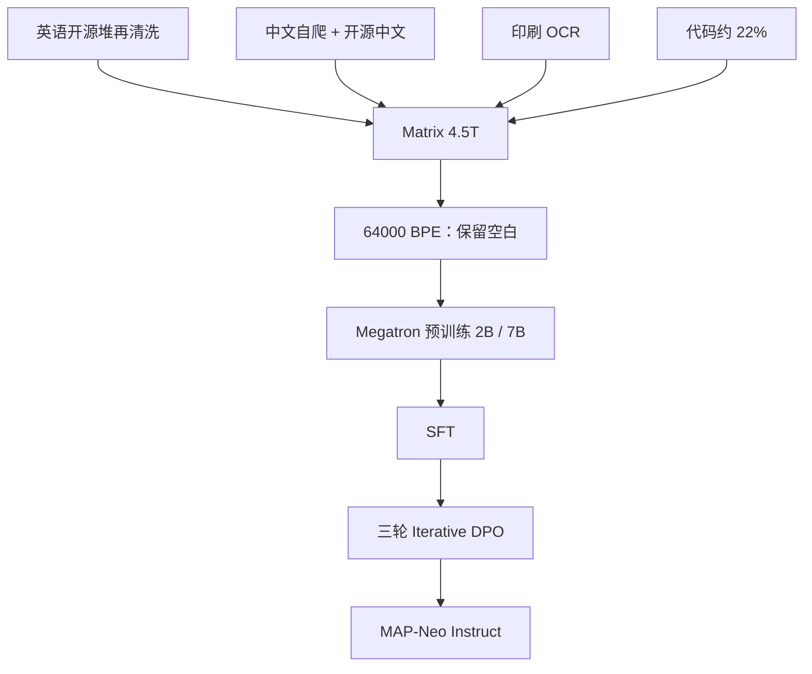

# MAP-Neo

    
真正开放不只是最后一份权重：语料、清洗流水线、中间检查点与训练代码要能一起复现一条中英双语 7B。

    <footer>—— Zhang 等，MAP-Neo，arXiv:2405.19327</footer>

M-A-P、滑铁卢大学、武汉人工智能研究院与 01.AI 等合作的 **MAP-Neo**，针对「开权重但不开数据」与「开数据但打不过工业 7B」两条缝。2024 年报告给出从零预训练的 **7B**（以及 **2B**）中英双语稠密模型，训在 **4.5T** 高质量 token 上，并开源 Matrix 语料、清洗工具、中间检查点、分词器与基于 Megatron 改过的训练栈。它要证明：透明 LLM 不必停在 Pythia / Amber / [OLMo](/llm/olmo2) 的英语学业分上，中文、数学与代码可以同时靠近当时的 Mistral / Llama 3 开权重点。更细的数据附录与标度律展开见后续的 [MAP-Neo 报告](/llm/map-neo-report)；本篇写系列主张与可核对的结构。

## 问题

Llama 3、Mistral 开权重推动了微调生态，但预训练混合、中间损失尖峰、分词器空格处理对社区仍是黑盒。BLOOM、Pythia、LLM360、OLMo 把代码与语料打开，却在 HumanEval、GSM8K、MMLU、CMMLU 上明显落后工业 7B。MAP-Neo 的问题是：在 **双语、含大量代码** 的 4.5T 上，把透明度做到 OLMo 同级，同时把推理与中文知识拉到可引用的对照表。

第二个问题是分词器。中文压缩率低、代码缩进若被 SentencePiece 默认「合并多余空白」吃掉，预训练曲线上数学会涨、代码会抖。这不是模型宽度能补的。

### 7B 用满头注意力，2B 才用 MQA

解码器 Transformer，上下文 **8192**。7B：28 层，$d=3072$，16 头，FFN $d_{\mathrm{ff}}=24576$（报告写恒为 $8\times d_{\mathrm{model}}$），**KV 头 16**（多头）。2B：18 层，$d=2048$，8 查询头，**KV 头 1**（[MQA](/llm/gqa)）。RoPE、RMSNorm、[SwiGLU](/llm/swiglu)。词表 **64000**，BPE，数字切成单个数字，未知 UTF-8 回退到字节；`remove extra whitespaces` 必须关掉，否则缩进塌成单空格。

7B 不是 GQA。不要把 2B 的 MQA 写成全系列。FFN 按 $8\times d$ 计的是 SwiGLU 的宽口径，实现里门控投影是否「各一半」要看配置文件，和 Gemma 报告里的计数差同类。

## 方法

**Matrix** 语料：报告称发布时是最大的透明预训练堆之一。构成大约网页（Common Crawl 系）过半、代码约 22%，其余论文、书籍与印刷品 OCR。英语侧是对 RedPajama-V2、Dolma CC、CulturaX、Amber/RefinedWeb、SlimPajama 等的再过滤与多层去重（精确文档、MinHash LSH、段落、超长子串）。中文侧约 80% 自爬网页，其余 CCI、ChineseWebText、万卷、Yayi、SkyPile 等。另有印刷品 OCR 管线，以及按主题从网页召回高质量域数据（DeepSeek-Math 式 recalling）。

预训练分基础阶段与衰减阶段，学习率 $2\times 10^{-4}$，全局 batch 1024 序列。7B 在 64 节点、512 张 H800 上训，张量并行 2，优化器状态类似 ZeRO-1；2B 用 256 卡、TP=1。他们改 Megatron-LM 以处理超大语料溢出，并做坏节点隔离与检查点恢复。报告提出 **NEO Scaling Law**，强调多源（中英代码混合）上 Chinchilla 拟合会在大模型、大数据时偏，用来指导 7B 的数据配比，而不是宣布推翻 Hoffmann 曲线。

### 对齐：SFT 之后三轮 Iterative DPO

聊天模型跟 Storm-7B 路线做迭代 DPO：每轮生成成对回复、奖励模型打分、DPO 更新。提示集用 Nectar，奖励模型 Starling-RM-34B；第三轮加入中文偏好数据以保住双语。中间检查点与评估代码一并公开，避免「只有最终 Instruct 一个点」。

## 机制

透明的意义是：别人可以问「C-EVAL 这一分是中文网页召回、是衰减阶段，还是 DPO 第三轮」。报告 Table 1 用同一套评测口径对比：MAP-Neo-7B 在 C-EVAL / MMLU / GSM8K / HumanEval 上高于所列透明模型（OLMo-7B、Amber、Pythia），并在部分项接近或超过 Llama 2/3 与 Mistral 的开权重 7B/8B——这是**他们自己的评测管线**，转引时要写协议。NEO 标度律的机制主张是：异构语料下损失随 $D$ 的饱和形状与单语网页堆不同，用小模型（250M–980M）拟合再外推 7B；它解释的是这条数据混合，不是普适新物理。

分词器空白开关是机制级事故：代码缩进是语法，不是「多余空白」。第一阶段没关时，推理与数学仍可涨、代码基准波动；第二阶段修好后代码指标才稳住。这比再堆 4 层 MLP 更决定 HumanEval 能不能看。2B 用 MQA 是小容量上 KV 冗余不值得；7B 用满头，是质量优先、服务 KV 另算。

「第一个性能可比的全开源双语 LLM」是论文自我定位，对照的是当时透明英语模型与部分开权重 7B。不要扩写成超过所有 2025 年开源 7B。后续独立的 map-neo-report 条目写更长附录，本篇不把 Spark 清洗伪代码展开。

### 和 OLMo、Yi、工业开权重

要英语科学可复现、Dolma 工具链，选 OLMo。要中英都强且数据全开，MAP-Neo 是 2024 年中少数选项。01.AI 的 Yi 是合作方之一，但 Yi 本身不是 Matrix 配方；不要把 Yi-34B 奖励模型误当成 MAP-Neo 底座。工业开权重（Llama 3 8B、Mistral）仍然可能在英语综合榜领先，它们不开 4.5T 原盘。

## 边界与工程取舍

4.5T 的存储与清洗需要集群，不是笔记本可复现。OCR 质量决定印刷品子集，错误会进下一词。MinHash 阈值与子串 $k=50$ 会误删合法重复（法律条款、代码头）。迭代 DPO 用的 Starling/Yi 奖励模型把另一条模型的偏好带进来，透明度在「我们用了哪份 RM」上是开的，在 RM 自身数据上并不开。8192 是训练长度，不是 128K 外推方案。

从别的 7B 词表热启 MAP-Neo 会错位。Megatron 修改若没跟上他们的溢出补丁，大语料 loader 会在他们描述过的边界上再次炸。评测不要混 OpenCompass 与 lm-eval 的 shot 设定。

### 衰减阶段补的是配比，不是新架构

报告把预训练分成基础阶段与衰减阶段，学习率同为 $2\times 10^{-4}$ 量级，变的是数据与是否预热。代码指标在修好分词器空白之后，往往在衰减段才拉直——读者容易把这误读成「最后再堆一层 MLP」。机制其实是：前面学到的表示终于能在干净缩进的 token 上对齐 HumanEval 风格的空格，衰减只是降低噪声、让已经对齐的方向进盆地。中文网页召回与数学 recalling 同样主要在数据轴上起作用。若复现时只下载最终权重、不跑衰减段的混合，C-EVAL 与 GSM8K 的对照表会对不上他们论文里的那一列。

基础设施一节写了 H800、NCCL、IB、NVSwitch 与双层 Clos，那些是 512 卡作业能跑完的条件，不是 7B 推理用户需要的。把机房拓扑抄进聊天模型卡没有意义；把「我们改过 Megatron 溢出」漏掉，别人用上游 Megatron 重训 Matrix 却会在他们修过的边界上失败。透明的一半是数据，另一半是这些并不好看的工程补丁。

真实编号：Zhang 等 *MAP-Neo: Highly Capable and Transparent Bilingual Large Language Model Series*，arXiv:2405.19327（v4 于 2024-07）。不要给 2B 单独立号。仓库：`multimodal-art-projection/MAP-NEO`。

## 小结

- MAP-Neo 是全开源中英 7B（及 2B），4.5T Matrix 语料，8192 上下文，SwiGLU + RMSNorm + RoPE。
- 7B 满头注意力，2B 为 MQA；分词器必须保留代码空白。
- 透明度覆盖语料、清洗、检查点与训练代码；对齐为 SFT + 迭代 DPO。
- 出处：Zhang 等，arXiv:2405.19327，2024。
