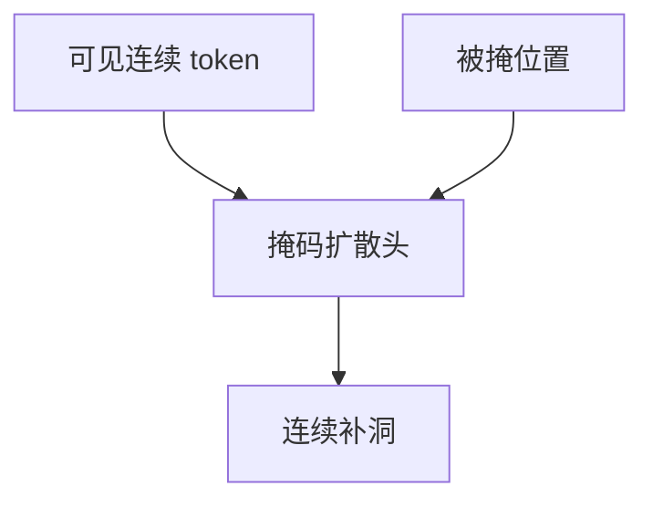

# MAR 掩码自回归

不必先把图拧成码本下标。对连续视觉 token 做掩码，用扩散损失补洞，自回归结构仍在，量化可以拿掉。

<footer>—— Li 等 Autoregressive Image Generation without Vector Quantization（MAR）；掩码先行见 Chang 等 MaskGIT</footer>

[上一课](/llm/var-next-scale)仍在离散尺度上走。缺口是量化本身：[VQGAN](/llm/vqgan) 的词表方便 softmax，但丢掉的信息回不来。MAR 把生成写成对连续 token 的掩码预测，补洞用扩散（或流）而不是词表 CE。后课统一模型默认：理解已经用连续 patch，生成也可以不必换一套码。

## 问题

MaskGIT 在离散码上随机掩码、并行预测被掩位置，推理逐步降掩码率。MAR 把「被掩位置」换成连续向量，用小型扩散头按条件（未掩可见 token + 位置）去噪出连续值。于是：没有码本崩溃，梯度是稠密的，和理解侧 [ViT](/llm/vit-as-encoder) 连续特征更同构。

代价是不能再用标准 LM softmax 做统一词表；似然接口变成掩码 + 连续去噪，和纯文本 CE 仍异质。

掩码率日程决定从粗结构到细节，类似尺度课程，但不显式金字塔码。随机掩码与光栅顺序都是分解，只是条件集不同。

## 方法

训练：对连续 tokenizer 输出随机掩码，扩散损失只加在被掩位置。推理：从全掩或噪声开始，逐步揭示。文本条件与 CFG 可加在扩散头上。评测对照同骨干的 VQ-AR：看细字与纹理是否因去掉量化而升，以及步数是否可接受。

## 机制

可见 token 提供双向上下文（非因果），比 raster 更早看见四周，这是 MaskGIT 家族相对因果 AR 的几何优势。连续扩散补洞避免 softmax 对码字的硬选择，细节可以落在码本之间。与整图 [DDPM](/llm/ddpm) 的差别是：条件来自部分已揭示的视觉 token，而不是只有时间 $t$。

## 边界

统一到单一 Transformer 词表仍未完成。下一课 Janus / Show-o 在理解与生成之间拆或缝编码器。

## 小结

- MAR 用掩码 + 连续扩散损失做图像生成，去掉 VQ 词表。
- 双向可见上下文利于结构；接口与文本 CE 仍不同。
- 理解用的连续 token 与这条生成路更近。
- 出处：Li 等 MAR；Chang 等 MaskGIT。
