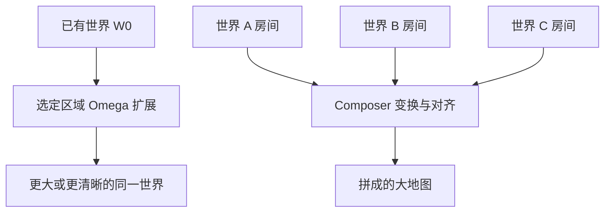

# 区域扩展与 Composer 拼世界大图

生成之后可选定区域一步扩展；也可以在 composer 模式里由你决定把哪些世界、以何种相对布局拼成极大空间。

<footer>—— World Labs，Marble: A Multimodal World Model</footer>

单个生成世界有边界：角落糊、可走区域不够、或你其实想要一整栋而不是一间。Marble 给出两条把世界变大的路，不要混成一种操作。区域扩展是在**已经存在的同一世界**上指定一块地方，让模型长出更多内容或把糊掉的局部修清晰。Composer（Studio Compose）是把**多个已生成世界**拿来平移、旋转、缩放，由用户决定谁挨着谁，拼成一张更大的可漫游图。本篇只写这两条放大术，以及何时该扩展、何时该另开一个世界再拼。

## 问题

生成器在训练与推理上都有有效体积。一次提示对应一块能维持细节的空间；再往外，溅射变稀、墙面解体、远桌背面发糊。用户的自然反应是「把提示写成一整座城市」。那会让模型在同一份预算里摊薄细节，得到一张大而空的皮。正确的问题是：新内容应该从当前世界的边界长出去，还是本来就是另一个房间、另一套光照，应作为独立世界再拼接。

扩展与拼接的失败模式不同。扩展失败是接缝处风格断裂、或选区里原有家具被改没。拼接失败是地板高度错层、门口对不上、两套天空盒在接缝闪烁。若用扩展去「长出隔壁完全不同的展厅」，等于要求同一生成条件吞下两套提示；若用拼接去「把这张桌子的糊背面变清晰」，等于用另一份世界去贴一块局部，光照与尺度很难贴平。

### 谁拥有布局权

扩展时布局权仍在模型：你指定区域，它决定区域内长什么，只受原世界上下文约束。拼接时布局权在人：选哪些世界、相对怎么放，文档写明构图完全由你控制。整栋房子没有「上传平面图自动接房间」的提示类型——图像与自动布局重建的是单一空间，多房间要各自生成再在 Compose 里按你的平面图放置。这是产品边界，不是暂时缺少的一句咒语。

扩展也能用于提清：远角、桌背、原本解体成伪影的区域，扩一次可以重新变实。这时目的不是更大，而是同一体积内更高的局部密度。选区仍应连续、与原结构有重叠，否则提清会变成另贴一块补丁。

## 方法

### 区域扩展：在 $W$ 上追加体积

记当前世界为 $W_0$，用户选出区域 $\Omega$（空间中的盒子或刷选）。扩展算子产生 $W_1$，使得在 $\Omega$ 外尽量

$$
W_1\big|_{\Omega^c}\approx W_0\big|_{\Omega^c},
$$

在 $\Omega$ 内补充几何与外观，并与边界 $\partial\Omega$ 连续。一步完成，用户控制的是「哪一块」，不是区内每一件道具。扩展可以沿可走方向加大足迹，也可以指向已经在足迹内但质量差的角落。检验应走：从旧区域走进新区，地板是否一平、风格是否还是原来那套灯。

### Composer：多 $W$ 的刚体装配

Composer 把世界当可变换的实例。对世界 $W^{(k)}$ 施加相似变换 $T_k$（位移、旋转、缩放），拼成

$$
W_{\mathrm{big}}=\bigcup_k T_k(W^{(k)}).
$$

重叠处需要处理溅射冲突：文档提供笔刷或盒遮罩删除多余溅射、对齐地面、让门洞搭上。没有自动布尔「按平面图挖门」。人负责把共享墙重叠、把楼板齐平，再走一圈看过渡。溅射计数有配额（文档示例量级为数十万到数百万 splats 的上限显示），拼得越大越要删重叠、控密度。

复制世界再挪去填缝，是拼接里的合法手法：同一地砖世界复制一份去补缺口，再用遮罩去掉重叠。这仍是装配，不是扩展。扩展不会在场景树里多出一个可单独变换的实例。

## 机制

扩展依赖原世界当条件：模型看见 $\Omega$ 外的溅射与外观，在区内做有条件的生成。因此选区应包含足够的「旧」上下文当种子。选一块与原场景脱开的飞地，条件弱，结果更像在空白处新生成，接缝会硬。提清之所以有效，是因为糊区周围仍有干净结构可借。机制上扩展更接近局部重生成，而不是把分辨率滑条拉高；预算会重新花在 $\Omega$ 上。

拼接几乎不调用生成器去「理解整栋建筑」。它是空间编辑：实例变换、遮罩、地面齐平。一致性完全来自人的摆放与事后清理。所以文档强调：对齐地面高度、检查重叠、匹配光照、亲自走过渡。光照匹配尤其不能自动化成一条「融合」按钮——两间房若一个阴天一个钨丝灯，拼在一起会有分界。应在各自生成时就用相近的风格句子，而不是指望 Compose 当调色台。

### 何时扩展、何时新开世界再拼

同一风格、同一连续空间、只是体积不够或局部烂：扩展。功能不同、光照不同、本来就是下一间房、或你已经有平面图上的分间：各生成再拼。试图用一次扩展长出整层楼，会把 $\Omega$ 撑得太大，条件场稀释，新区开始像另一个提示。试图把完全相同的一间房扩展成「旁边再来一间一样的」，不如复制实例——那是拼接的活。

Auto Layout 与 Composer 的分工：前者在一次生成里缝多张图成**一个**空间；后者在生成之后把**多个**空间摆到一起。多图缝解决不了「整栋房」，Composer 解决不了「这张图和那张图其实是同一客厅的两面」。

## 边界与工程取舍

扩展不能保证 $\Omega$ 外绝对不变。局部重生成可能改到边界附近的物体。若门外的椅子必须锁死，选区不要贴太近，或接受事后再编辑。扩展也不是物理仿真：长出去的走廊不会自动接到你没选中的另一侧门口。闭环还是要靠人看。

Composer 不是版本管理器里的程序化关卡生成。变换是刚体为主，弯曲世界去贴曲面地形不是它的合同。配额会挡住「无无限城市」：溅射上限到了就要降密度或拆成多个导出件。导出后的大地图在引擎里仍可能要再切流式加载——那是游戏侧的事，Marble 只负责把生成世界装配到你能走通。

不要用拼接冒充测量上的整栋扫描。每间房的生成误差会在门口累积成错位，人眼可以靠重叠墙遮过去，机器人导航会撞墙。需要度量准确的设施，应在引擎里用自己的图纸重建，把 Marble 世界当外观壳。两条放大术服务的是可走通的创作体积，不是地籍。

本篇不写 Chisel 如何为每个房间摆体块，也不写导出网格。放大术假设你已经有一个或多个世界。先有合格的单世界，再扩展或再拼；在烂世界上放大，只是把缝和糊放大。

## 小结

- 变大有两条路：对同一世界做区域扩展；用 Composer 把多个世界按你的布局装配。
- 扩展由模型填选区，宜用于连续空间加体积或提清局部。
- 拼接由人控制变换与接缝，宜用于多房间、多功能区；没有自动读平面图接口。
- 重叠溅射要删，地面要齐，光照应在各自生成时就靠近。
- 配额限制无限拼城；度量级整栋扫描不是这两条术的合同。
- 出处：World Labs Marble 博文「Building Large Worlds by Expanding and Composing」；文档 Studio Compose 与扩展相关说明。
