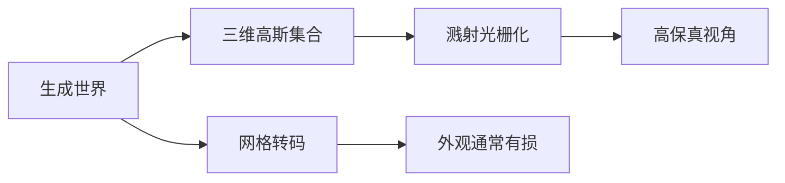

# 三维高斯溅射作为高保真表示

高斯溅射是 Marble 世界保真度最高的表示：场景是大量半透明粒子，可在浏览器里渲染。

<footer>—— World Labs，Marble: A Multimodal World Model</footer>

Marble 把生成结果写成可带走的三维，而不是只留在服务端的一次会话。在可选表示里，三维高斯溅射（3D Gaussian Splatting, 3DGS）被指定为高保真外观通道：用大量各向异性的半透明高斯粒子描述场景，光栅化后接近训练或生成时看到的观感。网格更利于碰撞与工业软件，但要达到同样的视效通常更贵、更易在细结构和半透明上让步。本篇只写溅射作为高保真表示：它是什么、为何适合生成式世界、以及保真与可编辑性之间的账。浏览器里的具体渲染器是另一件事。

## 问题

神经辐射场把世界写成沿射线积分的连续场，画质可以很高，查询一次新视角却要很多次网络前向，不适合当「导出后随便转」的资产。三角网格反过来：到处都能进引擎，但高视效依赖密几何加复杂材质；生成模型直接吐出这种资产，拓扑和 UV 往往经不起看。需要一种表示，既是真正的三维（转相机不是再跑生成），又能以可接受的速度画出细小结构和视角相关外观。

Kerbl 等人 2023 年的工作把场景参数化成三维高斯集合，用投影与 $\alpha$ 混合做实时辐射场渲染，证明这条路可以在显式原语上追上神经场的观感，同时保持光栅化的速度。生成式世界产品选它当最高保真导出，是因为它同时满足「是资产」和「看起来像生成时那样」。问题变成：这些粒子在几何上有多「真」，以及何时应降级到网格。

### 粒子不是实体碰撞体

每个高斯有位置、协方差（椭球形状）、不透明度与颜色（可带视角项）。密集叠在一起时，人眼看到的是表面；物理引擎看到的是一堆没有干净内外的概率云。高保真因此专指**外观**保真：新视角下的光度一致性、细结构、半透明。它不自动等于可仿真的实体。把溅射点数当成「几何分辨率」会误导：点数多主要是为了把外观残差打下去，不是为了给出流形表面。

Kerbl et al., *3D Gaussian Splatting for Real-Time Radiance Field Rendering*，SIGGRAPH / ACM TOG 2023。不要给 Marble 的产品导出另编一篇不存在的 3DGS 论文号；产品用的是这一表示族。

## 方法

### 原语与图像形成

记第 $i$ 个高斯均值为 $\mu_i$，协方差 $\Sigma_i$，不透明度 $o_i$。投影到相机后，在像素上按深度排序做 $\alpha$ 混合。沿一条像素上的序 $1\ldots N$，

$$
C=\sum_{i=1}^{N} c_i\,\alpha_i\prod_{j=1}^{i-1}(1-\alpha_j),
$$

其中 $\alpha_i$ 由 $o_i$ 与二维投影高斯在该像素的值决定，$c_i$ 是该高斯的颜色。这与体积渲染的前向混合同构，但求值是溅射而不是沿射线步进神经网络。实时来自：原语显式、可排序、可在 GPU 上光栅化。

Marble 世界导出为这样的集合。生成器直接优化或预测这些参数，使在训练相机或提示约束下 $C$ 好看。用户带走的文件就是粒子云，而不是必须带着原生成网络才能重绘。配额上，产品界面会显示当前 splats 用量与上限——大世界、细表面会先碰到计数墙，而不是先碰到「网格面数」墙。

### 为何生成式世界偏爱它

生成过程本来就在多视角外观上受监督（提示图、视频帧、或自身渲染）。3DGS 的参数与这项损失同构：改一个高斯，立刻改附近像素。网格还要额外过重建、重拓扑、烘焙法线，每一步都丢生成器真正拟合过的外观。半透明、绒毛、远景的体积感，用高斯叠层比用切面更容易装。高保真在这里的意思是：少做一层「变成工业网格」的有损转码。

同一世界仍可再导出网格。那是另一条合同：能进 DCC 与碰撞。本篇的命题只是：若问「看起来最像 Marble 里看到的那个世界」，答案是溅射，不是简化碰撞体。

## 机制

各向异性协方差让单个原语能贴薄表面：沿切向铺开、沿法向压扁，用很少点数近似一块墙。各向同性点云要密一个数量级才有类似的边。这是保真对参数效率的来源。优化或生成时，分裂与剪枝控制密度：需要细节的地方多高斯，平坦墙面少高斯。生成式管线若省略自适应密度，大平面会要么过拟合成斑，要么糊成一团。

视角相关颜色（球谐等）让高光随相机走，而不把高光烤死在表面。这对「看起来真」贡献很大，对「这是什么几何」贡献很小——换光照或进路径追踪时，烤进去的高光会错。高保真因此有范围：保的是在类似观察条件下的渲染，不是任意重打光的物理材质。产品用溅射预览世界，正是接受这一范围。

### 与网格的信息差

网格要的是表面：流形、法线、可选 UV。从高斯抽表面是额外的几何推断，必然平滑掉薄结构和半透明层。信息差不是实现马虎，是表示轴不同。若先网格后贴图去追溅射观感，等于放弃 3DGS 的主优势。正确的分层是：外观主本在高斯；需要实体时另出视觉网格与碰撞网格。后文专写双网格；此处只需承认高保真通道不与碰撞通道共用一份原语。

点数上限会逼你在「更大」和「更清」之间选。Composer 拼大地图时尤其明显：重叠不删，计数先爆，保真在接缝处反而下降——重影不是更高保真。

## 边界与工程取舍

3DGS 不是度量重建的替代物。椭球中心可以漂在真实表面附近，尺度误差对视觉不敏感、对机械臂敏感。需要 CAD 精度时，溅射只能当参考外观。它也不是通用材质表示：换环境光、做全球光照，应在网格或其它着色器里重做，不要期望粒子云自动变成 BSDF。

编辑粒度是粒子级或区域级，不是「这张椅子的 CAD 零件」。局部删除用笔刷抹溅射，可能在边缘留下毛边；结构化编辑更适合回到生成器或网格侧。文件体积随点数涨，移动端与浏览器要靠量化、层次与视锥剔除——那是运行时，不改变「主保真表示是高斯」这一选择。

不要把 2023 年论文的实时演示规格直接写成 Marble 的规格。论文用已知多视图优化场景；Marble 用生成模型给出高斯。优化充分的捕获场景，与一次生成的世界，空洞分布不同。评测应对着生成相机与用户新相机分开看：训练视角漂亮只说明拟合，新视角才说明作为三维表示是否站得住。

本篇不写 Spark 如何在 THREE.js 里画这些粒子，也不写从高斯抽网格的算法细节。结论只有一条：在 Marble 的导出菜单里，要外观保真，选三维高斯溅射。

## 小结

- 三维高斯溅射是 Marble 标明的高保真世界表示：半透明各向异性粒子加溅射合成。
- 图像形成是排序后的 $\alpha$ 混合，与体积渲染同构，但走光栅化。
- 保真主指外观与新视角一致性，不指碰撞或可重打光的物理材质。
- Kerbl 等人 2023 年给出这一表示族的实时渲染基础；产品导出属于该族，没有另造的论文号。
- 网格是另一合同；从溅射转网格通常有损于绒毛、半透明与细结构。
- 出处：Kerbl et al., *3D Gaussian Splatting for Real-Time Radiance Field Rendering*, 2023；World Labs Marble 博文 Exporting Worlds 一节。
