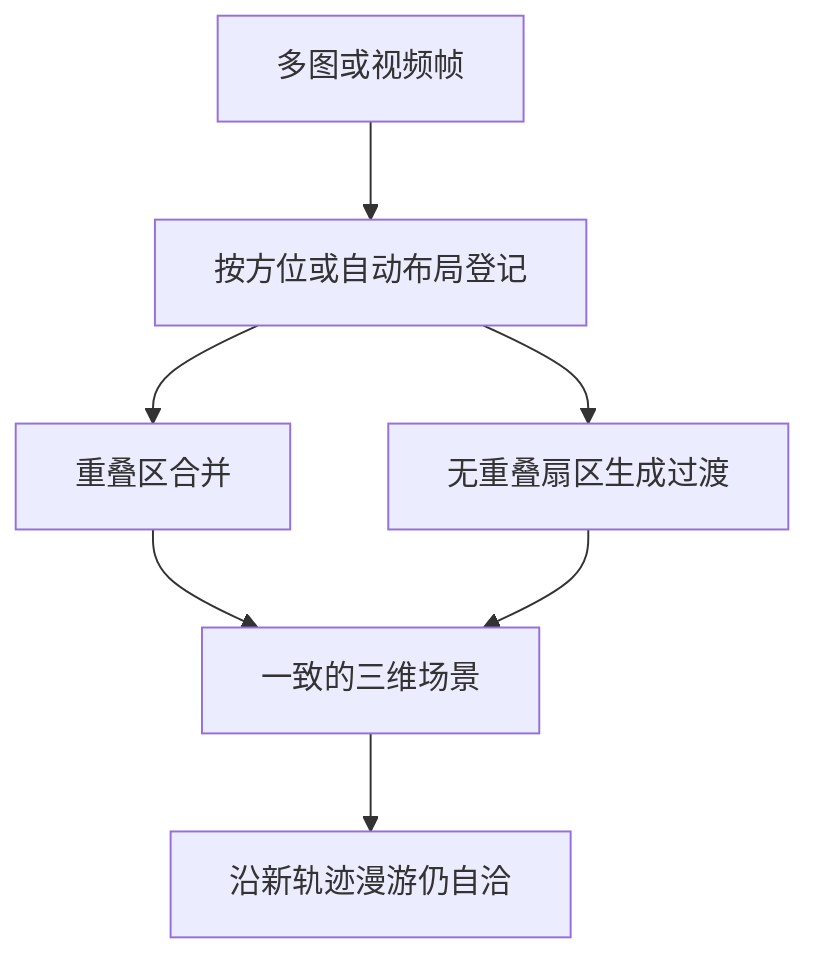

# 多图与视频的视角拼接成一致场景

多图提示让你把世界不同部位的参考图缝成一个统一的三维世界，并从不同角度控制它将呈现的样子。

<footer>—— World Labs，Marble: A Multimodal World Model</footer>

文本和单图强迫模型发明所有没写进提示的东西。多图与短视频把发明范围缩小：每一张图钉住一个方向或一个局部，模型负责把它们登记到同一空间，并在视角之间长出过渡。这是拼接，不是把若干张图当幻灯片轮播，也不是摄影测量软件里的稀疏点云重建说明书。本篇只写这件事：多视角如何变成一致场景、方位与重叠各起什么作用、以及缝不上时失败在哪一层。

## 问题

单视图三维提升的病是「这一面像、背面是另一个房间」。多视图若处理不当，会换成另一种病：每一面都像对应那张图，但转角处出现两套家具、两套光照、两条地平线。一致场景要求：同一物体在不同输入里只占一份几何，地板是一张，光是一场，用户沿弧线走过去时不应穿过接缝。

输入常常不满足经典重建假设。创作者用二维生成器分别迭代「客厅正面」和「客厅朝窗」，两张图可能焦距不同、家具套数不同、甚至不是同一空间。真实场所的几张快照可能重叠不足、曝光跳变。视频看似连续，但可能是剪辑过的多镜头。拼接系统必须同时做登记（这些像素是同一世界的哪些射线）和调和（冲突时听谁的、缝上缺口）。只做登记会在冲突处撕裂；只做调和会把所有图糊成平均客厅，失去多图的控制意义。

### 控制用多图与测量用多图

World Labs 把多图写成一种更精细的控制：不同图像对应世界的不同部分或不同朝向，模型在输入视图之间做平滑过渡。这可以是创意流程——各视图在二维工具里分开迭代再抬升。也可以是真实空间的几张照片或一段短视频，用来带上现实场所的元素。两种用法的评测不同。控制用法允许缝里的内容被发明；测量用法应尽量少发明已见重叠区。把创意缝当成扫描，会在重叠区出现「谁也不像」的折中。

方位角（azimuth）把图放到水平方向上：0° 正面、90° 右、180° 背、270° 左。它是提示里的粗位姿，不是标定好的外参矩阵。写错方位等于要求模型把两张本应相对的图叠在同一面墙上。

## 方法

### 带方位的多图提示

产品与 API 允许为每张图指定水平方位，并可附一段可选文本。生成器要学习的映射是：图像 $I_j$ 应像从方位 $\alpha_j$ 附近看世界 $W$ 所得。重叠少时，中间扇区由模型填充，这是刻意的创意插值。文档写明：无重叠的图像让模型在视图之间创造性地填空。重叠多时，同一视觉元素应在登记后合并，而不是复制两份。

自动布局（Auto Layout）则让模型自己估计相对位置，适合同一空间、相近分辨率与宽高比、彼此有重叠的一组照片，张数上限与手动方位模式可以不同。自动布局重建的是「照片实际看见的那一个空间」；门后、实墙后、楼梯转上去相机没拍到的部分仍会为可漫游而被合理生成，不会去匹配一张从未看见的平面图。

### 视频当作连续多视图

视频是时间上密集的多图。短视频描绘真实场所的不同角度时，系统应把帧当成同一轨迹上的观测来组合。它比手摆四张方位图更密，因而更接近重建谱的一端，但仍不是保证度量重建：镜头运动、压缩伪影、自动白平衡都会破坏帧间的光度一致性。可选文本仍可拉风格；关掉自动说明则避免模型根据画面「看懂」出用户没要的物体。

记视图 $j$ 的重投影为 $R(W, T(\alpha_j))$。拼接目标可写成

$$
\sum_j \ell_{\mathrm{view}}(R(W, T(\alpha_j)), I_j)+\lambda_{\mathrm{gap}}\,\ell_{\mathrm{gap}}(W),
$$

其中 $\ell_{\mathrm{view}}$ 在已见图上要小，$\ell_{\mathrm{gap}}$ 约束未覆盖扇区的可走通与外观连续，避免两堵墙之间掉进虚空。$\lambda_{\mathrm{gap}}$ 过大，缝会被糊成无聊的平均；过小，缝里会长出与两侧无关的第三套场景。

各图宽高比与分辨率不一致时，自动布局会变脆。这不是审美问题：内部把图当成同一相机模型下的观测，焦距与画幅乱跳等于标定失败。先统一画幅，再谈重叠。

## 机制

拼接的几何核心是把像素射线投进同一坐标系。方位模式用用户提供的粗 $T(\alpha)$ 当先验；自动布局从重叠纹理估计相对 $T$。无论哪一种，一致性发生在三维，而不是在全景图上做二维缝合。二维缝合可以骗过一张 360° 海报，一低头仍会露馅。三维一致意味着侧视图里出现的窗，在俯视移动时仍是那扇窗。

冲突调和发生在重叠。两张图里沙发颜色不同，模型必须选择、混合或拆成两件——后者通常是失败。好的行为是承认输入违反「同一空间」假设，而不是各信各的导致重影。光照同样：一边阴天一边黄金时刻，缝上会出现两条影子。文档建议匹配色温与光照，是因为生成器不是专业的多曝光融合管线。

### 重叠是信息，不是重复浪费

摄影测量里重叠是为了视差与匹配。Marble 的创意多图里，重叠还承担「告诉模型这两张是同一空间」的身份证据。完全无重叠时，身份证据弱，填充项 $\ell_{\mathrm{gap}}$ 主导，世界更像几个舞台布景用走廊连起来。有重叠时，匹配点把尺度和朝向锁住，过渡更像转角而不是传送门。视频的帧间重叠天然密，所以短视频抬真实场所往往比四张互不相干的概念图更稳——前提是没有剪辑跳切。

整栋房子不要指望一组自动布局照片一次完成。文档的建议是：每个房间自己生成（多图或全景），再在 Composer 里按平面图手工拼接。自动布局没有「读平面图自动把房间接上」的入口。那是另一篇的拼世界大图，不是本篇的视角缝。

## 边界与工程取舍

多图拼接不是 SfM + MVS。没有保证的内参、没有控制点、没有误差以厘米计的报告。需要测绘级网格时，应走测量合同，而不是创意多图。方位是水平角，俯仰与滚转通常不在这组提示里精细给出，仰拍与天花板可能弱。视频有体积与时长限制；超限不是模型「不理解电影」，是服务配额。

也不要与单全景混用同一套心理模型。全景已经覆盖一周，再塞多图会变成互斥输入。近距离、不同朝向、略重叠的标准平面照片，是自动布局写明的甜区。远距离、完全不同房间、或一张室内一张室外，系统仍会输出「一个世界」，但一致是假的：那是两个空间被生成器强行缝在同一漫游体里。

创意填充是能力也是风险。无重叠扇区里出现的门廊可能很好看，却从未出现在任何输入里。交付给客户前应走一圈看缝，不能只检查输入方位上的几张截图——那些截图本来就会像，因为损失 $\ell_{\mathrm{view}}$ 就是这么训的。一致场景的检验位在输入没给过的相机上。

## 小结

- 多图与视频把不同视角登记到同一 $W$，并在缝上生成过渡，目标是一致可漫游场景。
- 方位提示提供粗水平位姿；自动布局适合同空间、同画幅、有重叠的照片。
- 无重叠时填充是创意；有重叠时应合并而非复制。门后未见处仍可能被生成，不是平面图。
- 光照、画幅、是否跳切决定缝能否成立；二维全景缝合不等于三维一致。
- 多房间应分世界再组合，不要指望一次多图缝整栋。
- 出处：World Labs Marble 博文中的 Multi-Image and Video to World；产品文档中的多图提示、方位与 Auto Layout 说明。
