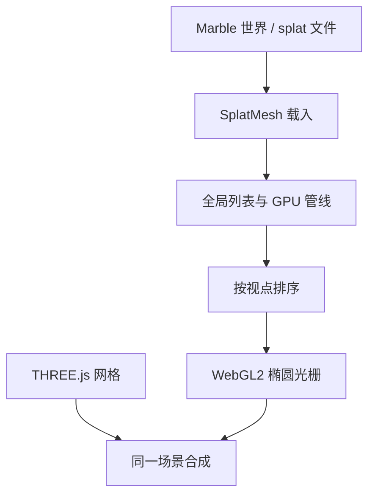

# Spark：浏览器高斯溅射渲染

高斯溅射把场景写成半透明椭球的集合；要在浏览器里交互，就必须在 WebGL 上完成投影、全局排序与混合，而不是先把世界烘焙成网格再导出。

<footer>—— 归纳自 Kerbl et al., 3D Gaussian Splatting, SIGGRAPH 2023；World Labs Spark / Marble 产品叙述</footer>

Marble 生成的高保真世界默认不是三角网格，而是三维高斯溅射（3D Gaussian Splatting, 3DGS）。要让用户在网页里走进这个世界，必须有一个能在浏览器里跑的溅射渲染器。World Labs 把这件事做成开源库 Spark：它挂在 THREE.js 上，目标后端是 WebGL2，把溅射当作一等图元，而不是把 splats 先转成网格再走传统光栅。本篇只讲这条渲染通路；溅射作为世界表示见 [三维高斯溅射作为高保真表示](/llm/marble-gaussian-splats)，网格导出见 [碰撞网格与视觉网格双导出](/llm/marble-dual-mesh)。

## 问题

网格渲染假定表面是分片线性的：顶点、法线、纹理。3DGS 把外观写成数百万个各向异性高斯，每个高斯有中心、尺度、旋转、不透明度和颜色。Kerbl 等人证明，这种表示既能拟合复杂外观，又能用可微光栅做实时绘制。问题立刻变成工程问题：扫描或生成得到的 splats 往往有数百万到上千万个，消费级浏览器的 GPU 显存与填充率都远小于训练时用的桌面卡；WebGPU 在 2025–2026 仍不是「几乎所有设备都有」；已有网页溅射库常常只能正确画一个 splat 物体，或把排序放在主线程，相机一快就出现半透明排序伪影。

Marble 的产品约束更硬：世界要在浏览器里生成、浏览、再分享链接。若渲染器只能离线出图，生成式世界就退化成预渲染视频。Spark 要回答的是：如何在 WebGL2 上对动态、可变换、可多物体共存的 splats 做正确的画家算法，并且把下载与显存做成可流式的，而不是一次载入整个场景。

### 半透明混合依赖全局顺序

单个高斯投影到像平面后是近似椭圆。颜色沿视线用 over 算子叠：

$$
C=\sum_{i\in\mathcal{N}} c_i\alpha_i\prod_{j=1}^{i-1}(1-\alpha_j),
$$

其中 $\alpha_i$ 由二维高斯密度与不透明度相乘得到，$\mathcal{N}$ 必须按距相机由远到近（或等价的深度序）排列。若每个 splat 物体只在自己内部排序，两个交叠的物体看起来会像贴纸叠在一起，而不是共处同一三维空间。浏览器里还没有桌面 OpenGL 那样随手可用的 GPU 基数排序原语，WebGL2 的计算着色器能力也有限，排序策略本身就是设计点。

公式里的 $\alpha$ 混合与网格的 alpha blend 同形，但图元完全不同：网格按三角形覆盖，溅射按椭圆覆盖。排序错了，网格通常只是 Z-fight；溅射会整片「糊」到错误的深度层上，观感比网格更糟。

## 方法

Spark 把一帧拆成三步：先把场景里所有 splat 物体变换到同一坐标系并生成一张全局列表，再按当前视点排序，最后用一次实例化绘制把椭圆光栅化。物体可以各自有位姿；列表生成时在 GPU 上跑一条可编程管线，于是重着色、裁剪、位移、骨架动画不必改核心循环。排序在 WebGL2 上不走计算着色器全排序：GPU 算距离，读回 CPU，在 Web Worker 里做两遍基数排序，避免堵住主线程。绘制时每个 splat 是覆盖投影椭圆的定向四边形（两个三角形），顶点着色器算四角，片元着色器按高斯轮廓写 $\alpha$，硬件混合写入帧缓冲。

### 与 Kerbl 光栅的关系

Kerbl 等人的可微光栅在训练或桌面实时里把三维协方差 $\Sigma$ 经观察变换 $W$ 与雅可比 $J$ 投成二维：

$$
\Sigma'=JW\Sigma W^\top J^\top.
$$

Spark 不重新发明这条投影几何，它把已经优化好的 splat 参数当输入，在浏览器里重复「投影—排序—混合」。训练期的球面谐波视相关颜色、不透明度激活，到了运行时就是纹理或属性缓冲里的数。Marble 导出的 `.ply` / `.spz` 等格式，就是这条参数表的容器；Spark 宣称支持 PLY、SPZ、SPLAT、KSPLAT、SOG，以及面向流式的 `.rad`。

### 流式与细节层次

消费设备通常只能交互地画大约 $10^6$ 量级的 splat，而合成或扫描场景可以到千万级、文件到百兆甚至上 GB。Spark 2.0 用三件系统手段把「能画」变成「能在网上逛大世界」：细节层次（LoD）按距离换粗 splats；渐进流式按视线优先下载能分辨细节的数据；虚拟分页在固定 GPU 预算里换入换出 splat 页。这不是改 3DGS 的数学对象，而是给表示加了一层与视点相关的驻留策略。

LoD 降低的是当前帧参与排序与混合的 splat 数，不是把世界永久简化成低模网格。用户走近时，细层应能补回来；补不回来的，是流式预算或生成侧本身没有那些高斯。

## 机制

溅射能在浏览器里成立，是因为每个高斯的屏幕贡献是局部的：远离投影中心的片元 $\alpha$ 迅速掉到可忽略，填充率虽高，但不需要全局光线步进。排序把三维遮挡近似成一维顺序，避免了体渲染的逐步积分。THREE.js 集成的意义是：相机、控制、后处理、网格碰撞体可以复用现有场景图；Spark 只负责「这一类图元如何正确画进去」。World Labs 写明 Spark 与 Marble 一起长出来：生成侧产出 splats，浏览侧必须在同一套 WebGL 约束下交互，否则生成格式会迁就某个桌面查看器，分享链接会断。

可编程 GPU 管线把「静态扫描」和「可编辑世界」接到同一渲染器上。splat 的中心、颜色、不透明度都可以按帧改写，于是所谓 4DGS、实时重打光、SDF 裁剪都能落在列表生成那一步，而不强迫把动态重烘焙成新的 PLY。这与网格蒙皮类似：蒙皮改的是顶点位置，溅射管线改的是高斯参数。

WebGL2 读回距离再 CPU 排序，是在可移植性上买正确性。相机极快时，若排序滞后一帧，半透明仍会闪。这是实现边界，不是 3DGS 公式失效。桌面或 WebGPU 上的 GPU 排序可以缩小这条缝，但不能假装所有目标浏览器已经具备。

## 边界与工程取舍

Spark 是渲染器，不是物理引擎。碰撞、脚步声、刚体，要另接 [碰撞网格](/llm/marble-dual-mesh) 或宿主场景的物理库；splat 参数里没有「这是木头」的材质语义。视相关外观依赖球谐或生成时烘焙的颜色，浏览器里重打光只能近似。LoD 与分页假设世界可以按空间切开：若生成结果把细节均匀洒在所有高斯上、没有可合并的粗层，流式收益会变小。

不要把「能在浏览器里逛」理解成「已经有一份与训练时相同的可微光栅」。Spark 的目标是前向绘制与流式，不暴露 Kerbl 那套对 splat 参数的梯度。也不要把 Spark 写成 Marble 世界模型的权重：模型在服务端或生成管线里产出 splats，浏览器只消费。出处上，3DGS 的表示与混合公式来自 Kerbl et al., SIGGRAPH 2023；Spark 的 WebGL2、THREE.js、全局排序与 2.0 流式，来自 World Labs 的工程博客与开源仓库，没有一份需要你去填的 World Labs arXiv 号。

## 小结

- Spark 是 World Labs 开源的浏览器 3DGS 渲染器，挂在 THREE.js 与 WebGL2 上，用来交互绘制 Marble 一类 splat 世界。
- 正确性的核心是全局由远到近排序再 $\alpha$ 混合；只在物体内部排序会把交叠画成贴纸。
- 一帧三步：生成全局 splat 列表（含可编程 GPU 管线）、排序、实例化椭圆光栅。
- 大场景靠 LoD、渐进下载与虚拟分页，在固定显存里流式驻留，而不是一次装入全部高斯。
- 溅射负责外观；碰撞与物理仍要网格或其他代理。
- 表示与混合公式对照 Kerbl et al., *3D Gaussian Splatting for Real-Time Radiance Field Rendering*, SIGGRAPH 2023；浏览器实现以 World Labs Spark 叙述为准，勿伪造 arXiv。
