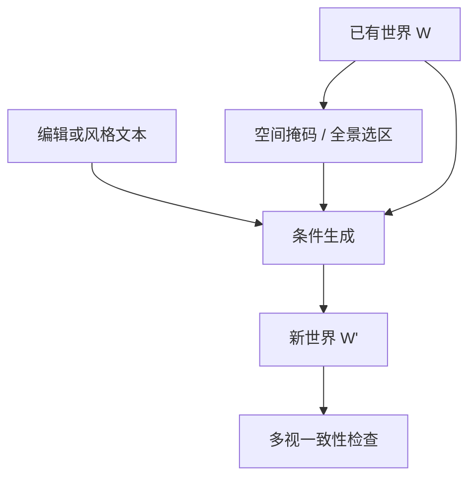

# AI 原生局部编辑与风格改写

生成只是创作的起点；真正能用的世界模型必须允许局部改一处、换物体、改风格，甚至重组大块结构，而不是每次推倒重来。

<footer>—— 归纳自 World Labs, Marble: A Multimodal World Model</footer>

文生世界、图生世界一次出整场，细节却很难一次对上脑中的布局。Marble 把编辑写成生成管线的一等公民：改动可以很小——拿掉一件物体、修一块表面；也可以很重——换物体、改整体视觉风格、重组大片空间。这与在二维画布上 inpaint 不同，因为世界有三维结构，局部改写必须在多视上仍然像同一个地方。本篇讲 AI 原生编辑与风格改写；粗几何定结构、文本定风格见 [Chisel](/llm/marble-chisel)，扩区域与拼世界大图见 [区域扩展与 Composer](/llm/marble-expand-compose)。

## 问题

一次采样得到的 splat 世界是一个完整样本，不是分层 PSD。用户指出「把后墙改成舞台、桌子换成面向舞台的矮凳」，若只在当前视角的像素上涂改，侧视、俯视会露出未改的旧几何，或者新内容漂在旧高斯上面。网格时代的办法是人工改顶点；生成式世界没有可维护的拓扑，编辑必须再走一遍生成，同时把「未指定区域」钉住。

风格改写是另一类请求：同一套空间结构，换成博物馆灯光或吉卜力上色。若风格与结构缠在同一个噪声过程里，改风格会连带挪墙。Chisel 用粗几何与文本解耦结构/风格；编辑工具则要在已经生成的高保真世界上做同类解耦：哪些高斯或哪些空间区域可以重采样，哪些必须作为条件留下。

### 局部性需要空间掩码而不是词掩码

语言模型里「局部」是 token 下标；世界里「局部」是空间区域 $\Omega\subset\mathbb{R}^3$，以及它在各相机下的投影。提示「去掉桌上的花瓶」必须落到 $\Omega$，而不是整句重写场景。没有空间掩码，模型只能做全局重绘，用户看到的「小改」其实是另一次全图采样，家具会漂。

产品里的全景编辑允许框选区域再写提示，或对整幅全景做全局改。先改全景再升成三维，是把局部性放在二维流形上处理，再请求三维一致。这比直接在 splat 上涂更可控，但全景缝与三维升成仍可能把局部改写放大成整屋变化。

## 方法

公开叙述把编辑分成尺度。小而局部：移除物体、修一块区域。更剧烈：替换物体、改视觉风格、重组世界的大块结构。Create & edit 工作流把全景编辑、快速三维预览、全质量生成分成阶段，让用户在升成高保真 splat 之前就在全景上迭代。这意味着「AI 原生」不是在 DCC 软件里插一个插件刷顶点，而是编辑指令（文本、框选、参考图）重新进入世界模型的条件，再生成与旧世界对齐的新世界。

风格改写把结构当条件、外观当可重采样变量。设旧世界为 $W$，风格文本为 $s$，希望

$$
W'\sim p_\theta(\cdot\mid G(W),s),\qquad G(W)\approx G(W'),
$$

其中 $G$ 抽取粗几何（布局、物体占位、相机可走空间）。$G(W)\approx G(W')$ 是结构保持；$s$ 驱动纹理、光照、材质。局部物体替换则把 $G$ 再拆成冻结区与可写区：冻结区从 $W$ 拷贝或强条件，可写区按新提示采样。

### 与二维 inpaint 的差别

二维 inpaint 的未知区域是图像上的像素洞，已知区域是同一张图的其余像素。三维编辑的未知区域是空间里的一块，必须在所有相关视锥里同时合理，并且与冻结 splat 在边界上接上密度与颜色。只 inpaint 一张导出色卡，再贴回世界，等价于把一张贴纸打进三维，侧视会穿帮。因此编辑器要么在全景/多图条件上改、再重新升成，要么在 splat 域做受掩码约束的再优化。公开材料没有给出 Marble 内部是「再跑一遍世界模型」还是「局部 splat 优化」；写作只应坚持接口：指令是 AI 条件，输出是仍可探索的三维世界。

风格改写最容易偷换结构：换「赛博朋克」时把窗户改成巨型屏幕，平面布局变了。评测应看可走空间与物体占位是否还在，而不是只看是否更像目标风格。Chisel 把粗盒子留下，正是为了给风格一条不能拆的骨架。

### 风格改写与物体替换的掩码不同

风格改写的可写集接近「全部外观、零布局」：颜色、材质、光照可变，$G(W)$ 应近似不变。物体替换的可写集是空间里的一块 $\Omega$，冻结集是 $\mathbb{R}^3\setminus\Omega$：$\Omega$ 内拓扑可以变，边界上密度与颜色必须接上。把两种请求用同一条全局提示去打，模型会在该改的地方缩手、在不该改的地方动手。编辑 UI 若只提供一个文本框、不提供选区，等于把掩码留给模型猜；猜错就是「小改变成重绘」。

## 机制

生成式编辑能「原生」，是因为世界模型已经学会从残缺条件补全三维。编辑只是把条件从「一张图、一段话」换成「旧世界的冻结部分 + 新指令」。这与大语言模型的 infilling 同构：上下文是冻结 token，洞是要写的 token。世界模型的洞是空间区域，上下文是其余 splat 或其余视角。多视拼接那条能力（见 [多图与视频的视角拼接](/llm/marble-multi-view-stitch)）在这里变成约束：新内容必须能和未改视角缝在一起。

风格与结构解耦依赖训练分布里「同布局不同外观」的样本，或显式的几何条件（深度、粗网格、Chisel 体素）。没有这种分解，文本里的风格词会通过同一套注意力改所有尺度。CFG（Ho & Salimans）一类引导可以把风格词的影响推高，但引导过强会破坏冻结区——这是引导强度与局部掩码必须一起调的原因。不要把 CFG 写成 Marble 公开实现细节；它只是条件生成里常见的旋钮。

「重组大块结构」已经接近重新生成。此时局部掩码很大，冻结上下文变少，模型更自由，也更可能丢掉用户仍想保留的角落。扩展（expand）是另一条增大世界的路：指定区域向外长，而不是在内部改风格。二者都改 $W$，但一个是边界外推，一个是内部改写。

## 边界与工程取舍

没有公开论文给出 Marble 编辑的损失函数、是否对 splat 做局部梯度、全景与三维如何循环一致。能写进技术笔记的是接口与失败模式。失败包括：边界接缝（新物体浮在旧地板上）、多视不一致（只有编辑时的那个视角是对的）、风格泄漏进结构、小物体删除后留下高斯残渣。编辑次数一多，世界会累积这些残渣，不如从更新过的全景重新升成一次。

也不要把编辑理解成对 Kerbl 3DGS 的交互式 densification 论文复现。Kerbl 的优化是从多视图像拟合一份 splat；Marble 编辑是世界模型条件下的再生成，图像监督未必还在。网格导出之后在 Blender 里改，是另一套「非 AI 原生」工作流：精确，但失去与世界模型条件的闭环。双导出（splat 看、网格碰）之后，若只改网格不改 splat，浏览外观与碰撞会分叉。

## 小结

- Marble 把局部增删、物体替换、风格改写、大块重组做成世界模型条件，而不是只提供二维贴纸。
- 局部性靠空间掩码或全景选区；没有空间范围的提示等于全局重采样。
- 风格改写应保持粗几何 $G(W)$，只重采样外观；与 Chisel 的结构/风格分离是同一分解在不同入口上的用法。
- 三维编辑必须在多视上成立，单视角 inpaint 不够。
- 公开依据是 Marble 博客与 Create & edit 文档；内部是再生成还是 splat 再优化未公开，勿造 arXiv。
- 扩展与 Composer 解决「变大」，编辑解决「变对」；二者都不要推倒整座世界，但大掩码编辑会接近重新生成。
