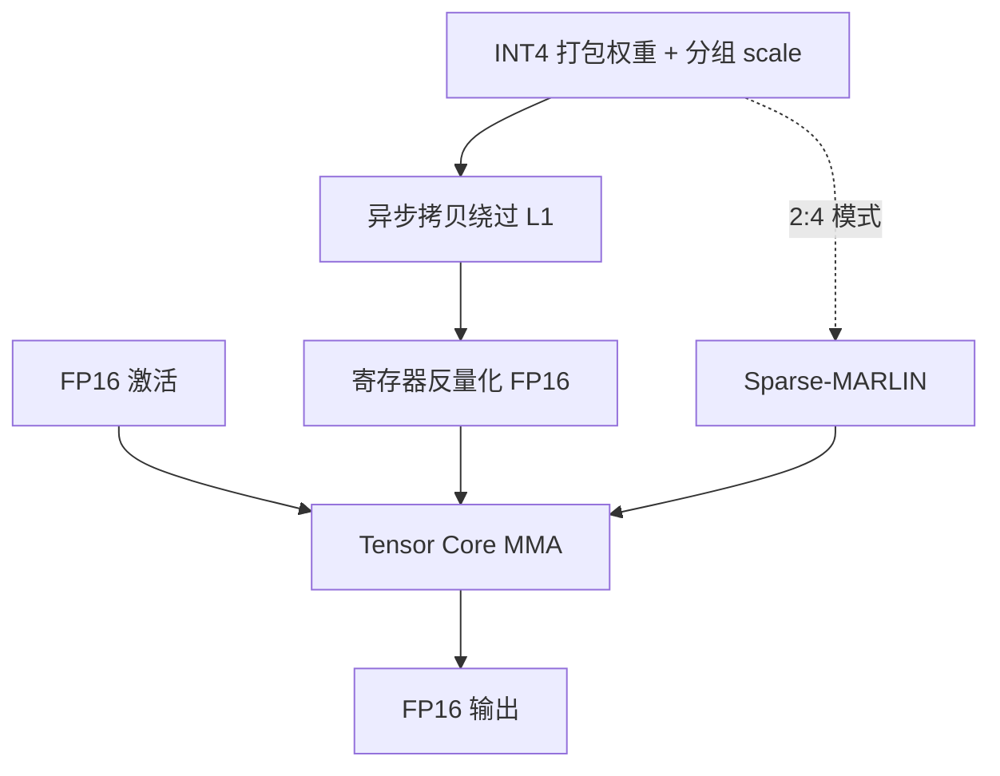

# Marlin INT4 内核

    
4-bit 权重的加速比在 batch 1 几乎免费；真正要设计的核，是在 batch 16–32 仍接近满速的那颗，否则服务端量化只省显存。

    <footer>—— Frantar, Castro, Chen, Hoefler, Alistarh, MARLIN: Mixed-Precision Auto-Regressive Parallel Inference, 2024/2025</footer>

[GPTQ](/llm/gptq) 与 [AWQ](/llm/awq) 决定网格怎么来；推理墙钟取决于核是否在加载 4-bit 的同时把反量化藏进 Tensor Core 的流水。许多开源核在单请求 decode 上能接近 4× 于 FP16，一旦连续批把 $M$ 抬到十几、几十，算术强度上升，反量化与调度填不满，加速比塌掉。Elias Frantar、Roberto L. Castro、Jiale Chen、Torsten Hoefler、Dan Alistarh 的 MARLIN（Mixed-precision Auto-Regressive LINear）针对这件事：在 Ampere 一类 GPU 上，把 FP16×INT4 GEMM 做到 batch 16–32 仍接近理想 4×，并在 vLLM 里量到端到端最高约 2.8×。它不是新的量化算法。代码在 IST-DASLab/marlin；vLLM 以 GPTQ-Marlin / AWQ-Marlin 后端接入。

## 问题

生成式 decode 在 GPU 上通常是显存墙：读权重的字节远大于算术。权重量化到 4-bit，理想加速比是 4，前提是计算仍能藏在减少后的搬运后面。Ampere 的 FP16 FLOP/byte 大约 100–200。若每个 4-bit 权重仍能摊上大约 25–50 次乘加，问题在理论上仍是带宽墙，batch 不必停在 1。现有核做不到这一点：反量化在 CUDA 核心上与 MMA 争资源，异步拷贝没用好，或 layout 迫使反复走 L1。于是服务场景——多客户端、连续批、$M$ 到十几——量化变得「能装下、快不了」。

论文要交的合同是：**给定已经量化好的 INT4 权重**（分组如 128），核在单层大矩阵上对 batch 16–32 接近理想加速，到 64–128 仍显著快于 FP16，并在 vLLM 端到端可测。自变量是 kernel，不是新的 Hessian。把 Marlin 写成「一种量化方法」，或把 ICLR 2023 GPTQ 的 PPL 表当成 Marlin 的速度表，都是时间线错误。

### 为什么对标 Ampere

开源说明写明计算能力 ≥ 8.0（Ampere / Ada），当时**尚未为 Hopper 做同等优化**。Ampere 的异步拷贝可以绕过 L1 直达 shared memory，Tensor Core 吃 FP16 MMA。INT4 权重在寄存器里解成 FP16 再 MMA，流水必须把 GMEM→SMEM、反量化、MMA 叠起来。Hopper 的 WGMMA / TMA 是另一套发射模型；后来的 Machete 等核走 Hopper 路径，不要把 Marlin 的 A10 数字抄到 H100 上当同一核。

论文 Figure 1 在 A10、约 72k×18k 的层上对比 torch/CUTLASS FP16、ExLlamaV2、AWQ 核、bitsandbytes。Marlin 在 batch≤32 贴近 4× 理想线，其它核更早掉下来。这是单层微基准，不是 Llama-70B 的 SLA。

## 方法

权重以打包 INT4 加分组尺度（及对称量化下的零点约定）驻留 HBM。核按 tile 异步加载，在寄存器/共享内存反量化到 FP16，用 Tensor Core 与 FP16 激活做 MMA，累加后写回。关键技术组合：异步拷贝与绕过 L1、复杂任务调度与流水、为量化定制的权重 layout（与原始 GPTQ 打包不完全相同）。作者因此在量化流程里对 GPTQ 做了小改：分组裁剪阈值搜索（近 AWQ 的 clip）、变长校准序列，并注明格式与原版 GPTQ 实现略有差别，精度仍高。vLLM 后来把零点、AWQ、以及部分形状约束收进 `marlin_utils`；能跑 Marlin 不等于任意 GPTQ 文件可直接 `mmap`。

Sparse-MARLIN 在稠密 INT4 之外叠加 NVIDIA 2:4 稀疏 Tensor Core：权重需满足 2:4 模式，通常来自 SparseGPT 再加蒸馏。论文表中 INT4+2:4 的任务分有时高于稠密原模型，那是蒸馏后的数，不是「稀疏免费涨点」。相对稠密 Marlin，稀疏变体额外加速约到 65% 量级（论文表述），端到端相对 FP16 可到约 3.2×（特定设置）。

### 服务集成里的形状约束

vLLM 的 Marlin 后端要求计算能力 80+、受支持的 group size、以及 $K$、$N$ 对齐（thread 维度最小值一类常量，如 $K$ 方向 128、$N$ 方向 64 量级）。张量并行把列或行切碎后，要对齐这些 tile，否则回退到更慢的核。`desc_act` / `g_idx`（GPTQ 的 act-order）会打乱 $K$ 维连续性，Marlin 用重排或 `is_k_full` 一类逻辑消化；消化不了就不要强行选 Marlin 后端。这些是引擎契约，论文微基准用的是规整大矩阵。

## 机制

带宽墙成立时，加速比上限约是 FP16 字节除以 INT4 字节，再扣尺度元数据。Marlin 的贡献是把「反量化 + MMA + 访存」的依赖拉成深度流水，使 $M$ 增大后仍能用异步拷贝的延迟隐藏计算。$M$ 继续增大，问题变成计算墙，4-bit 不再有 4×，加速比滑向「反量化开销 + 与 FP16 MMA 同阶的算力」——论文里 batch 128 仍高于 1×，但远离 4×，这是屋顶线，不是实现失败。

与 [ExLlamaV2](/llm/exllamav2) 的对比在论文图里是直接的：ExLlamaV2 为单用户、混合比特宽优化，小 $M$ 很强；Marlin 为中等 batch 的稠密 INT4 服务优化。选核看工作点：交互式单卡聊天与连续批 API 不是同一颗核的主场。bitsandbytes 的 NF4 路径还掺了训练期存储语义，更不是同一合同。

「接近理想 4×」绑定对称 INT4、分组 128、大矩阵、A10 一类推理卡。W4A8、FP8 激活、Hopper 的 FP8 MMA，都要另一颗核。Marlin 后来在 vLLM 里被扩展到更多 dtype，那是仓库演进，引用论文数字时应对齐 2024 年的 INT4×FP16 设定。

## 边界与工程取舍

### 核不修复网格，也不跨架构自动变快

Marlin 不量化激活；prefill 大 $M$ 仍可能是计算墙，INT4 权重只减小读字节，算力仍按 FP16 MMA 计。没有 4-bit 核的引擎，GPTQ 检查点只省显存。校准域与 GPTQ/AWQ 算法决定精度，核决定速度——换核不会修复坏的网格。Ada / Ampere 是论文主场；H100 上应实测是否走了 Hopper 优化核，而不是假定 3.9× 可移植。Hopper 的 TMA / WGMMA 改变了拷贝与 MMA 的发射模型，把 Ampere 上调好的 shared-memory 流水原样搬过去，占用率与异步拷贝收益都会变。

分组大小、对称与否、是否带零点，都是打包契约。vLLM 的 `query_marlin_supported_quant_types` 把这些写成白名单；白名单外的 AWQ 变体或 GPTQ 描述文件会回退。回退往往仍能出 token，只是墙钟回到「能装下」而不是「4×」。端到端 2.8× 绑定论文里的 vLLM 集成、Llama/Falcon 一类已能量化的模型与特定 batch，换 MoE 路由或小矩阵层会把加速比稀释。

何时用 Marlin：vLLM / 同类服务、GPTQ 或 AWQ 的 4-bit 权重、batch 从个位数到几十、需要相对 FP16 的稳定加速。何时不用：要混合 2/3/5/6-bit 的平均码率（那是 EXL2）、要原生 FP4 MMA（Blackwell NVFP4 / MXFP4）、或设备是 TPU / Trainium。Sparse-MARLIN 额外要求 2:4 结构与配套稀疏化流程。

出处：Frantar et al., *MARLIN: Mixed-Precision Auto-Regressive Parallel Inference on Large Language Models*（PPoPP 2025 / 作者 2024 预印本）；代码 IST-DASLab/marlin 与 Sparse-Marlin；服务集成见 vLLM Marlin 后端。量化算法对照 GPTQ（ICLR 2023）与 AWQ；核对照不替代论文 PPL 表。

## 小结

- Marlin 是 FP16×INT4 的服务端 GEMM 核，目标是中等 batch 仍接近量化带来的带宽加速。
- 论文在 Ampere 上对 batch 16–32 给出近 4× 单层加速，vLLM 端到端最高约 2.8×。
- 它不产生网格；GPTQ/AWQ 产生网格，layout 还可能被核要求改打包。
- Sparse-MARLIN 叠加 2:4，加速与精度数字绑定稀疏化流程，不是免费乘数。
- 小 $M$ 的消费级路径仍可能是 ExLlamaV2；Hopper/Blackwell 原生窄格式是另一条路。
- 出处：Frantar et al. MARLIN 论文与 IST-DASLab 代码；集成对照 vLLM。
