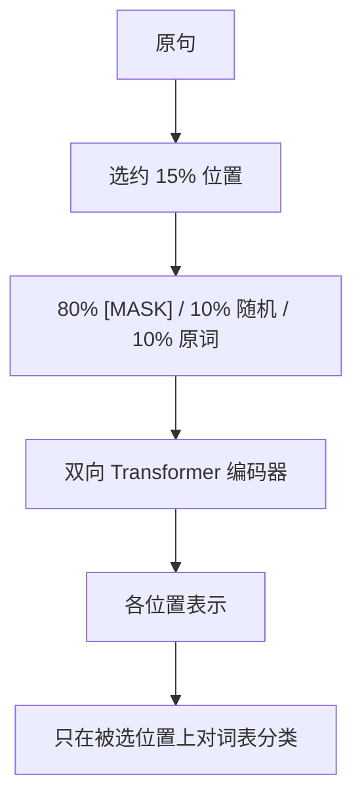

# Masked LM

随机挡住一些标记，让表示从左右两侧的未挡上下文里重建它们——预训练的是双向编码器，不是从左到右的生成器。

<footer>—— Devlin et al., BERT: Pre-training of Deep Bidirectional Transformers for Language Understanding, NAACL 2019</footer>

掩码语言模型（Masked LM, MLM）是去噪目标：从完整句中挖掉一部分 token，用剩余上下文预测被挖掉的位置。Devlin 等人的 BERT 把这一目标接到 Transformer 编码器上，使每个位置的自注意力默认可读全句（被挖掉的位置仍作为 `[MASK]` 嵌入出现），从而得到双向表示。它与 Causal LM 的分解目标不同：没有从左到右的链，生成也不能直接逐步采样。本篇写 BERT 式 MLM 的问题、15% 配方与预训练—微调裂缝，不把 Span BERT、T5 的 span 腐蚀展开成另一篇。

## 问题

左到右的语言模型在位置 $t$ 只能用 $x_{<t}$，对「理解」任务不自然：判断一句是否通顺、槽位是否被后半句约束，往往需要右侧。ELMo 用双向前缀拼接近似双侧，仍不是同一套参数里的真双向交互。要让位置 $i$ 的表示同时依赖左右，训练时又不能让模型直接抄 $x_i$ 本身，就必须把 $x_i$ 从输入里拿走或替换掉。MLM 的问题设定就是：**双侧可见，但被预测的符号在输入中不可用**。

若拿走的方式与微调时的输入不一致，会出现预训练—微调裂缝。BERT 用 `[MASK]` 替换，而微调几乎从不出现 `[MASK]`。这是 MLM 相对 Causal LM 多出来的匹配问题：Causal LM 的训练符号与生成符号是同一套。

### 不能看见答案，但要看见两侧

实现上不是把该位置从序列里删掉（那会让长度与对齐错乱），而是保留占位。占位符携带「这里有东西」的位置信息，不携带词表身份。模型必须从 $x_{\setminus i}$ 恢复身份。若占位符偶尔仍是原词，裂缝会小一些，但任务会变容易，需要按概率混合，见下文 BERT 的 80/10/10。

NSP（下一句预测）是 BERT 原文里的第二个目标，不是 MLM 的定义。后来不少工作弱化或去掉 NSP。写 Masked LM 时应把「挖词重建」与「句对分类」分开；本篇以挖词为主。

## 方法

Devlin 等人的标准配方：选中约 **15%** 的 WordPiece token 作为预测对象。对被选中的位置，输入替换规则为：**80% 换成 `[MASK]`，10% 换成随机词表项，10% 保持原词**。损失只在被选中的位置上计算交叉熵，未选中位置不贡献 MLM 损失。编码器是完整的双向自注意力，没有因果上三角。位置编码为可学习绝对位置，最长 512，这是 BERT 原文设定，不是 MLM 目标的必然部分。

15% 是在「一次提供足够多的训练信号」和「留下足够多的未损上下文」之间的折中。腐蚀太低，每个 batch 的有效标签太少；腐蚀太高，句子被挖空，双侧上下文本身残缺，任务退化成乱猜。随机 10% 与保持 10% 是为了让模型不能把 `[MASK]` 当成「只有这里才需要从上下文取词」的作弊特征，微调时任意位置都可能被查询。

### 微调时目标消失

预训练结束，`[MASK]` 头往往丢掉或不用，改在 `[CLS]` 或各 token 上接分类 / 抽取头。此时注意力仍是双向，输入不再腐蚀。MLM 的作用是把编码器训成一套通用初始化。这与 Causal LM 继续用同一个下一个词头做生成不同。若强行用 MLM 模型逐步生成，需要迭代填掩码或改成非自回归解码，延迟与质量都不是 Causal LM 的路径。

## 机制

双向注意力让位置 $i$ 的查询可以打到左右任意未损位置的键，表示是条件于几乎整句的。被 `[MASK]` 的位置仍产生查询，但自己的值向量是掩码嵌入，不泄漏原词。随机替换引入噪声，迫使表示对「输入里这个词不一定对」鲁棒。保持原词的 10% 则提供一条捷径：有时身份就在输入里，模型要学会何时相信输入、何时相信上下文——微调时全部是「相信输入」。

与 Causal LM 比，每个被选位置的条件信息更多（双侧），但每个序列只有约 15% 的位置给梯度。BERT-base 用这一点在 GLUE、SQuAD 一类理解任务上建立了预训练标准。生成任务上，缺了从左到右的因式分解，只能另接解码器或改掩码。UniLM 后来用同一套参数切换掩码来同时做理解与生成，那已是 Prefix / 统一掩码，不是纯 MLM。

BERT 的 15% 作用在 WordPiece 上，不是作用在空白分词的词上。一个英文词可能对应多个子词，被选中的是子词。中文若按字或按 SentencePiece，同样的 15% 对应的语言跨度不同，不能直接说「每句遮 15% 的词」。

### 裂缝的机制

训练时模型看见大量 `[MASK]`，学会「掩码位=要填的槽」。微调没有槽，表示分布偏移。80/10/10 把一部分训练位置改成看起来像微调的输入，减轻偏移，不能消灭。后续有整词掩码、span 腐蚀，改的是挖哪些位置，裂缝的根源仍在：预训练输入含损坏，下游输入通常不损坏。T5 把损坏改成显式的哨兵再生成 span，等于把 MLM 改写成编码器—解码器的去噪，裂缝形态又变一次。

## 边界与工程取舍

MLM 编码器不是聊天模型。双向表示适合分类、抽取、句向量，不适合直接做开放生成。长度 512 是 BERT 原文的工程选择；把 MLM 接到长上下文要另解位置与算力，目标本身不提供长度外推。15% 与 80/10/10 是被广泛复用的超参，不是信息论最优；换词表、换语言、换 span 都应重扫腐蚀率。

不要把任意「输入里有洞」都叫 BERT。Causal LM 的填充式提示、Prefix LM 的源端全可见、UL2 的混合去噪，各自条件集合不同。引用应写 Devlin 等，*BERT*，NAACL 2019（及 2018 预印本）。不要把 RoBERTa 去掉 NSP、动态掩码的改进写进 BERT 定义——那是后续工作。

推理期若仍随机掩码再重建，那是在做填空或数据增强，不是 BERT 微调标准路径。标准路径是全可见输入 + 任务头。

## 小结

- Masked LM 挖掉部分 token、用双向上下文重建，预训练的是编码器表示。
- BERT 配方：约 15% 位置，80% `[MASK]`、10% 随机、10% 保持；损失只在这些位置上。
- 相对 Causal LM：条件更全、监督更稀、生成不能直接自回归。
- `[MASK]` 造成预训练与微调输入不一致；80/10/10 减轻但不消除。
- NSP 不是 MLM 的一部分；下游通常丢掉掩码头，改接任务头。
- 出处：Devlin et al.，*BERT: Pre-training of Deep Bidirectional Transformers for Language Understanding*，NAACL 2019。
