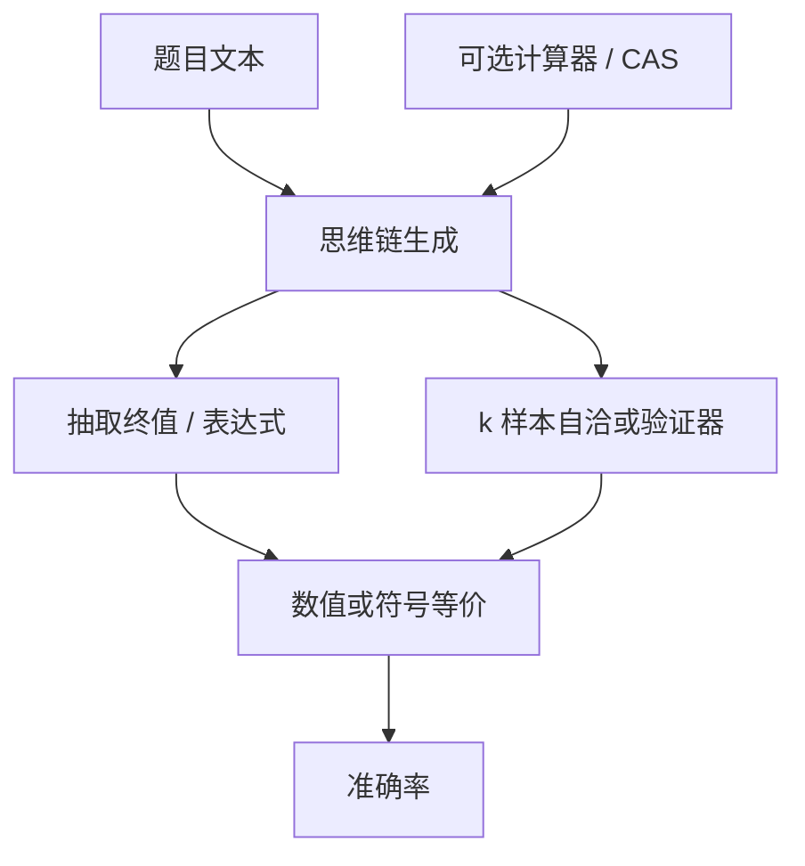

# GSM8K / MATH

小学应用题看起来短，却强迫模型把自然语言里的数量关系写成一串可检验的算术步骤；竞赛题再把步骤换成需要定义、技巧与符号操作的证明式推导。

<footer>—— Cobbe et al., Training Verifiers to Solve Math Word Problems；Hendrycks et al., Measuring Mathematical Problem Solving With the MATH Dataset</footer>

数学是少数「对错可以机械判定、过程却必须多步」的能力探针。Cobbe 等人的 GSM8K 收集约八千道小学应用题，答案是一个数，中间需要两到八步四则运算与单位换算。Hendrycks 等人的 MATH 把难度拉到高中竞赛：代数、数论、几何、组合、微积分，答案常是化简后的表达式。两套基准经常被写在同一张表里，但它们考的工作记忆深度、符号密度和对思维链的依赖并不相同。本篇把 GSM8K 与 MATH 当作数学评测的两级台阶：前者问「会不会把故事翻译成计算」，后者问「会不会在竞赛分布上找技巧」——都不是 [MMLU](/llm/mmlu) 那种再认式知识。

## 问题

语言建模目标不惩罚中间步骤错误，只要最终词预测对。数学题若只看自然语言流畅度，模型会写出「因此答案是 7」这种自信的错账。需要终值可核对的数据集，才能把推理能力从文风里拆出来。应用题还多一层：数字埋在句子里，谁是被减数、要不要先统一单位，都是阅读加建模，不是计算器。竞赛题则把阅读比重降低、把定义与技巧比重升高——同一套「准确率」背后是两种失败。

开放生成的给分必须钉死。GSM8K 通常从模型输出里用正则抽出最后一个数（或指定框里的数）与标准答案比较；MATH 需要对表达式做等价判断，而不是字符串全等。抽数规则、是否允许计算器、是否自洽采样，每一个都会让排行榜移动几个点。没有这些脚注的「GSM8K 92%」无法复现。

### 两套难度对应两种错误模式

GSM8K 的典型失败是：抄错题里的数字、运算顺序反了、单位没换、多算或少算一步。题目短，上下文够用，瓶颈更像逐步状态追踪。MATH 的典型失败是：选错恒等变形、几何辅助线不会添、把近似当精确、或在代数上合法但不是题目要的最简形式。后者即使思维链很长，也可能在技巧这一跳上全军覆没。把两套分数加总成「数学能力」，会让一个会算账、不会竞赛的模型，和一个会套公式、读不懂应用题的模型看起来一样。

Cobbe 原文的贡献不只是题集，还有验证器：对同一道题采多样本，用单独训练的 verifier 打分再选。今天许多人只报贪心或自洽投票的准确率，等于丢掉了论文里「生成加验证」那一半方法。对比时要写清解码协议。

## 方法

GSM8K 的主指标是终值准确率。设标准答案为标量 $y$，模型输出文本经抽取函数 $\phi$ 得到 $\hat{y}$：

$$
\mathrm{Acc}=\frac{1}{N}\sum_{i}\mathbf{1}\bigl[\phi(o_i)=y_i\bigr].
$$

$\phi$ 必须冻结：取最后一个数字、忽略千分位逗号、处理分数与小数的等价。思维链是默认配套，而不是可选美化——零样本直接报数字，分数会显著低于「先写步骤再报答案」。自洽（Wang 等人）对同一题采 $k$ 条链再多数表决，用计算换稳定；报分时 $k$ 与温度是协议的一部分。

MATH 在抽取之外还要符号等价。常用路径是：把答案解析成表达式，用符号系统（如 sympy）化简后比较，或一组数值代入点检验。解析失败应记为错，而不是人工放水。科目要分列：代数高、几何低是常见画像，总分会掩盖。竞赛题对提示里的「请写出逐步解法」更敏感，因为技巧型题目几乎无法靠选项排除——MATH 不是选择题。

### 验证器、工具与污染

Cobbe 把验证器写成对完整解答的二分类或打分器，用来在候选集里挑。这与后来的过程奖励、逐步验证是同一家族的祖先：终值对了过程仍可能瞎编，但终值错了过程一定有问题。工具则改变任务定义。允许 Python 解释器时，GSM8K 的算术负担被卸掉，剩余的是建模与代码书写；MATH 的一部分代数也可卸给 CAS。带工具的分数必须单独成表，否则是在比较「心算」和「会不会调计算器」。

污染在数学上同样存在，但形态不同。题面短、数字可改，简单 n-gram 重叠可能低估「见过同构题」。更可靠的门禁是内部改数字、改叙事仍保持同解法的平行集：若公开集暴涨、平行集不动，就是记忆而不是迁移。

## 机制

应用题要求模型维持一个可变状态：当前已经算出的中间量、还没用上的条件、下一步该消掉哪个未知数。自回归每步只追加 token，状态必须写在文本里（思维链）或隐在残差流里。链写得越清楚，后续步越能当阅读理解来做，这是 CoT 对 GSM8K 特别有效的原因：它把工作记忆外置到上下文。链写得漂亮但数字错，外置失败——模型在模仿「数学课语气」，没有在维护状态。

### 竞赛题是短路径搜索

竞赛题额外要求一个搜索元素：许多题在标准恒等式空间里有一条短路径，其余路径极长。模型若只学会「像证明一样说话」，会在局部合理的变形上走丢。自洽相当于对这条短路径做随机重试；验证器相当于事后过滤。它们提高的是采样效率，不是单条链的必然正确。温度过低，搜索不够；过高，链在算术上更脏。GSM8K 对温度更宽容，因为步骤空间较窄。

终值对、过程错，在 GSM8K 上也会发生：两处符号错误互相抵消。只核对 $\phi(o)$ 会高估「会推理」的比例。若产品要的是可审计的解题过程，必须加逐步核对或过程奖励，不能只签终值 SLA。

## 边界与工程取舍

GSM8K 已经接近许多前沿模型的天花板，剩余错误里含标注争议、极绕的叙述、以及抽取器误伤。继续用它做唯一数学门禁，区分度会消失；它仍适合小模型、基座消融、以及回归测试——崩了说明推理或抽数坏了。MATH 还有头，但竞赛分布与用户问「这张账单怎么分」不是一回事。产品评测应另备同分布的财务、统计、单位换算题。

不要把「MATH 50%」理解成「会一半的高中数学」。题是竞赛筛选过的，普通课本练习的通过率会高得多。也不要把中文数学能力用英文 GSM8K 代理：数字一样，叙事结构、量词和单位词不同。需要中文应用题集时，应单独建，而不是机器翻译后假装是同一分布。

与代码评测的边界也要划清。用程序把应用题解出来，测的是「数学建模加编码」，对 [HumanEval](/llm/code-bench) 友好的模型可能在无工具 MATH 上仍然弱。两套能力相关，但替换不了。

思维链评测会把长度和算力写进分数。同一检查点，允许 2k 生成 token 与截断到 256，GSM8K 可以差出一大截。协议必须写 `max_new_tokens`、停止符，以及是否在「答案是」之后才抽数。

## 小结

- GSM8K 测短应用题上的状态追踪与算术；MATH 测竞赛分布上的技巧与符号变形。二者不宜合成一个「数学分」。
- 指标是抽取后的终值（及 MATH 上的符号等价）；抽取规则、CoT、自洽 $k$、是否工具都必须写进协议。
- Cobbe 的验证器说明：多样本加打分是方法的一部分，不是排行榜装饰。
- 思维链把工作记忆外置；终值对仍可能过程错，产品若要审计就不能只看 $\phi(o)$。
- 公开集接近天花板或疑污染时，改数字的平行集比再卷 0.5 分更有信息。
- 英文应用题不能代理中文数学；带解释器的分数必须分表。
- 出处：Cobbe et al., *Training Verifiers to Solve Math Word Problems*；Hendrycks et al., *Measuring Mathematical Problem Solving With the MATH Dataset*。
