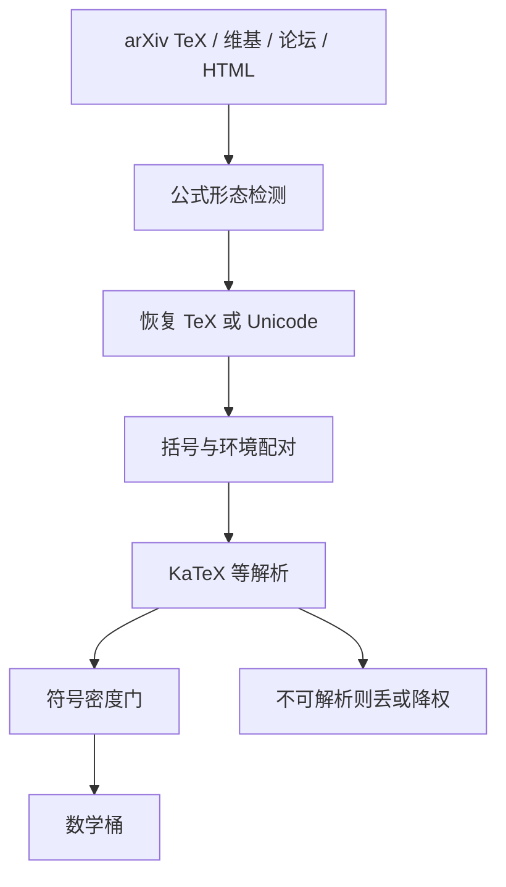

# 数学数据抽取与校对

    
网页上的数学多半不是可训练的符号序列：公式是图片、MathJax 碎片或残缺的美元符号；抽出来却不校对，等于教模型写无法编译的 LaTeX。

    <footer>—— 数学网页语料的工作假设；公开抽取见 OpenWebMath 等从 Common Crawl 回收公式的实践</footer>

通用网页管线会系统性伤害数学。Trafilatura 按新闻密度砍短节点，行内公式先没；Wenzek 的维基 KenLM 把高符号密度当成不像自然语言；DCLM 的指令正例很少是推导。要得到可学的数学，必须单独做抽取与校对：从 arXiv TeX、维基数学、MathStackExchange、以及 Crawl 里带 MathJax / MathML 的页，恢复出平衡的符号序列，并丢掉编译失败、乱码与纯图片公式。Penedo 的 FineWeb 可以提供「提到数学的网页」；真正的推导监督来自保留了 LaTeX 的专用桶。Soldaini 的 Dolma 把论文源分开，正是因为 HTML 网页不是数学的可靠载体。

## 问题

数学在 HTML 里有五种常见形态：Unicode 符号、`$...$` 与 `\( \)`、MathML、MathJax 的脚本配置、以及渲染后的 PNG/SVG。抽取器通常只看见第一种和残缺的第二种。图片公式在纯文本预训练里变成「见图」或 alt 文本空洞。即便恢复了 TeX 片段，未闭合的 `$`、宏未定义、`\begin{align}` 错配，会让序列在符号层不合法。语言模型会模仿这种破损，下游解题时输出无法解析的公式。

来源质量极不均。arXiv 的 TeX 源是金标准，但许可与宏包复杂，展开失败会产生碎片。维基的 `<math>` 相对干净。论坛帖混出口语与公式，美元符号同时表示金钱。Crawl 中的课件常是 PDF 再转 HTML，公式全是图。把这些来源并进「高质量网页」而不做公式级过滤，数学 token 占比看起来在涨，有效可编译序列占比在降。

### 口语化数学不能替代符号序列

「把两边同时除以三」教的是策略，教不会分式的线性写法。Minerva 一类工作强调 arXiv 级符号密度，不是因为网页上没有数学主题，而是因为主题页缺少符号监督。配比里应同时有：符号密集的论文 / 教材，以及带自然语言讲解的论坛。后者不能单独承担竞赛级推导。FineWeb-Edu 可能给习题页打高教育分，但若抽取丢掉了公式图片，留下的是题干残句。教育价值分类器看不见缺失的符号。数学桶的质检必须发生在公式恢复之后，而不是只看页面级分数。

校对的另一面是标准化。同一公式可写成 `frac`、`\dfrac`、Unicode 横线。不规范化，去重与语言模型都把它们当不同字符串。过强的规范化又会抹掉作者有意的对齐与编号——那些对「读论文」有用。应分两层：训练用保留原 TeX；过滤用规范化后再看是否可解析。

## 方法

管线按来源分流。论文：优先 TeX 源（arXiv），用 TeX 引擎或受限宏展开，失败则降级到 GROBID / Nougat 对 PDF 做公式 OCR，并打低置信标记。维基：解析 `<math>` 与模板。网页：检测 MathJax 配置、MathML、`alt` 与常见公式 CSS 类，把节点序列化成 TeX 或 Unicode，而不是让通用抽取器当普通文本。论坛：保护围栏代码与美元公式，金钱消歧用简单规则（数字紧邻货币符号则不当公式）。

校对至少三道门。平衡：美元、括号、`\begin/\end` 配对。解析：KaTeX 或等价解析器无致命错误。密度：公式 token 占总 token 的上下界，避免无公式的「数学」页，也避免纯宏包列表。可选第四门：对表达式抽样做符号计算一致性（两边数值代入），成本高，只适合精选教材。OpenWebMath 一类工作展示了从 Crawl 用启发式召回数学页再清洗的可行性；它不能替代 arXiv 源，但能补习题与中学讲解。

### 召回页与恢复公式是两步

先用 URL、关键词、脚本引用（MathJax CDN）、MIME 把候选页召回，再在候选上做重抽取。用 FineWeb 全文跑 KaTeX 不可行。召回会引入假阳性：讨论「数学教育政策」的新闻。密度门与解析门负责去掉它们。假阴性更严重：个人博客自建公式渲染，检测不到 MathJax。对高价值域（`.edu`、已知课件站）应放宽召回、收紧校对，而不是全球同一规则。

MinHash 对数学页要改 shingle。规范化 TeX 后再做字面去重，否则同一论文的 HTML 与 PDF 转写会留下两三份破损程度不同的副本，模型优先学最破的那份——因为它更常见于 Crawl 镜像。

## 机制

数学语言模型需要在符号上做局部合法与长程相等。训练分布若含大量不可解析序列，损失会推动模型去模仿破损模式，因为它们在数据里是高概率的。校对相当于把支撑限制在「解析器可接受」的近似集合上，使 NTP 的局部统计与下游解析器一致。这与代码的语法门相同，只是数学的「运行」更常是解析而不是执行。

密度门改变配比。没有密度下限，数学桶会被口语帖淹没，符号监督被稀释；没有上限，宏包与字体定义文件会占满。Dolma 把论文单列，是用源类型当密度的弱代理；网页数学没有这个代理，必须显式测符号比。跨语言方面，公式本身接近语言无关，但讲解不是。应保留公式、按 lid 分讲解语言，避免把所有数学页送进英语 KenLM 头档。

### 与 PDF / OCR 路径的接口

扫描教材与论文 PDF 是数学的重要来源，也是错误源。OCR 把上下标认错，会生成可解析但数学上错误的 TeX——校对的解析门放行，符号计算门才能拦住一部分。对预训练，宁可用较少的 arXiv 真源，也不要用大量未校准 OCR。Nougat 一类模型专为学术 PDF 恢复 TeX，其输出仍应过解析门，并与源 TeX 能对齐的子集做置信度估计。HTML 抽取篇解决不了图片公式；必须在这里分流。

## 边界与工程取舍

可解析不等于正确。$(a+b)^2=a^2+b^2$ 能过 KaTeX。竞赛数据需要答案核对或过程监督，那是另一条管线。预训练数学桶以「合法符号 + 人类讲解」为目标，不要假装已经做了正确性证明。许可：arXiv 与论坛各有条款，不能因为「数学」就绕过代码许可篇里同样的治理。

过度过滤会失去手写体、非正式推导与语言混排（中文讲解 + 英文符号）。这些对中文数学能力必要。校对规则应按语种与学段分档：竞赛 LaTeX 严，中小学 Unicode 公式宽。生成模型产出的「假习题」会通过解析门，应靠来源信誉与 SemDeDup 打生成腔，而不是再加更严的括号规则。

不要用通用质量分类器给数学页打分后直接截断。维基 / 指令正例会压低符号密集页。数学要么独立分类器（正例用教材与 arXiv），要么只用启发式密度 + 解析，不用 DCLM 网页头。

## 小结

- 通用抽取与维基困惑度会丢掉或惩罚公式；数学必须分源抽取。
- 优先 TeX 源，HTML 要恢复 MathJax / MathML，图片公式走 OCR 并降置信。
- 校对门：配对、解析、密度；可解析不等于数学正确。
- 规范化后再去重，避免破损镜像排挤干净源。
- 讲解语言与公式分离记账；勿用英语网页质量头截断数学。
- 少而可编译，优于多而破碎。
- 出处：Crawl 数学回收见 OpenWebMath 等；论文源与混合物见 Soldaini Dolma；网页上限见 Penedo FineWeb 与 Barbaresi / Resiliparse 抽取；过滤偏见见 Wenzek CCNet 与 Li DCLM。
