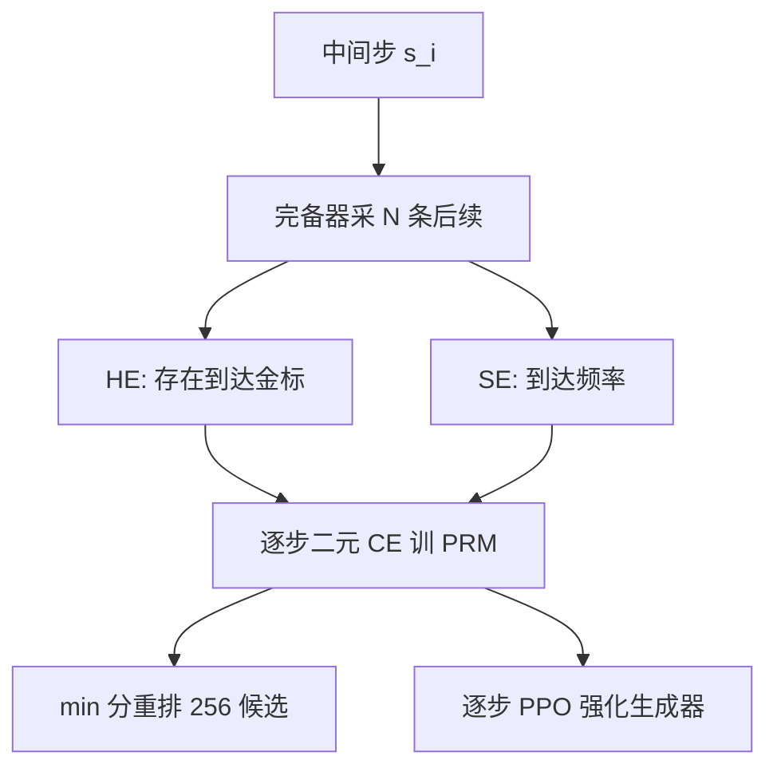

# Math-Shepherd PRM

    
把中间步的质量定义成「从这里接着写，还能推到正确终点的潜力」；用完备器采样后续路径，硬估计或软估计自动标逐步对错，不必再请人逐行打勾。

    <footer>—— Wang、Li、Shao 等，Math-Shepherd: Verify and Reinforce LLMs Step-by-step without Human Annotations，ACL 2024</footer>

Peiyi Wang、Lei Li、Zhihong Shao、Runxin Xu、Damai Dai、Yifei Li、Deli Chen、Yu Wu、Zhifang Sui 在 arXiv:2312.08935（ACL 2024 长文）里给出 **Math-Shepherd**：一张用自动逐步标签训出来的数学过程奖励模型。人标 PRM 的瓶颈是专家时间和协议；他们把逐步质量定义成蒙特卡洛到达率，用与生成器同族的微调模型当「完备器」，从每一步往后解码 $N$ 条，看最终数字是否等于金标。验证时拿 PRM 对 256 个候选重排；训练时把逐步分数送进 PPO。本篇按原文写定义、硬/软估计、主表数字，并标明它与 [Lightman 人标](/llm/lightman-prm) 不是同一对象。

## 问题

ORM 只给整段一个对错，PRM 更会指出第一处破绽，但 Uesato 2022 与 Lightman 2023/2024 都靠人标过程。竞赛数学的标注员要能读证明，成本随步数线性涨，限制了开源复现。作者要的是：**不把人标当必要条件**，仍能训出可用的逐步验证器。代价是标签定义必须改：人标问「这一步数学上是否合法」；自动标签问「这一步之后是否还可能到达金标」。后者会把「非法但可挽救」或「非法却碰巧蒙对」标成正，噪声结构与 PRM800K 不同。

他们在 GSM8K 全集与 MATH 的 500 题切片上评（与 Lightman 的 MATH-500 同一切片逻辑，全文声称子集与全集成绩接近）。生成器先用 MetaMath 微调。验证设定是每题 256 条候选，用奖励模型挑一条。RL 设定是逐步 PPO，而不是只做离线重排。

### 潜力不等于局部正确

定义写在第 3.3 节：一步的质量是它推出正确终点的潜力，类比 MCTS 里的到达价值。这与「当前断言是否真」可分离。例如提前引入一个错误但可逆的代数变形，完备器若常能改回来，软估计仍高；人会标负。反过来，一步正确但把问题引入极难的子情况，到达率低，自动标签偏负。作者承认与 ORM 类似的噪声，并声称仍足以训好 PRM。引用时不要写成「无监督发现了数学真理」，写成「用终点预言机估计逐步价值」。

完备器与生成器同分布时，标签估计的是当前策略下的 Q；换更强完备器，标签变成「存在续写能救」。原文用微调后的开源模型既当生成器也当完备器，两条能力绑在一起。

## 方法

对问题 $p$ 与逐步解 $s=(s_1,\ldots,s_K)$，要标 $s_i$ 时，从该步用完备器解码 $N$ 条后续 $\{(s_{i+1,j},\ldots,a_j)\}_{j=1}^{N}$。硬估计（HE）：

$$
y_{s_i}^{\mathrm{HE}}=\begin{cases}1 & \exists j:\ a_j=a^{\ast}\\0 & \text{otherwise}\end{cases}
$$

软估计（SE）：$y_{s_i}^{\mathrm{SE}}=N^{-1}\sum_j\mathbb{I}(a_j=a^{\ast})$。HE 更像二分类可达性，SE 保留频率。PRM 用逐步二元交叉熵（原文称二分类与三分类差别不大）。评测时轨迹分取各步分数的**最小**，与 Lightman 的乘积不同。也可与自洽组合：按最终答案分组，组内把 RM 分加总再选众数答案。

两个下游。**验证**：256 路候选，Shepherd 挑最高分，图 1 里 DeepSeek 67B + Shepherd 在 GSM8K 达到 93.3%、MATH 子集 48.1%，作者称为当时无工具开源的强结果，仍低于当时的 GPT-4-0613。**RL**：逐步 PPO 用 PRM 给每步奖励。Mistral-7B 在 GSM8K 上 $77.9\%\to 84.1\%$，MATH 上 $28.6\%\to 33.0\%$；再加验证可到 89.1% 与 43.5%（ACL 相机就绪稿数字）。这些绑定 MetaMath 微调起点、256 候选与他们的 PRM 检查点。

数据构造相对 ORM 只多一段：ORM 对整段看一次终点；Shepherd 对每个中间步都要 rollout。计算量约是步数乘 $N$ 乘生成长度。这是用 GPU 换标注员。过滤与 MetaMath 题集质量会进标签：金标错，正负全反。

### 验证与强化是两条曲线

验证器实验不更新生成器，量的是排序质量。PPO 实验更新生成器，量的是逐步奖励能否改变策略。原文两条都报，不能只用 93.3% 那条代表「训练了 Shepherd」。93.3% 是 67B 生成器加 256 路重排；7B PPO 的 84.1% 是另一张表。把验证增益写成「模型变强了」会夸大权重里的能力。

相对 Lightman：没有主动学习挑高分错解，标签密度来自全量自动标注；没有公开与 PRM800K 同级的逐步人标对照作为主训练数据。作者说自动标签与人标相关性强，那是支持「可以当代理」的证据，不是证明逐步真值一致。

## 机制

HE 把逐步分类的决策面推到「可达集是否非空」。$N$ 有限时，难步容易被低估（没采到那条救命续写），易步即使局部有瑕疵也常被标正。SE 提供介于 0 与 1 的软目标，优化更稳，但对 $N$ 的方差敏感。min 归约与「一步错则污染后续」的数学解题同构，所以验证时接近一票否决；若任务允许局部瑕疵，min 会错杀。

逐步 PPO 的机制是把稠密信号放到决策点上：错步立刻负奖励，不必等整段结束。这降低结果监督的信用方差。风险是策略学会讨好 PRM：写完备器喜欢的续写风格、把步切得很碎以提高某类分数，而不是写更短的正确证明。PRM 与生成器若同源，共盲会在 RL 里放大，验证器余量变小。

「无人工标注」指逐步标签不靠人，不指完全无监督。题面、金标、MetaMath 轨迹、完备器权重都是人工或模型产物。金标错了，Shepherd 会系统性地强化错误终点。

### 为何它能超过自洽

自洽只看最终数字众数，同一错解重复出现会赢。PRM 读过程，可以在多数票错误时把少数正确过程抬上来，也可以在多数正确时扔掉过程烂的。SC+RM 把两种信号加起来：先按答案分桶，再对桶打分。原文这一项是加分项，不是 Shepherd 的定义本身。256 候选是验证算力，不是训练超参；部署若只能 8 路，曲线要重测。

## 边界与工程取舍

定义依赖金标，开放题、多答案题、证明题没有单一 $a^{\ast}$ 时框架不成立。完备器弱，早期步的 SE 接近随机，PRM 学不到有用边界。$N$ 与步数的乘积在 MATH 长解上很贵，这是自动过程监督相对人标换来的另一张账单。评测子集 MATH-500 与后来社区切片对齐，但 67B + 256 路的 48.1% 不要直接和今天的 pass@1 长链模型比，搜索预算不同。

不要把 Math-Shepherd 写成 R1。R1-Zero 用结果级规则奖励与 GRPO，没有这张逐步分类器。DeepSeekMath 的过程监督 GRPO 在精神上接近「逐步奖励」，标签来源仍可不同。开源复现应公开：完备器检查点、$N$、HE 还是 SE、归约是 min 还是积、候选数。

图 1 把 DeepSeek 67B + Shepherd 与早期 GPT-4 叙述对比，作者自己写仍落后 GPT-4-0613。引用「超过 GPT-4」必须落到具体快照与是否含工具、是否 BoN。

### 何时不必上 Math-Shepherd

已有 PRM800K 且任务就是 MATH 风格逐步判定，人标 PRM 更贴局部真假。检查器能在线跑且只关心填空，规则 ORM / GRPO 更简单。没有可靠金标，不要用伪造的终点去自动标过程。需要逐步搜索剪枝时，Shepherd 可以用，但应在同一切分上校准阈值，不要直接抄 256 路的 min 分。

## 小结

- Math-Shepherd 用完备器从每一步 rollout，以到达金标的潜力作为逐步标签，训二元 PRM。
- HE 是可达性，SE 是频率；评测轨迹分取逐步分数的最小。
- 两条用法：256 路验证重排，以及逐步 PPO；Mistral-7B 与 DeepSeek 67B 的数字不可互换解释。
- 标签便宜但噪声是「蒙对也算潜力」，与 Lightman 人标不是同一随机变量。
- 出处：Wang 等，*Math-Shepherd*，ACL 2024，arXiv:2312.08935。
