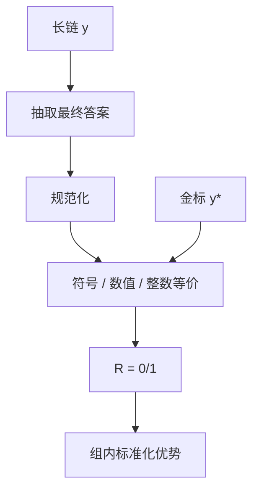

# 数学验证器与等价

$1/2$ 与 $0.5$ 是同一个数；字符串不等价不是答错。校验器的规范比模型更常成为噪声源。

<footer>—— GSM8K / MATH 的答案核对传统；DeepSeekMath 与 R1 把抽取 + 等价接到 GRPO</footer>

[上一课](/llm/code-verifier-unittests)把代码 $R$ 写成单测执行。数学没有「跑程序」这么干净：最终答案是表达式、整数或选择题。缺口是：**抽取之后必须定义等价，而不是 `strip()` 后的字符串相等。** Hendrycks 的 MATH、Cobbe 的 GSM8K、DeepSeekMath 的规则奖励，都在这条规范上。本课写验证器，不重写 [GRPO](/llm/grpo) 公式。

## 问题

[可验证奖励](/llm/verifiable-reward) 要求 $\mathrm{check}(\mathrm{extract}(y), y^\star)$。extract 锁 boxed / 最后一行；check 若是字符串相等，则 $\tfrac12$、`0.5`、`1/2` 会假阴性，策略被教去模仿金标的书写而不是数学。假阳性同样存在：抽到中间计算当最终答案。规范要版本化，像代码一样 diff。

符号计算（SymPy 化简后比较）、数值采样（随机点求值）、整数化（DAPO-Math 把题改写成整数答案）是三条路。整数化降低解析失败，也改变题意。复现必须声明用哪条。

### 过程胡写、答案碰对

结果验证不管中间步骤。蒙对、抄错再改回、用错误引理得到对的数字，都得 $R=1$。这是与 [PRM](/llm/process-supervision) 的分工：本课只钉终点；逐步合法留给过程模型。R1-Zero 接受终点监督，换来不标步骤。

格式奖励（是否包在 `\boxed{}`）应尽早饱和后关掉，否则模型靠格式刷分。可验证课已经警告过这一点。

## 方法

流水线：采样 $G$ 条长链 → 按训练/评测同一套正则抽取 → 规范化（去空格、统一分数线）→ 等价判定 → $R\in\{0,1\}$ 或部分分。等价：对有理数用精确比较；对表达式试解析再 `simplify(a-b)==0`；失败则回退字符串。超时与解析异常记为 0，并打日志，否则静默假阴会污染优势。

接到 [PPO](/llm/ppo-llm) 或 GRPO 时不要把解析失败与数学错误混成同一损失桶。评测脚本必须与训练 $R$ 同源；MATH 官方解析与自写脚本不一致时，分数不可比。

## 机制

等价放宽了书写，梯度才对准数学内容。过宽的数值比较（容差太大）会把近似错当对。过严的符号失败会把正确但解析器吃不了的式子当错，策略学会只输出解析器偏好的规范形——又一种黑客。整数化是工程折中：解析稳，表达力下降。

组内全错时没有相对信号，难题上学习停滞，这是验证器加上群体基线的合取，不是验证器单独的错。温度与题库难度要一起调。

不要把「LLM 检查两式是否相等」当作本课验证器。那是裁判，会把等价噪声换成模型噪声。

## 边界与工程取舍

证明题、开放推导没有短答案，本课 $R$ 不够，应走 PRM 或形式化助手（Lean）。代码题走上一课。多目标（对且短、对且可读）留给下一课加权。验证器吞吐高，是推理 RL 的主场；不要为了「统一接口」把数学改回 RM。

## 小结

- 数学 $R$ 是抽取 + 等价，不是字符串相等。
- 符号、数值、整数化三条规范必须声明；假阴假阳来自规范。
- 终点正确不蕴含过程合法；过程走 PRM。
- 训练与评测必须同源脚本。
- 出处：Cobbe 等 GSM8K；Hendrycks 等 MATH；Shao 等 DeepSeekMath；DeepSeek-AI R1。
