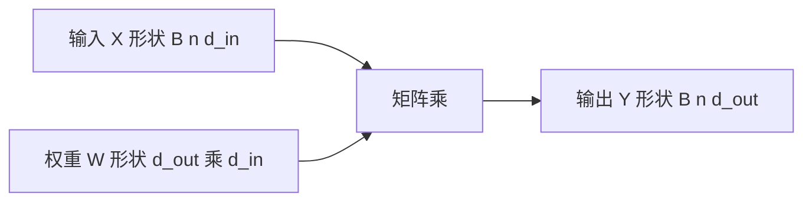

# 矩阵乘作为一层

仿射变换把一组输入坐标改写成另一组输出坐标；深度网络的一层，首先是一次可学习的矩阵乘。

<footer>—— 据 Goodfellow, Bengio &amp; Courville, Deep Learning, 2016 整理</footer>

[张量、形状与广播](/llm/tensor-shape-broadcast)钉死了轴如何对齐。本课不重讲广播规则。缺口是：对齐之后，把 $x\in\mathbb{R}^{d_{\mathrm{in}}}$ 映到 $y\in\mathbb{R}^{d_{\mathrm{out}}}$ 的基本可学习算子是什么。没有这次矩阵乘，后面的感知机、注意力里的投影、分类头都没有对象。偏置、激活、初始化是后课；这里只把「一层 $=$ 一次 GEMM」钉住。

## 问题

形状合法只说明两个数组能相乘，不说明乘完的结果是一层网络。逐元素乘没有把「每个输出坐标都看见全部输入」这件事写进去；卷积把局部窗口摊开之后，核心仍是矩阵乘。缺口因此不是新的形状规则，而是把可学习参数收进一张矩阵 $W$，使 $y$ 的每一个分量都是 $x$ 的线性组合。

若把一层写成一堆标量权重的 Python 循环，批维、序列维无法一次交给硬件。框架与加速器为 GEMM 做了几十年优化；大模型里绝大多数浮点运算都落在不同形状的矩阵乘上。本课把这一事实写成定义，而不是写成实现偏好。

### 矩阵乘不是逐元素乘

$(B,n,d)$ 与另一张同形张量相乘，得到的仍是逐位置缩放，通道之间不混合。线性层要的是：$d_{\mathrm{in}}$ 被收缩，$d_{\mathrm{out}}$ 被展开，每个输出通道是输入通道的加权和。形状上看，是 $(B,n,d_{\mathrm{in}})$ 与 $(d_{\mathrm{in}},d_{\mathrm{out}})$ 的收缩，不是 $(B,n,d)$ 与 $(B,n,d)$ 的 Hadamard 积。把两种乘法叫成同一个「乘」，后课的投影层会没有对象。

公式里常写 $y=Wx$ 或 $y=xW^\top$，差别只在 $W$ 按行还是按列存。框架的 Linear 默认右乘 $xW^\top$。本课两者等同，后课读代码时先看 $W$ 的形状是 $(d_{\mathrm{out}},d_{\mathrm{in}})$ 还是反过来。

## 方法

存储 $W\in\mathbb{R}^{d_{\mathrm{out}}\times d_{\mathrm{in}}}$。单个向量 $y=Wx$（或 $y=xW^\top$）。一批 $X\in\mathbb{R}^{B\times d_{\mathrm{in}}}$ 则 $Y=XW^\top\in\mathbb{R}^{B\times d_{\mathrm{out}}}$。序列再加一轴：$X\in\mathbb{R}^{B\times n\times d_{\mathrm{in}}}$，矩阵乘作用在最后一维，前两维当批。参数量是 $d_{\mathrm{in}}d_{\mathrm{out}}$，与 $B,n$ 无关：同一张 $W$ 被所有位置共享。

这就是全连接层的核心。后课 MLP 的两张投影、注意力里把残差流切成查询键值、语言模型的分类头，都是同一算子换形状。本课不引入偏置向量 $b$；没有 $b$ 时，过原点的线性映射不能表示平移，那是[线性层与偏置](/llm/linear-layer-bias)的缺口。

## 机制

每个输出神经元规定一组对输入的权重。矩阵乘把「$d_{\mathrm{out}}$ 组权重同时作用在一批向量上」收成一次核函数。梯度 $\partial L/\partial W$ 具有外积结构：输入向量与上游传来的输出梯度相乘，按批与位置求和。后课反向传播会把这一行写成局部规则；本课只需承认：$W$ 的每个元素都有明确的对损失的导数，因为映射对 $W$ 是线性的。

共享同一张 $W$ 是归纳偏置：序列里第 $1$ 个位置和第 $n$ 个位置用同一组坐标变换。位置之间的差异必须由输入内容（以及后课才出现的位置编码）提供，而不是由「每一列一套 $W$」提供。这与卷积共享核是同一类节省，只是这里的「窗口」是整个特征维。

## 边界

本课不讨论偏置、激活、初始化方差，也不把卷积展开成 im2col。低秩分解、混合专家里的路由，都还是同一张稠密 $W$ 的变体，不在这里展开。下一课[范数、余弦与投影](/llm/norm-cosine-projection)不问如何变换空间，而问变换之后如何度量两个向量有多像。后课默认：看见「一层线性」，就写成一次对最后一维的矩阵乘，参数量 $d_{\mathrm{in}}d_{\mathrm{out}}$。

## 小结

- 线性层的核心是 $y=xW^\top$；批与序列维沿前面的轴并行，最后一维被收缩。
- 参数量 $d_{\mathrm{in}}d_{\mathrm{out}}$，与批大小、长度无关；同一 $W$ 被各位置共享。
- 这不是逐元素乘：通道混合靠收缩 $d_{\mathrm{in}}$。
- 注意力与 MLP 的投影、分类头，都是这一算子换形状。
- 出处：Goodfellow et al., Deep Learning, 2016，前馈网络中的仿射变换。
