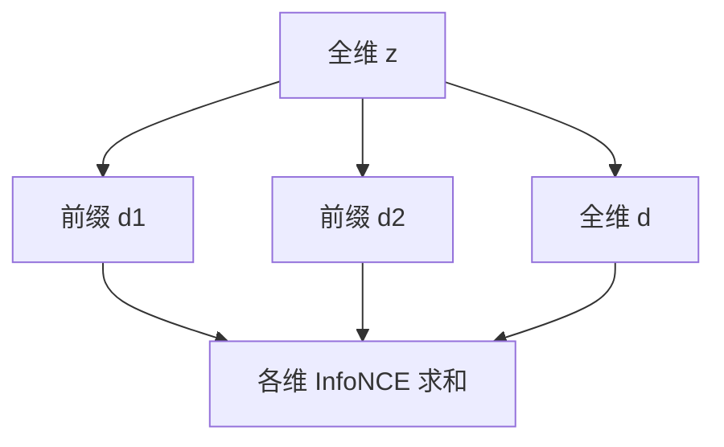

# Matryoshka 表示

同一个向量的前 $k$ 维仍是合法嵌入。短的用于粗检索，长的用于重排，不必为每种维度训一个模型。

<footer>—— Kusupati 等, Matryoshka Representation Learning</footer>

[上一课](/llm/hard-negatives)把空间细粒度撑开，默认维数仍是固定的 $d$。索引内存与 ANN 延迟随 $d$ 涨。本课写 Matryoshka 表示：训练时对前缀维一起做对比损失，使截断仍有意义。缺口是部署预算，不是再挖负例。后课指令嵌入默认你可以先截维再谈「按指令改空间」。

## 问题

产品常要多层：内存里存 64 维粗向量，命中后再用 768 维精排。若三个模型分别训，空间不对齐，粗召回的 Top-$n$ 对精排无效。Kusupati 等人的 MRL 在同一 $z\in\mathbb{R}^{d}$ 上对一组维数 $\{d_1\lt \cdots\lt d\}$ 同时施加损失，迫使信息按维数嵌套排列：前几维先编码粗语义，后继维补细节。

与 PCA 事后截断不同：未经 MRL 训练的向量，能量不一定集中在前缀，截断会毁度量。

嵌套的是**同一塔的输出前缀**，不是一层套一层的网络宽度。实现上是对 $z_{1:d_i}$ 再归一化后做 InfoNCE。

## 方法

对每个选定 $d_i$，取 $z^{(i)}=\mathrm{normalize}(z_{1:d_i})$，算 InfoNCE，总损失加权求和。推理：存一份全维向量，按层截断；或索引只存短前缀以省内存。加权不要让最大维独占梯度，否则短前缀学不会。评测必须分列各 $d_i$ 的召回，而不是只报全维。

## 机制

梯度要求：仅用前 $d_1$ 维也要能分开正负对，于是粗信息被迫挤进前缀。更高维在粗信息已够用的对上可以近零，在细粒度难负例上才有用——与难负例课互补。若难负例全是主题级，高维没有可学的残差，MRL 退化为浪费。

## 边界

截断不是免费的：短维上的召回一定弱于全维，只是通常强于另训的小模型或 PCA。下一课指令嵌入改变的是条件，不是维数嵌套。

## 小结

- MRL 让一个向量的前缀维可当合法嵌入，服务粗到细的索引。
- 各目标维都要进损失；事后 PCA 不能替代。
- 细粒度难负例给高维可学的残差。
- 出处：Kusupati 等 *Matryoshka Representation Learning*。
