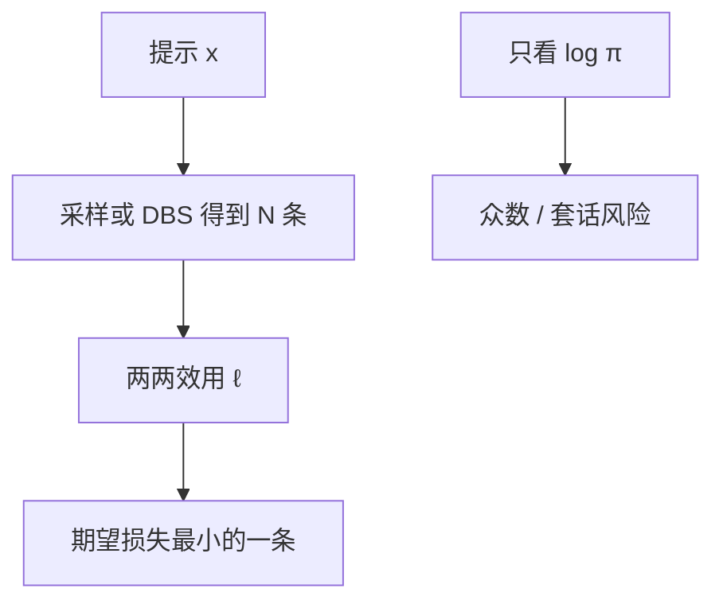

# MBR 解码

不要交付众数，交付在期望效用下最好的那一条：用样本近似后验，再用任务度量当损失函数。

<footer>—— Eikema & Aziz, Is MAP Decoding All You Need?, COLING 2020；神经度量上的 MBR 见 Freitag et al., 2022</footer>

[上一课](/llm/diverse-beam-search)把束掰成多条脊，交付的仍是「某条脊上的 MAP」。本课改交付规则：最小贝叶斯风险（MBR）不找 $\arg\max_y \pi(y\mid x)$，而找使期望损失最小的 $y$。机器翻译里 Kumar 与 Byrne 早已用 MBR；Eikema 与 Aziz 指出神经 MT 的众数往往是退化的，应从模型的 *样本* 里估后验，再用 BLEU 或神经度量选代表。后课的层对比与上下文对比，是逐步改分布；MBR 是序列级重排，先修这一层。

## 问题

[长度惩罚](/llm/length-penalty-degeneration)与 DBS 都还在 MAP 家族里打转：一条假设的好坏等于它自己的 $\log\pi$ 加减惩罚。人在意的是效用：翻译是否充分、摘要是否漏点、答案是否可核对。MAP 的众数可以是「安全套话」，期望效用的最优可以是一条概率不最高、但与许多样本都接近的句子。缺口是：已经有一堆候选（束、DBS、或温度采样）之后，如何用它们互相当证据，而不是再看一遍 $\pi$。

MBR 的代价立刻出现：要对候选两两算效用，成本 $O(N^2)$ 次度量前向。神经度量（COMET、BLEURT）本身是模型，N=64 的 MBR 可能比再生成一次更贵。本课把「选哪条」从「生成哪条」拆开，不把度量训练写进来。

MBR 不是多数票。多数票在 *答案空间* 上计数，见 [Self-Consistency](/llm/self-consistency)。MBR 在 *字符串或嵌入空间* 上最小化期望损失，即使没有可解析的最终答案也能用——这也是它比投票更贵的原因。

## 方法

从 $\pi(\cdot\mid x)$ 抽（或束出）集合 $\mathcal{Y}=\{y_1,\ldots,y_N\}$。选

$$
\hat y=\arg\min_{y\in\mathcal{Y}}\sum_{y'\in\mathcal{Y}}\ell(y,y'),
$$

其中 $\ell$ 是任务损失（$1-$BLEU、一减 COMET、编辑距离）。这是用样本对后验做蒙特卡洛、并用 $\mathcal{Y}$ 同时当假设集与证据集的常用近似。$\ell$ 必须与任务同向：开放聊天没有稳定 $\ell$，MBR 会把文风推向度量模型的偏好，与 RM 上的 Best-of-N 同一类风险。

候选从哪来决定覆盖。只用普通束，MBR 重排的是同一脊上的微扰，收益小；用 [温度](/llm/sampling-temperature-topp) 采样或 DBS，证据集才张开。Freitag 等人表明：用神经度量当 $\ell$，MT 上 MBR 可超过把度量当 reranker 只打 $\pi$ 的基线——因为比较的是假设之间，不是假设与源的绝对分。

## 机制

若 $\pi$ 把质量铺在一个语义簇上，MBR 的最优接近该簇的「中心」，对个别噪声样本稳健。若 $\pi$ 是多峰且各峰效用不同，$\ell$ 负责挑峰：BLEU 会偏向 n-gram 中心，神经度量会偏向其训练过的「好翻译」流形。假阳性与 RM 过优化同构：$N\to\infty$ 时交付的是 $\ell$ 的模式。因此 MBR 的上限是度量，不是生成器覆盖——覆盖只保证中心能被样本碰到。

对称 $\ell(y,y')=\ell(y',y)$ 时，MBR 选出的是集合的中位；不对称损失（漏翻 vs 过翻）会改变中心。不要默认所有度量可交换。

## 边界与工程取舍

延迟敏感的对话不要默认 MBR：$O(N^2)$ 次 COMET 前向会把 TPOT 打穿。离线 MT、评测、数据过滤更合适。数学题应先解析再在答案空间投票，不要对整段思维链做 BLEU-MBR。候选必须独立或至少多样；对贪心的 $N$ 份复制做 MBR 无定义。

出处：Eikema & Aziz, COLING 2020；Freitag et al., 2022（神经度量 MBR）。经典 MT 的 MBR 见 Kumar & Byrne。不要发明「LLM-MBR」的 arXiv 编号。

## 小结

- MBR 最小化期望任务损失，不最大化 $\pi$；交付的是样本集的中心而非众数。
- 候选要用采样或 DBS 张开；普通束上的 MBR 收益薄。
- 成本是 $O(N^2)$ 次度量；上限由 $\ell$ 的校准决定。
- 可解析答案上，投票通常更便宜、更对症。
- 开放生成的 $\ell$ 会把文风推向度量模型。
- 后课改逐步分布，不再假设已经有一套序列级度量。
- 出处：Eikema & Aziz, COLING 2020；Freitag et al., 2022。
