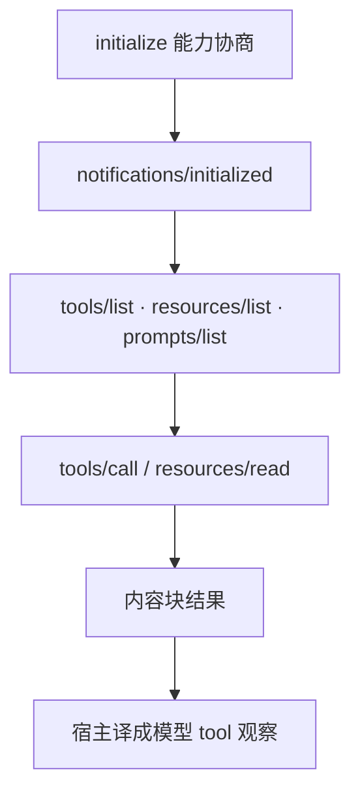

# MCP 协议设计

    
用 JSON-RPC 做能力协商与运行时发现：宿主管模型与授权，服务器管数据源；工具、资源、提示是三种不同的原语，不是三种函数别名。

    <footer>—— Anthropic，Model Context Protocol 规范与 2024 年 11 月公告；对照 JSON-RPC 2.0</footer>

[MCP 与工具生态](/llm/mcp) 一文写网络效应与「USB-C」类比。本篇把镜头对准**协议本身**：生命周期、能力位、方法名、传输与内容块。Anthropic 于 2024 年 11 月公布 Model Context Protocol：客户端（嵌在 IDE、桌面宿主里）与服务器（独立进程或远程服务）用 JSON-RPC 2.0 交换消息。它不规定 [ReAct](/llm/react) 怎么规划，也不规定模型厂商；它规定如何列出工具、如何调用、如何读资源、如何取提示模板，以及可选的反向采样。没有一篇叫 MCP 的经典 NeurIPS 论文，出处就是公开规范与公告。本篇不把连接器博客的延迟数字写进协议定义。

## 问题

Function calling 的 `tools` 数组是**这一次** HTTP 请求里的静态清单。进程模型缺失：密钥、崩溃、热更新、多数据源隔离都挤在宿主进程里。插件若绑死某一家聊天产品，同一份数据库要写 N 套适配。协议要解决的是进程间契约：如何握手版本、如何声明「我有工具 / 我能订阅资源 / 我禁止你调用模型」、如何把一次调用的 id 与结果对齐、传输在本地管道与远程 HTTP 之间如何换而不改方法名。

三种信息不能都叫 tool。查询与副作用是工具；大段只读上下文（文件、schema）是资源，应有 URI 与可选订阅；可复用的消息草稿是提示模板，参数化后变成对话前缀。若全做成函数，缓存、权限与日志语义都会错：读第 3 页变成一次「调用」，无法做资源级 ETag 或变更通知。设计问题是原语划分，而不只是再包一层 JSON。

### 先协商能力，再调用方法

未在握手中声明的能力，对端不应调用对应方法。服务器说没有 `resources`，客户端就不要发 `resources/read`。客户端若未开放 `sampling`，服务器不能把补全任务踢回宿主。这一位图比「文档里写了个方法」更硬：版本演进时，旧客户端遇到新方法应得到标准 JSON-RPC 错误，而不是静默忽略导致状态分歧。

规范会改传输（早期 HTTP+SSE 到后续 Streamable HTTP）并加字段。实现必须声明 `protocolVersion`。不要把某一周的草稿方法当成永远稳定的 ABI。本篇描述公开设计，不跟踪未发布的私有扩展。

## 方法

握手：客户端发 `initialize`，带协议版本、客户端信息与能力；服务器回自身能力与服务器信息；客户端再发 `notifications/initialized`。之后才是业务方法。工具：`tools/list` 返回名称、描述、`inputSchema`（JSON Schema）；`tools/call` 带名字与参数对象，结果是内容块列表（文本、图像等）加可选错误标志。列表可变更时走 `notifications/tools/list_changed`，客户端应再 list。资源：`resources/list` / `resources/read`，URI 标识；可订阅则有 `resources/subscribe` 与更新通知。提示：`prompts/list` / `prompts/get`，返回消息数组草稿。

传输：本地开发以 **stdio** 为主，一帧一条 JSON-RPC 消息，便于任意语言写小服务器。远程需要带会话的 HTTP 流，以便多宿主连接同一数据源；具体路径以当时规范为准。日志、进度、取消是控制面：长调用应能被 `notifications/cancelled` 打断，进度通知不要和最终结果抢同一个 id 语义。错误沿用 JSON-RPC 码（解析 -32700、方法不存在 -32601、非法参数 -32602、内部 -32603）并允许应用层附加 MCP 数据。

### 内容块与模型信封的翻译点

服务器返回的是协议内容块，不是 Chat Completions 的 `role: tool`。翻译发生在**客户端**：文本块变成 tool 观察字符串，图像块变成多模态消息部分，错误标志变成模型能读的失败说明。`inputSchema` 与 function calling 的 `parameters` 同构，所以列表可以一对一登记进当轮 `tools`。资源则通常注入为上下文，而不是一次函数调用——除非宿主故意把 `read` 包成工具。这一翻译层是设计的一部分：协议稳定，模型厂商可以换。

## 机制

对模型，MCP 往往透明：它仍在 function calling 分布上采样名字与 JSON。协议改变的是**条件前缀从哪来、副作用在哪执行**。发现使工具集随连接的服务器变化；隔离使密钥留在服务器进程；JSON-RPC `id` 使并行 call 可以对齐。`sampling/createMessage` 把方向反过来：服务器请宿主代调模型。这在不可信服务器上等于出借补全能力，默认应关。Roots 向服务器声明工作区根路径，缩小文件类服务器的可见范围，是权限设计而不是检索算法。

通知（notification）无响应、无 id 匹配义务，适合 list_changed、进度、日志。若把通知误当成请求去等结果，客户端会死锁。批量 RPC 在现代 MCP 传输里并不作为一等依赖；实现应以单消息帧为准。schema 稳定性决定生态：同一工具在不同宿主描述不同，模型调用分布就会漂移——这是协议无法单独修复的，需要服务器作者把描述当 API 的一部分来版本化。

MCP 不替代鉴权网关、不替代结构化解码、不替代多步规划。它只保证有一份可发现的进程契约。内部单个 Agent 运行时若永不复用连接器，直接函数分发更短；为「生态」把高权限 shell 暴露成通用服务器，是设计误用。

## 边界与工程取舍

### 传输换了，威胁模型也要换

远程传输的威胁模型与 stdio 不同：数据面进网络，要 TLS、鉴权、审计，不能因为「官方连接器」就共用本地信任假设。资源读取能打满上下文，必须有体积与超时。工具副作用的确认 UI 属于宿主，协议只把 call 送到服务器。评测应拆开：互操作（能否 initialize/list/call）、模型用工具成功率、服务器业务正确性。stdio 上「用户已登录本机」的隐含信任，搬到公网会立刻失效。

与纯 function calling：无 MCP 也能做工具，只是清单写死在宿主。与 [tool-call-sft](/llm/tool-call-sft)：训练的是模型如何填 schema，不是进程如何握手。规范演进期间，客户端应对未知能力降级，而不是声称实现「全部 MCP」。

出处：Anthropic Model Context Protocol 公开规范与 2024-11 公告；JSON-RPC 2.0（RFC 风格的 `jsonrpc: "2.0"` 消息模型）。无会议长文作为协议定义。

## 小结

- MCP 用 JSON-RPC 握手能力，再发现并调用 tools / resources / prompts。
- 宿主译成模型信封；服务器持有数据源密钥；sampling 默认关闭。
- 传输（stdio 与远程 HTTP 流）可换，方法名与内容块语义应保持。
- 协议不管规划算法与检索，只管进程间契约与隔离。
- 出处：Anthropic MCP 规范；JSON-RPC 2.0。
