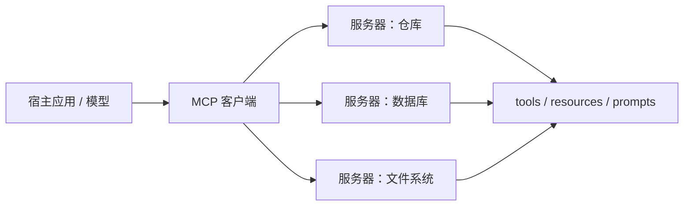

# MCP 与工具生态

    
用开放协议把上下文与工具从各家专有插件里抽出来：宿主负责对话与模型，服务器负责数据源与副作用，中间是可发现的 JSON-RPC。

    <footer>—— Anthropic，Model Context Protocol 公开规范与 2024 年 11 月公告</footer>

Function calling 解决的是「这一次 HTTP 请求里有哪些函数」。应用一多，每个桌面客户端、每个 IDE、每个 Agent 运行时都要为 GitHub、数据库、文件系统各写一套适配，工具生态按客户端数量叉乘。Anthropic 提出的 Model Context Protocol（MCP）把这层适配收成开放协议：MCP 服务器暴露工具、资源与提示模板；MCP 客户端跑在宿主（聊天应用、IDE、自动化运行时）里，负责发现、鉴权与把调用翻译成模型能看的消息。它不是新的基座模型，也不是 ReAct 算法，而是工具与上下文的 USB-C。本篇写宿主—客户端—服务器的边界、三类原语、以及它和 [function calling](/llm/function-calling) 信封如何衔接。

## 问题

专有插件把「怎么连上数据」锁在某一家产品里。换宿主就要重写连接器；同一份 Postgres 在 IDE 与聊天应用里各维护一套 SQL 工具描述，描述漂移后模型调用行为也漂移。另一方面，把所有工具静态写进每次 Chat Completions 的 `tools` 数组，清单会随安装的集成线性膨胀，上下文被说明书占满，权限也无法按服务器隔离。需要运行时发现、按服务器进程隔离密钥、以及与模型厂商无关的传输。

协议还必须允许非工具的上下文：一整份文件、一组数据库 schema、一段可复用的提示词，并不都适合做成「函数」。若只提供 function calling，宿主只能把文件内容塞进 system prompt，缓存与访问控制都变粗糙。MCP 把资源（可读的数据）和提示（可复用的消息模板）从工具（有副作用的动作）里分开，问题设定比「再包一层 JSON 函数」更宽。

### 宿主、客户端、服务器

宿主是用户面对的应用，拥有模型调用、UI 与最终权限提示。客户端是宿主内的协议栈，维护与各服务器的会话。服务器是独立进程或远程服务，实现工具与资源，通常用 stdio 跑在本地，或用 HTTP 流式传输跑在远程。初始化时双方交换协议版本与能力集：服务器声明自己有 tools / resources / prompts 中的哪些；客户端声明自己是否允许服务器反向请求模型采样。能力未声明的方法不应被调用。

MCP 服务器拿到的密钥属于该数据源，不应等于宿主的模型 API key。反过来，服务器若被授予「代宿主调用模型」（sampling），就相当于把补全能力借给不可信进程。默认应关 sampling，只保留工具与只读资源。

## 方法

传输层是 JSON-RPC 2.0：请求有方法名与 id，响应匹配 id，通知无响应。本地开发常用 stdio，一条消息一行，便于把服务器写成任意语言的小进程。远程则走带会话的 HTTP 流，以便多客户端连同一数据源。握手之后，客户端调用 `tools/list` 得到名称、描述与 input schema，再在用户打开某连接器时把子集登记进当前对话的工具表。调用走 `tools/call`，参数是结构化对象，结果是文本或内容块（含图片等），由客户端改写成模型侧的 tool 观察。

资源用 URI 标识，`resources/list` / `resources/read` 把文件、工单、表结构读成模型上下文。提示模板 `prompts/list` / `prompts/get` 让服务器提供带参数的消息草稿（例如「根据这份 schema 写查询」），减少每个宿主各写各的 system prompt。这三类都可以在运行时通过通知做变更：工具列表热更新后，宿主应重新同步，而不是沿用进程启动时的一份静态 JSON。

### 三类原语：工具、资源、提示

工具对应有副作用或查询语义的函数，input schema 与 function calling 的 parameters 同构，因此客户端可以一对一地翻译成 `tools` 字段。资源是可寻址的只读（或可订阅）数据，适合当检索语料或 schema 目录，而不必为「读第 3 页」发明一个函数。提示是服务器维护的对话草稿，适合把领域诀窍留在连接器里而不是散落在各宿主的提示库。把读文件全部实现成工具也能用，但会失去 URI、订阅与「当上下文而不是当动作」的语义，日志和缓存都会变差。

## 机制

对模型而言，MCP 通常是透明的：它仍然看见 function calling 风格的名字与 JSON 参数，或看见被贴进前缀的资源文本。协议的价值在 *发现与隔离*。发现使工具清单随已连接服务器变化；隔离使崩溃、限流、密钥泄漏以服务器为边界。JSON-RPC 的 id 把一次 `tools/call` 与结果对齐，并行调用可以在客户端映射为并行 function calling 的多个 `tool_call_id`。资源读入会增加预填充长度，应有体积上限，否则一次 `resources/read` 就能把上下文窗打满。

生态上的网络效应来自「写一次服务器、挂多个宿主」。这要求 schema 与错误形状稳定，否则模型在 A 宿主学到的调用在 B 宿主因描述不同而失败。它不规定检索算法：服务器内部可以是 [混合检索](/llm/hybrid-retrieval) 或一次 SQL。也不规定多步策略：循环仍是宿主的 [ReAct](/llm/react) 或规划器。MCP 只保证「有一个地方能列出并调用工具」。

不要把 MCP 写成「Anthropic 模型专用」。规范是开放的；宿主可以接任何实现了 chat 与工具字段的后端。反过来，接了 MCP 也不等于模型会用工具——模板、微调数据和 <code>tool_choice</code> 仍然决定行为。

### 与专有 function calling 的关系

Function calling 是模型 I/O 契约；MCP 是工具进程与宿主之间的契约。两者叠在一起：MCP 的 list/call 填满 function calling 的声明与执行。没有 MCP 时，宿主把硬编码函数当执行器，仍然可以做 function calling。没有 function calling、只把 MCP 资源塞进提示，模型只能读不能按 schema 调动作。产品上应先有执行白名单，再考虑是否用 MCP 做发现，而不是为了「生态」把不可信服务器连进生产。

## 边界与工程取舍

MCP 不解决工具幻觉、不解决 JSON 参数错误，那些仍靠描述质量、[结构化输出](/llm/json-schema-decode) 与执行层校验。它也不替代企业服务网格：认证、审计、多租户配额要做在宿主或网关上。远程服务器把数据面暴露到网络，威胁模型与本地 stdio 不同，不能共用一份「反正是官方连接器」的信任假设。规范会演进（传输从早期 SSE 到后续流式 HTTP），客户端应声明对齐的协议版本，而不是声称追踪每一天的草稿。

不要为每个内部微服务都写一个 MCP 服务器，除非真有多种宿主要复用。内部只跑一个 Agent 运行时，直接函数分发更短。也不要把高权限 shell 做成通用 MCP 工具再交给通用模型。评测生态时分开：协议互操作（能否 list/call）、模型用工具成功率、服务器实现正确性。三者失败形态不同。

出处是 Anthropic 的 MCP 规范与公告、JSON-RPC 2.0。没有一篇叫「MCP」的经典 NeurIPS 论文；不要把连接器博客的延迟数字写进协议定义。

## 小结

- MCP 用 JSON-RPC 让宿主发现并调用外部服务器上的工具、资源与提示，解决的是生态与隔离，不是新的推理算法。
- 宿主拥有 UI 与模型；服务器拥有数据源密钥；sampling 反向调用默认应关。
- 工具与 function calling 的 schema 同构，便于翻译；资源与提示覆盖「不是函数」的上下文。
- 对模型通常透明，价值在运行时清单、进程隔离与一次编写多宿主复用。
- 不替代鉴权、检索算法或多步 Agent 循环。
- 协议版本与传输要显式对齐；远程与本地的威胁模型不同。
- 出处：Anthropic Model Context Protocol 规范与 2024 年 11 月公告；JSON-RPC 2.0。
