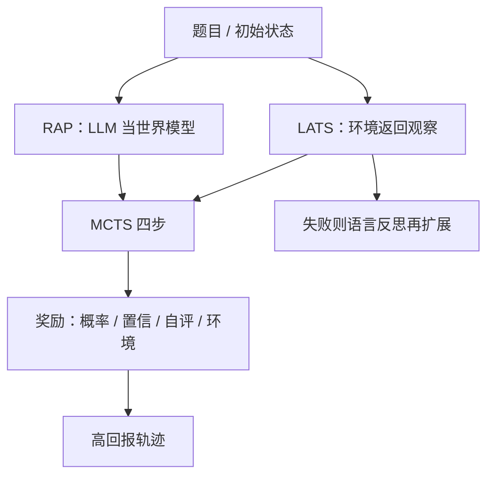

# MCTS-LLM 搜索

    
把语言模型同时当成推理智能体与世界模型，再用蒙特卡洛树搜索在推理空间里做有原则的探索，而不是一次生成整条思维链。

    <footer>—— Hao et al., Reasoning with Language Model is Planning with World Model (RAP), EMNLP 2023</footer>

把语言模型接到蒙特卡洛树搜索上，不是再发明一套 UCB 公式，而是把「动作、状态、奖励、转移」写成文本对象，让一次查询里的计算预算可以按节点分配。2023 年这条线几乎同时出现两篇可引用的论文：Hao 等人的 RAP（Reasoning via Planning）把同一套冻结 LLM 既当智能体又当世界模型，在内部模拟里走 MCTS；Zhou 等人的 LATS（Language Agent Tree Search，ICML 2024）把环境交互当成转移，不再另训世界模型，并加上自我反思。机制专文见 [MCTS 用于语言模型](/llm/mcts-llm)。本篇写这两篇（以及它们明确对照的 ToT）实际改了 MDP 的哪一块、评测数字在什么设定下成立，以及为什么不能把一次带搜索的解码写成「已经完成 AlphaZero 式训练」。

## 问题

Chain-of-Thought 把多步推理压成一条从左到右的文本。错一步，后面整段跟着错；[自洽](/llm/self-consistency) 用多条独立链投票，错的前缀会在 $N$ 条里重复付费。Tree of Thoughts（Yao 等，2023）把思维切成节点、用 BFS/DFS 搜，但价值来自再提示同一个模型，深度通常很浅。Hao 等人把缺口写得更硬：语言模型缺少可查询的内部世界状态——积木在哪、方程里中间量是多少——因此无法像人那样「先在脑子里走几步再决定」。Blocksworld 一类规划题上，直接让 GPT-3 出计划成功率极低，而人可以靠状态想象完成。

RAP 要回答的不是「要不要树」，而是：状态与动作如何实例化成文本、奖励从哪来、MCTS 的四步如何接到两次不同的提示（智能体 vs 世界模型）。LATS 面对的是另一类任务：网页购物、HotPotQA 检索、写代码跑测试。这些任务有可执行环境，转移不必靠模型幻觉下一块积木；缺的是把 ReAct 的「想-做」和 ToT 的搜索、Reflexion 的语言反馈收进同一次 MCTS。

### 世界模型是提示角色，不是新权重

RAP 的世界模型 $p(s_{t+1}\mid s_t,a_t,c')$ 与策略 $p(a_t\mid s_t,c)$ 共用同一套冻结参数，差别只在提示 $c$ 与 $c'$。Blocksworld 里状态是积木配置的自然语言描述，动作是 STACK / UNSTACK / PUT / PICKUP 加上对象；世界模型被要求写出执行该动作后的新配置。数学题里动作可以是子问题，状态是对子问题的回答。这已经不是棋盘上的确定规则：文本世界模型会写错下一状态，搜索再精确也只是在错误动力学上规划。

RAP 默认基座是 LLaMA-33B，温度 0.8，提示全部手写。把数字对照到 GPT-4 的 CoT 时，比较的是「33B + 规划」对「更强模型的单链」，不是同一 $\pi$ 上有无 MCTS。LATS 主实验则直接用 GPT-3.5 / GPT-4 当 $p_\theta$，同样不更新权重。

## 方法

RAP 的一次 MCTS 迭代仍是选择、扩展、模拟、回传。选择用 $Q(s,a)$ 加探索项；扩展时智能体采样 $d$ 个动作，世界模型各预测下一状态；模拟用 rollout 策略走到终点；回传把路径上的奖励聚合成 $Q$。奖励不是单一标量，论文给出几类可组合的项：动作的对数概率（模型「本能」）、状态置信（对同一子问题多次采样的多数比例）、LLM 自评（让模型当评论员）。终止后，作者观察到按路径累计奖励取最优，往往优于只按访问次数。多条完整轨迹还可以再集成，接近自洽，但是在树上共享了前缀计算。

LATS 把转移换成环境：代码解释器、网页、维基检索返回的观察写回节点。价值是混合的：语言模型对轨迹的评分，加上成功/失败的环境信号；失败轨迹触发一段语言反思，作为后续扩展的额外上下文。它不需要 RAP 那种内部动力学提示，但每步扩展都可能真的点一次网页或跑一次测试，墙钟和副作用与纯文本规划不是同一量纲。

### 评测数字绑在任务与基座上

Blocksworld 上 RAP 报告：LLaMA-33B + RAP 相对 GPT-4 的 CoT，在计划生成设定里有约 33% 的相对提升；2/4/6 步题上提升更明显。GSM8K 与 PrOntoQA 上 RAP 相对 CoT、least-to-most 及其自洽变体都有一致增益。这些表必须带着「步骤级动作、有限迭代次数、手写奖励」一起读。LATS 用 GPT-3.5 时，HotPotQA 上相对 ReAct 大约翻倍，WebShop 平均分提高约 22.1；接 GPT-4 时 HumanEval Pass@1 报到 92.7%。编程数字含环境执行与反思，不能当成纯采样的 pass@1。

ToT 是共同对照：BFS/DFS + 思维节点，没有显式世界模型，也没有 LATS 的环境闭环。三者都把动作切粗（句/步/工具调用），否则词表级分支使扩展不可行——这一点与机制专文一致。

## 机制

UCB 把预算压向 $Q$ 高且访问少的边。RAP 的 $Q$ 若来自可靠的状态置信，搜索会在分叉点加模拟；若世界模型系统性写错积木位置，高 $Q$ 只是「模型自信的错觉」。LATS 的环境反馈降低了这一类动力学幻觉，但把方差换成了工具失败、页面改版、测试套件噪声。自我反思是语言形式的资格迹：它不改 $\theta$，只改后续提示，因此同一失败模式可能被反复写入上下文，树变深的同时提示也变长。

计算上，RAP 每次扩展是两次 decode（动作 + 状态）；LATS 每次扩展可能是一次 decode 加一次环境。共享前缀让树优于独立 [Best-of-N](/llm/best-of-n)，但节点一多，KV 与提示长度重新碰到服务墙。探索常数抄棋类默认值通常过大：语言模型先验已经很锋利，$c$ 大会退化成更贵的宽度采样。

Snell 等 2024 把带过程奖励的 lookahead 看成去掉随机探索后的 MCTS 特例，强调测试时更想利用而不是为了学 $V$ 去探索。RAP/LATS 的默认形态正是冻结 $\pi$、只在该次查询上搜。要把轨迹写回权重，需要另做 SFT 或 RL，那是下一篇 AlphaZero 式框架才系统做的事。

### 与提示自评的可靠性

RAP 自己用多种奖励，正是因为单一「请给 0–1 分」的自评不稳定。LATS 把环境 0/1 当作锚，语言模型分只作辅助。任务没有执行器时，搜索质量封顶在评论员校准上：数学最终答案可核对，过程分仍可能奖励「看起来像标准解答」的错步。这与 [过程奖励引导的搜索](/llm/prm-guided-search) 是同一上限，只是 RAP 用提示评论员，而不是单独训的 PRM。

## 边界与工程取舍

### 论文贡献停在测试时规划

不要把 RAP/LATS 写成「语言模型通过 MCTS 学会了推理」。下次查询树清空。o 系列公开系统卡强调强化学习与思维链，没有给出可复现的树超参；对照应停在博客表述。步骤切分失败时（模型一步写完整答案），树退化成 BoN。安全上，搜索最大化 $s$，若 $s$ 不含拒答，MCTS 比单次采样更会找到越狱完成路径。LATS 的计算机/网页权限把这一风险从文本变成真实副作用，必须沙箱。

复现时最容易抄错的是动作粒度、迭代次数和是否用环境。只报 HumanEval 92.7% 而不写 GPT-4、执行器与反思，等于没有复现。Blocksworld 的合法动作若由规则过滤而不是模型自由生成，已经借用了领域约束，不能外推到开放对话。

可引用：Hao et al., RAP, EMNLP 2023；Zhou et al., LATS, ICML 2024；Yao et al., Tree of Thoughts, 2023。不要虚构「MCTS-LLM 2024」这种不存在的单一论文标题；本篇标题是栏目名，指向这一组公开工作。

## 小结

- RAP 把冻结 LLM 同时提示成智能体与世界模型，用 MCTS 在文本状态上规划；LATS 用环境转移替换内部动力学，并加入语言反思。
- 动作必须是步骤/工具级；价值来源决定方差，提示自评弱于可执行反馈。
- 评测数字绑定基座与脚手架：LLaMA-33B+RAP 的规划提升，不能直接当成 GPT-4 的搜索增益。
- 二者都是测试时搜索，不是自我对弈训练；轨迹进权重要另做蒸馏或 RL。
- 出处：Hao et al., *Reasoning with Language Model is Planning with World Model*，EMNLP 2023；Zhou et al., *Language Agent Tree Search Unifies Reasoning, Acting, and Planning in Language Models*，ICML 2024。
