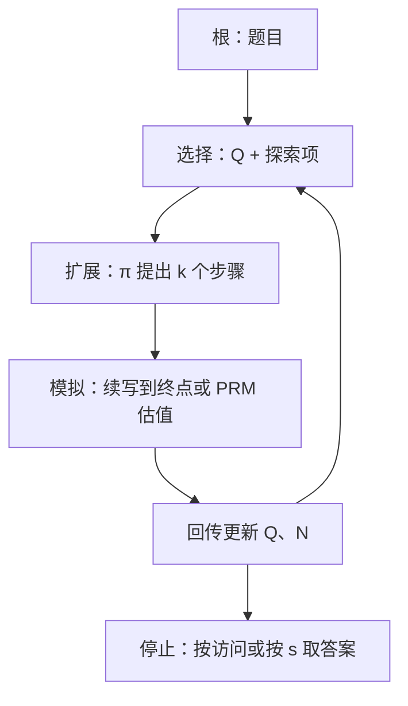

# MCTS 用于语言模型

用蒙特卡洛树搜索把策略先验与搜索结合起来：选择、扩展、模拟、回传，用访问次数而不是单次贪心来决定走哪一步。

<footer>—— 对照 Silver 等 AlphaZero（2017）的搜索循环，以及把它套到冻结语言模型上的公开做法</footer>

蒙特卡洛树搜索（MCTS）在 AlphaGo / AlphaZero 里与可学习的策略、价值网络绑在一起，从自我对弈中改进网络。语言模型上的 MCTS 通常 *不* 重新训练一棵从零开始的棋力：策略先验来自已经训好的 $\pi$，逐步或终局打分来自规则、结果模型或[过程奖励](/llm/prm-guided-search)，树只存在于一次题目的推理过程中。本篇写清 AlphaZero 对照下，哪些部件被换成了 LLM，哪些没有被换成——尤其不要把一次带搜索的解码写成「语言模型版 AlphaZero 已经完成自我对弈训练」。

## 问题

逐步生成是一棵巨大的树：每步分支约等于词表大小。束搜索固定宽度且不回头；独立[Best-of-N](/llm/best-of-n) 不共享中间计算，错的前缀会在 $N$ 条里重复付费。需要一种允许 *在高价值前缀上加模拟、在低价值前缀上少访问* 的预算分配。MCTS 用 UCB 一类指数把探索与利用写进选择规则，使同一笔测试时 FLOPs 不必均匀洒在 $N$ 条完整链上。

障碍同样具体。棋类动作集小、规则确定、终局可判定；语言动作集是词表，多数 token 不是「一步推理」，模拟（rollout）本身还要再跑模型直到 EOS，代价远高于走子。价值估计若只用终端对错，树深时方差极大；若用 PRM，则搜索质量封顶在过程模型的校准上。公开工作如 Hao 等人 2023 年的 RAP（把语言模型当世界模型做推理规划）、Yao 等人的 Tree of Thoughts，都是在 *缩小动作空间*（句子级/步骤级分支，而不是每个 token）之后，搜索才跑得动。

### 动作粒度必须先切粗

token 级 MCTS 对 32K 词表几乎不可用：扩展一步就要对大量子节点做先验或采样。实践把「动作」定义成一个推理步骤、一行方程、或一个思维句，由模型一次解码出整个动作，再作为树边。这已经不是 AlphaZero 的合法棋步集合，而是用 $\pi$ 当提议分布的分层搜索。评测应写明分支是步骤还是 token，否则模拟次数不可比。

AlphaZero 的价值网络与策略网络在搜索与自我对弈中 *共同训练*。LLM+MCTS 的默认形态是网络冻结、只在测试时搜。Snell 等 2024 把带 PRM 的 lookahead 视为去掉随机探索之后的 MCTS 特例，强调测试时更想利用而不是为了学 $V$ 去探索。两套目标不要混写。

## 方法

一次查询上的经典四步：

1. **选择**：从根沿树走到叶，每步取 $\arg\max_a Q(s,a)+U(s,a)$。$U$ 含先验 $P(a\mid s)$（来自 $\pi$ 的步骤对数概率或采样频率）与访问次数 $N$。
2. **扩展**：在叶上向 $\pi$ 要 $k$ 个新步骤（采样，不是整词表展开）。
3. **模拟**：从新节点继续生成到可打分的终点，或用 PRM/价值头直接估，免去完整 rollout。
4. **回传**：把终局或逐步分数加回路径上的 $Q$。

预算用模拟次数或生成 token 数衡量。最终答案可以取根上访问最多的子节点，或所有完成轨迹里 $s$ 最高的一条。后者更像在树的叶子上做 BoN。

### 与 AlphaZero 的部件对照

| 部件 | AlphaZero | 典型 LLM 用法 |
| 根状态 | 棋盘 | 提示 + 已写步骤 |
| 先验 $P$ | 训练中的策略网 | 冻结 LM 的步骤分布 |
| 价值 $V$ | 训练中的价值网 | 规则 / ORM / PRM / 再 decode |
| 环境转移 | 确定的规则 | 文本拼接；没有外部棋规 |
| 学习 | 自我对弈更新网 | 通常不更新；至多离线存轨迹再 SFT/RL |

转移函数是「把步骤文本接上去」，世界模型就是语言模型自己——RAP 把这一点写进方法名。没有独立的合法步检查时，树会扩展出语法正确但数学非法的边，只能靠 $s$ 事后打折扣。

## 机制

UCB 把预算压向 $Q$ 高且访问少的边。若 $Q$ 来自可靠的逐步分，搜索会在分叉点加模拟，类似人在草稿纸上对可疑步骤多试几次。若 $Q$ 来自嘈杂的终端 0/1，早期深度的节点共享太少终局样本，$U$ 项会把预算浪费在尚未区分的噪声分支上。这就是为什么 PRM 或短 lookahead 往往比纯终局 MCTS 更划算：不是 MCTS 魔法，是方差。

计算上，每次扩展/模拟都是一次或多次 decode，KV 可以按节点缓存前缀，但节点一多，缓存寿命与显存策略立刻变成系统问题，见[Decode 的显存墙](/llm/decode-memory-wall)。共享前缀的树比独立 BoN 更省 prefill，这是 MCTS 在相同 token 预算下有时更优的系统原因，而不只是算法原因。

探索常数 $c$ 与先验温度决定树是瘦而深还是宽而浅。把 $c$ 抄自棋类默认值通常过大：语言模型先验已经很锋利，$c$ 大会变成随机宽度搜索，退化为更贵的采样。

## 边界与工程取舍

### 测试时搜索不是自我对弈训练

不要把「用了 MCTS」写成模型通过搜索学会了推理。冻结 $\pi$ 上的搜索只改变该次查询的计算图，下次查询树清空。要把搜索轨迹蒸馏回权重，需要额外的 SFT 或 RL 工序，那是训练，应单独报成本。OpenAI 关于 o1 的公开说明强调强化学习与思维链，没有给出可引用的 MCTS 超参；对照应停在博客表述，不要补一篇不存在的树搜索论文。

步骤切分失败时（模型不分步、一步里塞完整答案），树退化成 BoN。PRM 与 $\pi$ 来自不同训练分布时，$Q$ 会系统性偏爱某种书写风格。安全：搜索会最大化 $s$，若 $s$ 不包含拒答，MCTS 比单次采样更会找到越狱完成路径。预算封顶必须同时限制深度、分支和总 token，否则一次难题可以打满服务队列。

可引用：Silver et al., AlphaZero, 2017；Hao et al., *Reasoning with Language Model is Planning with World Model* (RAP), 2023；Yao et al., Tree of Thoughts, 2023；Snell et al., 2024 中与 lookahead / MCTS 的讨论。不要虚构「LLM-AlphaZero 2024」的 arXiv 编号。

## 小结

- LLM 上的 MCTS 多半是冻结策略 + 外部 $s$ 的测试时搜索，不是 AlphaZero 式的自我对弈训练循环。
- 动作应切成步骤级，否则词表分支使扩展不可行。
- 四步循环仍在；价值来源决定方差，PRM/lookahead 往往比纯终局模拟更划算。
- 共享前缀让树搜索在系统上可能优于独立 BoN，但 KV 与节点数会重新碰到显存墙。
- 探索常数不能直接抄棋类；$c$ 过大即昂贵随机采样。
- 搜索轨迹要进权重必须另做蒸馏或 RL；o1 的内部搜索未公开到可复现的树超参。
- 出处：Silver et al., *Mastering Chess and Shogi by Self-Play…*, 2017；Hao et al., RAP, 2023；Yao et al., *Tree of Thoughts*, 2023；Snell et al., 2024。
