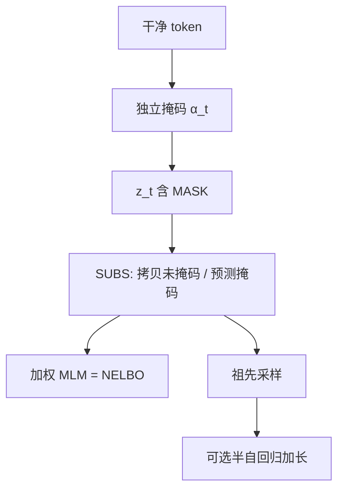

# MDLM

    
目标有简单形式——经典掩码语言模型损失的混合——并能给仅编码器模型配上有原则的采样。

    <footer>—— Sahoo et al., Simple and Effective Masked Diffusion Language Models, NeurIPS 2024</footer>

离散扩散在语言上长期落后自回归的对数似然。Sahoo、Arriola、Schiff、Gokaslan、Marroquin、Chiu、Rush 与 Kuleshov 收窄到吸收（掩码）过程，用 SUBS 参数化把逆向写成「未掩码原样拷贝、掩码处预测干净 token」，再解析掉损失里该为零的项，得到连续时间、Rao–Blackwell 化的 NELBO：带权的掩码交叉熵。工程上换现代分词、数值稳定的只对掩码位求 KL、[DiT](/llm/dit-architecture) 骨干加 RoPE、低差异时间采样。LM1B 上 $33$B token 的上界 $\leq 27.04$，相对 SEDD 同预算的 $\leq 32.79$ 约好 $17\%$，距重训自回归 $22.32$ 约 $21\%$；加到 $327$B token 为 $\leq 23.00$ 对自回归 $20.86$。项目页 s-sahoo.com/mdlm，代码 kuleshov-group/mdlm。

## 问题

D3PM 允许一般 $Q_t$，实现却要物化完整转移与后验，数值脆，小词表（如 $8$k）把依赖拉长。吸收核在 D3PM 与 [SEDD](/llm/sedd-diffusion-lm) 里已经是最强选项，却仍带着为一般核写的损失。若过程保证「一旦掩码就保持掩码、未掩码保持不变」，许多 KL 项可闭式消掉；让网络自己学这些约束，等于把方差和偏差留给优化。

另一缺口是生成：BERT 式 MLM 有双向表示，没有与 ELBO 对应的祖先采样。MDLM 要把同一条加权 MLM 损失既当似然下界，又当采样器的模型。

### SUBS 不是普通 softmax 头

未掩码位置必须输出自身；掩码类别的概率必须为零（干净数据从不等于 MASK）。这两条写进网络输出的替换，而不是靠损失慢慢学。缺任何一条，连续时间极限里的简化 NELBO 都不成立，表格 8 显示每一步简化都改善似然。

「Rao–Blackwell」在文中是借用：解析掉 $\langle x_\theta,m\rangle=0$ 等期望，降低方差并收紧界。真正的 RB 是对充分统计量取条件期望；这里能解析是因为建模选择，不是任意参数化都能积掉。不要写成统计学定理的直接应用。

## 方法

前向把每个 token 独立插值到 MASK：$q(z_t\mid x)=\mathrm{Cat}(\alpha_t x+(1-\alpha_t)m)$，$\alpha_t$ 从近 $1$ 单调降到近 $0$。后验：若 $z_t$ 未掩码则 $z_s=z_t$；若已掩码，则以与 $\alpha$ 有关的权重在 $m$ 与 $x$ 之间抽。逆向用 $x_\theta(z_t,t)$ 代替未知 $x$，再套同一后验，即 SUBS。零掩码概率：把 MASK 维 logit 置为 $-\infty$。Carry-over：未掩码位直接拷贝输入。

离散时间扩散损失化为

$$
\mathcal{L}_{\mathrm{diffusion}}=\sum_i\mathbb{E}_q\Big[\frac{\alpha_{t(i)}-\alpha_{s(i)}}{1-\alpha_{t(i)}}\log\langle x_\theta(z_{t(i)}),x\rangle\Big].
$$

$T\to\infty$ 得到

$$
\mathcal{L}^\infty_{\mathrm{NELBO}}=\mathbb{E}_q\int_0^1\frac{\alpha'_t}{1-\alpha_t}\log\langle x_\theta(z_t),x\rangle\,\mathrm{d}t.
$$

换元 $\gamma=\log(1-\alpha_t)$ 后，损失对 $\alpha_t$ 的具体形状不变。序列上前向独立、逆向在给定 $z_t^{1:L}$ 时对位置因式分解，目标变成对各位置掩码交叉熵的加权和。未掩码位因拷贝不贡献损失。

### 采样：缓存与半自回归

从全 MASK 出发，按有限 $T$ 离散化逆向，逐位置独立采样。未掩码不再改变。若某步没有任何新位置揭开，且 $x_\theta$ 不依赖时间，则可复用上一次网络输出，跳过该步——SEDD 的时间相关速率不能这样缓存。半自回归：先生成长度 $L$，再把尾部 $L-L'$ 当前缀拷贝，只对后面 $L'$ 个 MASK 做扩散，从而任意加长。DNA 等非语言序列上，同样目标可给 BERT 式编码器补上生成能力。

## 机制

LM1B 用 bert-base-uncased、上下文 $128$；OWT 用 GPT-2 分词、上下文 $1024$。去噪网络取 Lou 等给 DiT 加 RoPE 的 Transformer，约 $110$M。同 $33$B token，MDLM $\leq 27.04$ 对 SEDD $\leq 32.79$、重训 AR $22.32$；$327$B token 后 $\leq 23.00$ 对 AR $20.86$，相对差距约 $10\%$。OWT 上同样缩小与 AR 的间隔；有无时间条件困惑度接近。相对旧 D3PM 实现，现代分词与稳定损失让「被认为很弱」的吸收基线也明显抬升，说明差距不全在算法。

表示学习：在 C4 上用 MosaicBERT 做 MLM 预训练，再用不到 $1\%$ 的 token 做 MDLM 微调，GLUE 上可与 BERT 式训练相比，并多出生成接口。半自回归采样在任意长度上优于先前 SAR 扩散。

困惑度带 $\leq$，因为优化的是 NELBO。与 AR 的精确似然并排时必须标明。MDLM 相对 SEDD 的 $17\%$ 是对 Lou 等报告数字、在作者复现设定下的比较，不是把两篇论文的任意检查点直接相减。

### 加权 MLM 与固定 $15\%$ 掩码

BERT 的掩码率固定；MDLM 的 $t\sim[0,1]$ 使掩码率随机，权重 $\alpha'_t/(1-\alpha_t)$ 来自变分界，不是启发式。因此它是生成模型：可以祖先采样、可以报告似然界。把 MDLM 写成「BERT 加上随机掩码率」会丢掉 ELBO 与 SUBS。反之，不能把 BERT 的 NSP 或 $15\%$ 配方当成 MDLM 的实现。

## 边界与工程取舍

双向注意力没有 KV 缓存；缓存技巧只在「本步无新揭开」时省前向。质量—延迟要用墙钟测。吸收核不能表达「改成另一个非 MASK token」的前向，那是均匀 / 一般 $Q$ 的地盘。上下文 $128$/$1024$ 与数据（LM1B、OWT、C4、DNA）不是对话对齐。时间条件可去掉以换推理，不表示扩散时间在数学上无用——那是参数化选择。

不要把 DiT 图像论文的 FID 写进 MDLM。这里 DiT 只是带时间条件的编码器骨干。也不要把 LLaDA 的 $8$B、$2.3$T 倒填进这篇 $110$M 实验。

DNA 实验把同一套掩码扩散接到生物序列：预训练后在下游上与经典 BERT 式 DNA 模型相当或更好，并多出祖先采样。这说明目标并不绑定自然语言词表，绑定的是「离散符号 + 吸收核」。语言侧的分词教训同样适用：过小词表让依赖跨更多位置，扩散与自回归一起变差；作者把 D3PM 时代的 $8$k 词表当成反例。低差异时间采样把不同 $t$ 在 batch 内铺开，降低 NELBO 梯度方差，这与 Kingma 等在连续扩散里的做法同族，不是新的生成算法。若复现只换骨干、仍用脆弱的完整后验 KL，会把论文里「简单」的收益吐回去。

出处：Sahoo, Arriola, Schiff, Gokaslan, Marroquin, Chiu, Rush, Kuleshov，*Simple and Effective Masked Diffusion Language Models*，NeurIPS 2024（arXiv:2406.07524）。吸收扩散背景为 Austin 等 D3PM 与 Lou 等 SEDD。骨干引用 Peebles & Xie 的 Diffusion Transformer。

## 小结

- MDLM 把掩码扩散的逆向写成 SUBS，解析后的连续时间目标是加权 MLM，且是似然下界。
- 现代分词、稳定实现与低差异时间采样本身就抬升旧吸收基线。
- LM1B / OWT 上扩散困惑度新 SOTA，并逼近同设置自回归；可半自回归任意长度采样。
- 报告值为 NELBO 上界；与 SEDD、AR 比较要对齐 token 预算与分词。
- 设计故意只做吸收，换简单与低方差，放弃一般核。
- 出处：Sahoo et al.，NeurIPS 2024（arXiv:2406.07524）。
