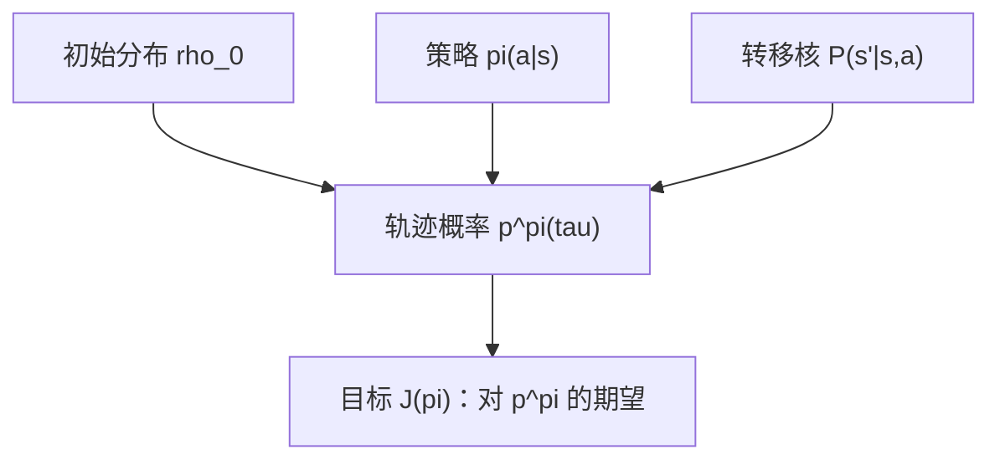
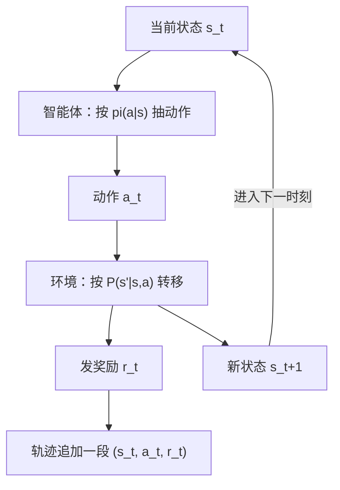

# MDP 五元组与轨迹分布

把试错学习变成可计算的问题，只需要五个符号：状态、动作、转移、奖励、折扣；其余一切——价值、方程、算法——都从这五个符号里长出来。

<footer>—— 据 Sutton &amp; Barto, Reinforcement Learning: An Introduction, 2018, 第 3 章；Puterman, Markov Decision Processes, 1994 整理</footer>

[上一课](/llm/prm-in-rl-loop)把过程奖励写进训练环，给 [推理 RL 闭环](/llm/rlvr)的稀疏 0/1 补上逐步信用：差分塑造奖提升、验证器默认冻结、进环后测试时缩放曲线作废。但它留下一层缺口：整个闭环里「策略」「轨迹」「奖励」仍是口头词——轨迹的概率怎么写、奖励在哪个时刻进入、优化的目标到底是哪个期望，都没有形式化。本课是「强化学习基础」的第一课，从零钉下五元组 $(S,A,P,r,\gamma)$ 与轨迹分布；本课程后续各课默认已经读完本课。

## 问题

上一课的闭环能跑，但没法分析。为什么长链上信用难分？因为一条采样出的轨迹是许多随机性的乘积：初始状态、每一步的动作、每一步的状态跳变。不把这些随机性写清楚，「优势」「回报」「最优策略」都只是比喻。需要一个框架，把序贯决策问题写成概率对象，让期望可以逐项展开。

马尔可夫决策过程就是那个框架。它的全部假设是一句话：**存在一个状态，使得给定了它，未来不再依赖更早的历史**。状态是决策所需信息的充分统计量。

### 五元组逐项落位

- $S$：状态集；$A$：动作集。有限或可数先够用，本课程前半程都在这个设定里。
- 转移核 $P(s'\mid s,a)$：在状态 $s$ 执行 $a$ 后跳到 $s'$ 的概率。这是「环境」的全部内容。
- 奖励 $r(s,a)$（或 $r(s,a,s')$）：每步由环境给出的标量。
- 折扣 $\gamma\in[0,1)$：下一课才给它自己的三种读法，本课只要求它存在。
- 策略 $\pi(a\mid s)$：智能体的一半，从状态到动作分布的映射。

$\gamma$ 通俗地回答「未来的奖励今天值多少」：$\gamma=0.9$ 时，10 步之后的奖励折算到现在只剩 $0.9^{10}\approx0.35$ 倍；$\gamma=0.99$ 时还剩约 $0.90$ 倍。$\gamma$ 越小，智能体越「近视」，越长的后果越被忽略。

**马尔可夫性的真正含义**不是「未来与过去无关」，而是「条件在现在之后，未来与过去独立」：$P(s_{t+1}\mid s_t,a_t)=P(s_{t+1}\mid s_t,a_t,\text{任意更早历史})$。把历史压缩进状态是建模负担，不是免费假设：状态漏掉相关信息（如 agent 场景里漏掉工具返回），马尔可夫性就被破坏，本课程的方法跟着失效。

可以把它想象成打牌时的「桌面快照」：只要快照记下所有需要的信息，下一步决策就不用回看每一轮历史。马尔可夫性要求的正是这样一张完整快照——状态漏掉一条关键信息（比如 agent 忘了工具的返回值），同样的快照也会通向不同的未来，性质随之失效。

## 方法

有了五元组，一条轨迹 $\tau=(s_0,a_0,r_0,s_1,a_1,r_1,\dots)$ 的概率可以连乘写出：

$$p^\pi(\tau)=\rho_0(s_0)\prod_{t}\pi(a_t\mid s_t)\,P(s_{t+1}\mid s_t,a_t)$$

其中 $\rho_0$ 是初始状态分布。乘积里两类因子泾渭分明：$\pi$ 的因子属于智能体，$P$ 与 $\rho_0$ 的因子属于环境。策略换掉时，环境那一半纹丝不动。

连乘里每个因子都不超过 1，所以轨迹越长概率越小：若每一步被策略与环境「保住」的概率约 $0.9$，走 20 步的整条轨迹概率只剩 $0.9^{20}\approx0.12$。这正是长链上信用难分的算术根源。

整门课的优化目标由此定义：$J(\pi)=\mathbb{E}_{\tau\sim p^\pi}[G_0]$，回报 $G_0$ 的定义是下一课的事。本课先钉住轨迹分布本身，因为后面一切——贝尔曼方程、策略梯度、重要性采样——都是对这个连乘做不同角度的变形。

## 机制

**为什么连乘里策略只通过动作分布进入**这件事重要：它把「学策略」与「知环境」拆开。对 $\pi$ 求导时，$P$ 的因子是常数，梯度只落在 $\sum_t\log\pi(a_t\mid s_t)$ 上——这正是后面策略梯度定理的出发点。同样地，离策略评估里用行为策略 $\mu$ 的数据评估目标策略 $\pi$，要修正的比率只有动作项 $\prod_t\pi/\mu$，转移核比值恒为 $1$。

把 $P(s'\mid s,a)$ 写进重要性比率是常见错误：环境 dynamics 不随策略改变，比率里只允许动作项。验证方法是问一句「换策略会改变这一项吗」。

把一步交互拆开看，两个「主人」各自负责什么、轨迹如何一段段长出来：

第二，马尔可夫性解释了语言生成有多幸运：自回归的条件分布天然只看已生成前缀，把「prompt + 前缀」当状态，马尔可夫性免费成立。但奖励是否在环内、是否稠密（上一课的主题）不改变马尔可夫性——奖励是观测，不进转移核。稀疏奖励让**学习**变难，不使**问题**变难。

## 边界

本课不讲部分可观测（POMDP）：状态不可全观测时要维护信念状态，那会吞掉马尔可夫性。不讲连续状态的测度细节：$P$ 换成核密度，记号照搬。也不回答「$r$ 谁定、$\gamma$ 取几」：奖励设计是后训练各课的主题，$\gamma$ 下一课展开。轨迹分布是对连乘的整体描述，怎么不对指数长的连乘求和就能算期望——这是贝尔曼方程要补的缺口。

后课默认：说到「策略」就是 $\pi(a\mid s)$，说到「轨迹分布」就是上面的连乘，说到「环境」就是 $P$ 与 $r$。

## 小结

- MDP 五元组 $(S,A,P,r,\gamma)$：状态、动作、转移、奖励、折扣，序贯决策的全部假设。
- 马尔可夫性是「条件在现在之后未来与过去独立」，状态压缩历史是建模负担。
- 轨迹概率 $p^\pi(\tau)=\rho_0\prod_t\pi\cdot P$：策略只经动作分布进入，环境因子与策略无关。
- 这个分离是策略梯度与离策略修正的共同根源；比率里写进 $P$ 必错。
- 稀疏奖励是学习困难，不是马尔可夫性破坏。
- 出处：Sutton &amp; Barto, *Reinforcement Learning*, 2018 第 3 章；Puterman, *Markov Decision Processes*, 1994。
