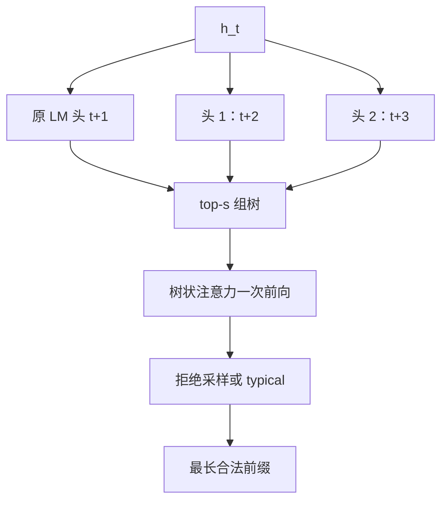

# Medusa 原文

    
不必另训一份草稿模型：在骨干最后一层隐状态上加几个解码头，并行猜后面若干 token，再用树状注意力一次验证。

    <footer>—— Cai et al., Medusa: Simple LLM Inference Acceleration Framework with Multiple Decoding Heads, ICML 2024</footer>

Cai、Li、Geng、Peng、Lee、Chen、Dao 的 Medusa（arXiv:2401.10774，ICML 2024）把投机解码里最难落地的「草稿模型」收成骨干上的浅头。Leviathan 等与 Chen 等已经给出无损接受规则；草稿本身既要小、又要跟目标分布对齐，分布式里还要两套权重。Stern 等人 2018 年的并行解码头更老：同一表示上预测未来位置，但朴素贪心路径浪费算力，头与头条件独立，远位置不准。Medusa 同时给出头的结构、树状验证、Medusa-1 / Medusa-2 两种训练，以及 typical acceptance 这一有损加速。概念综述见 [Medusa](/llm/medusa)；本篇按原文写公式、训练协议与实验边界，不把 [EAGLE](/llm/eagle) 的特征外推写进来。

## 问题

Decode 步是带宽墙：一次前向的 FLOPs 只服务一个新 token。要加速，只能提高「每次搬权重换回的 token 数」。独立小模型能做到，但获取成本高——数据不公开或目标已经过 RLHF 时，草稿更容易被拒；服务侧还要为草稿单独切分与批处理。并行头避免第二份模型，却引入条件独立：第 $k$ 个头看不到中间实际抽到的 token，只看到同一个 $h_t$。要把多头做成可用框架，必须同时解决头足够轻、候选能在一次注意力里批量验证、训练不能把骨干下一词训坏。

论文主实验是 **batch 为 1 的本地托管**，不是高并发连续批。接受长度换来的加速，在大 batch 下会被验证树的额外 token 稀释。读 2.x 倍时，先看清负载。

### 草稿模型的分布式摩擦

Chen 等人已经指出多模型在分布式里的编排麻烦。Medusa 的动机写得很硬：草稿参数挂在目标自己的表示上，前向图仍是一份骨干加几个浅头，与原有张量并行相容，不必为第二份模型再建通信域。这是系统约束，不只是「头比小模型准」。

Typical acceptance 用原模型概率与熵相关阈值判断「够不够像」，温度升高时反而更容易接受更长前缀。它不再严格保分布。原文把这条写成加速旋钮，引用时必须分开报质量，不能与拒绝采样的无损声明混用。

## 方法

记骨干在位置 $t$ 的最后隐状态为 $h_t$。原 LM 头给出 $p_t^{(0)}$，预测 $t+1$。第 $k$ 个 Medusa 头预测 $t+k+1$：

$$
p_t^{(k)}=\mathrm{softmax}\bigl(W_2^{(k)}\bigl(\mathrm{SiLU}(W_1^{(k)} h_t)+h_t\bigr)\bigr),
$$

其中 $W_1^{(k)}\in\mathbb{R}^{d\times d}$，$W_2^{(k)}\in\mathbb{R}^{d\times V}$。每个头是一层带残差的前馈。初始化让 $W_2$ 对齐原 LM 头、$W_1$ 为零，训练起点与骨干下一词一致。经验上 $K$ 取到五已经够用，推理可丢掉不准的远头。

每个头取 top-$s_k$ 个 token，候选是笛卡尔积，形成树。树注意力掩码只允许节点看见祖先，位置编码按树深度而不是按拼在一起的线性下标。一次前向给所有节点算出目标 logits。接受可用拒绝采样保分布，或 typical acceptance 换长度。

### Medusa-1 与 Medusa-2

Medusa-1 冻骨干，只训头。损失是各头交叉熵的加权和，$\lambda_k$ 随 $k$ 衰减（文中如 $0.8^k$），远位置天生更难。骨干可量化，单卡就能给 7B 级接头。Medusa-2 把头和骨干一起训，总损失加上 $\mathcal{L}_{\mathrm{LM}}$，头与骨干用不同学习率，并先做头的 warmup，避免初期大梯度把骨干拧歪。无公开 SFT 时用自蒸馏：模型自己生成多轮回复当监督；Medusa-2 还可用 LoRA 当适配器，关掉适配器就是教师，KL 对齐原分布。

树的规则笛卡尔积不是最优。校准集上估计各头 top-$i$ 的单点正确率，按对期望接受长度贡献最大的贪心加节点，直到预算用尽。推理常走这棵不规则树。

Vicuna 7B/13B/33B 与 Zephyr-7B 上，原文报告 Medusa-1 可超过约 2.2 倍加速且不牺牲生成质量，Medusa-2 约 2.3–2.8 倍。钉在论文设定、树预算与是否 typical 上。

头的 $W_2$ 与词表同宽，显存要算进服务预算。树节点拉长这一步的序列，注意力与 KV 写入按节点数增加。接受长度不是免费的，验证成本按节点涨。

## 机制

用目标自己的 $h_t$ 当草稿条件，把串行草稿前向换成几个浅分类头，再用一次带树掩码的骨干前向做验证。头共享 $h_t$，草稿与目标没有两套表示空间，分布漂移比独立小模型轻。树把多候选从 batch 维折进序列维。Medusa-1 无损于骨干下一词，因为骨干权重不变。Medusa-2 用联合训练换更高头准确率，必须用组合损失证明下一词没有塌。

条件独立是结构性弱点：远头 $\lambda_k$ 必须衰减，树用宽度补偿「看不见中间离散选择」。这正是后续 EAGLE 用顺序特征外推要对着打的点。原文没有声称解决了特征不确定性；它声称的是简单、可挂在现有骨干上的框架。

### 和标准投机解码的接口

生成候选、处理候选、接受候选，三步与 [投机解码](/llm/speculative-decoding) 相同。差别只在候选来自头，处理用树注意力。拒绝采样下 Medusa-1 可称无损加速；typical 进入有损区。不要把 typical 说成拒绝采样的加速版。

开源 FasterDecoding/Medusa 与论文是同一条线。框架里后来出现的「Medusa 头」实现，节点数、接受规则、是否冻骨干都以当时代码为准，不要把 ICML 表格里的 2.x 直接抄到另一套运行时上。

## 边界与工程取舍

大 batch 下 decode 已接近 compute-bound，再叠树验证可能变慢。头数不是越多越好：第五个头的边际接受长度可能盖不住节点。分布式里头跟着骨干切，树掩码要在每张卡上一致。Medusa 不替代连续批，也不解决长上下文 KV 体积。

不要把 Medusa 写成训练时的多 token 损失。训练目标是给头做监督，推理图仍是自回归；[MTP](/llm/mtp) 那种预训练期改主目标、推理可丢模块，是另一件事。引用加速比时写清 Medusa-1 还是 2、树预算、是否 typical、batch 是否为 1。

无匹配轨迹时必须自蒸馏，质量取决于提示集。对齐过的对话模型上，用预训练语料接头会漂。原文的自蒸馏协议是方法的一部分，不是附录技巧。

出处钉 Cai 等 *Medusa: Simple LLM Inference Acceleration Framework with Multiple Decoding Heads*，ICML 2024，arXiv:2401.10774。作者含 Tianle Cai、Tri Dao 等。不要与 Medusa-2 训练协议和后来社区的「Medusa 式多头」口头禅混成一篇新论文。

## 小结

- Medusa 原文用骨干最后隐状态上的浅头并行预测未来 token，避免独立草稿模型。
- 树状注意力一次验证；拒绝采样保分布，typical acceptance 用质量换长度。
- Medusa-1 冻骨干；Medusa-2 联合训并配差分学习率与 warmup。
- 主数字约 2.2× / 2.3–2.8×，主设定 batch=1。
- 条件独立限制远头；大 batch 与连续批下加速会稀释。
- 出处：Cai et al., ICML 2024，arXiv:2401.10774。
