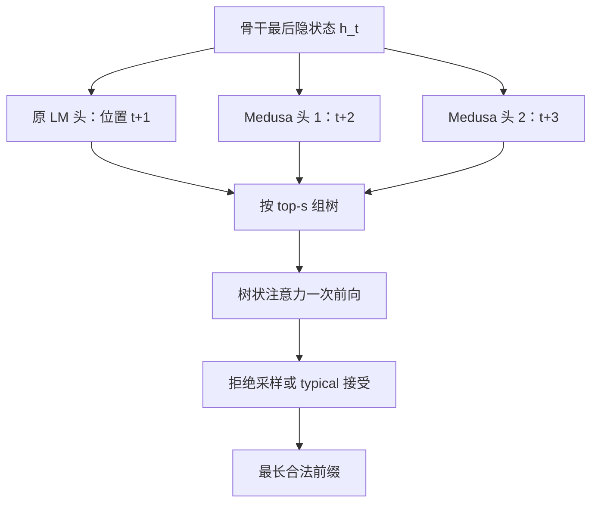

# Medusa

    
不必另训一份草稿模型：在骨干最后一层隐状态上加几个解码头，并行猜后面若干 token，再用树状注意力一次验证。

    <footer>—— Cai et al., Medusa: Simple LLM Inference Acceleration Framework with Multiple Decoding Heads, ICML 2024</footer>

自回归解码每步只吐一个 token，却要把整份权重从 HBM 搬进片上缓存。算术强度极低，加速器的矩阵吞吐大部分闲着。投机解码（Leviathan 等、Chen 等）用小草稿模型先串行写出一段候选，再用大模型一次前向验收；难点是草稿模型本身：既要小、又要跟目标分布对齐，分布式里还要两套权重一起调度。Cai、Li、Geng 等人的 Medusa 把草稿收成骨干上的额外解码头：同一份最后隐状态同时预测 $t+1,t+2,\ldots$，用树状注意力在一步里验证多条候选。本篇写头怎么接、树怎么验、Medusa-1 / Medusa-2 怎么训，不把 [EAGLE](/llm/eagle) 的特征外推或 [Lookahead](/llm/lookahead-decoding) 的 Jacobi 窗口提前写进来。

## 问题

decode 步是带宽墙：一次前向的 FLOPs 只服务一个新 token。要加速，只能提高「每次搬权重换回的 token 数」。独立草稿模型能做到这一点，但获取成本高——另训一个小模型、还要跟着目标模型一起升级；Chen 等人已经指出多模型在分布式里的编排麻烦。另一条更老的路是 Stern 等人 2018 年的并行解码头：在同一表示上直接预测未来若干位置。朴素用法每步只走一条笛卡尔积里的贪心路径，算力仍然浪费；头与头之间条件独立，位置越远越不准，接受长度上不去。

要把「多头并行猜」做成可用的投机框架，必须同时解决三件事：头的结构足够轻、候选能在一次注意力里批量验证、训练时不能把骨干的下一词能力训坏。Medusa 的对象就是这三件事，而不是再发明一种新的注意力核。

### 草稿模型为什么难落地

小模型要覆盖大模型的续写分布，通常得在相近数据上再训一遍。数据不公开、或目标已经过 RLHF，分布已经漂了，草稿更容易被拒。服务侧还要为草稿单独做切分、量化、批处理。Medusa 的动机是：草稿参数应挂在目标自己的表示上，前向图仍是一份骨干加几个浅头，分布式切分与原来的 [张量并行](/llm/tensor-parallel) 兼容，不必为第二份模型再建通信域。

Medusa 论文的主实验设定是 batch 为 1 的本地托管，不是高并发连续批处理。接受长度换来的加速，在大 batch 下会被验证树的额外 token 稀释。读 2.x 倍加速比时，先看清负载是不是单请求。

## 方法

记骨干在位置 $t$ 的最后隐状态为 $h_t$。原语言模型头给出 $p_t^{(0)}$，预测 $t+1$。Medusa 再接 $K$ 个头，第 $k$ 个头预测 $t+k+1$：

$$
p_t^{(k)}=\mathrm{softmax}\bigl(W_2^{(k)}\bigl(\mathrm{SiLU}(W_1^{(k)} h_t)+h_t\bigr)\bigr),
$$

其中 $W_1^{(k)}\in\mathbb{R}^{d\times d}$，$W_2^{(k)}\in\mathbb{R}^{d\times V}$。每个头只是一层带残差的前馈，初始化让 $W_2$ 对齐原 LM 头、$W_1$ 为零，训练起点与骨干下一词一致。经验上 $K$ 取到五已经够用，推理时可以丢掉不准的远头。

### 树状注意力一次验证多条候选

每个头取 top-$s_k$ 个 token，候选是各头 top 预测的笛卡尔积，形成一棵树：第 $k$ 层有 $s_k$ 个分支。树注意力的掩码只允许每个节点看见自己的祖先，位置编码按树上的深度而不是按拼在一起的线性下标来编。这样不必把 batch 维涨成「候选条数」，一次前向就能给所有节点算出目标模型的 logits。验证阶段可以用与投机解码相同的拒绝采样，使输出分布与原模型一致；也可以改用 typical acceptance：用原模型概率与熵相关阈值判断「够不够像」，温度升高时反而更容易接受更长前缀。后者不再严格保分布，用质量指标换接受长度。

### Medusa-1 冻骨干，Medusa-2 联合训

Medusa-1 冻住骨干，只训头。损失是各头交叉熵的加权和，$\lambda_k$ 随 $k$ 衰减（文中用如 $0.8^k$），因为远位置天生更难。骨干可量化，单卡就能给 7B 级模型接头，接近 QLoRA 的民主化路径。Medusa-2 把头和骨干一起训，必须保住下一词：总损失加上 $\mathcal{L}_{\mathrm{LM}}$，头与骨干用不同学习率，并先做头的 warmup，避免初期大梯度把骨干拧歪。没有公开 SFT 数据、或模型经过对齐时，用自蒸馏：拿同类提示让模型自己生成多轮回复当监督；Medusa-2 还要用 LoRA 当适配器，关掉适配器就是教师，KL 对齐原分布，不必在显存里再驻留一份完整教师。

树的规则笛卡尔积不是最优。校准集上估计各头 top-$i$ 的单点正确率，按「给期望接受长度贡献最大」的贪心往树上加节点，直到节点预算用尽。推理时按这棵不规则树走，往往三四个头就够。

## 机制

机制可以收成一句话：用目标模型自己的 $h_t$ 当草稿条件，把串行草稿前向换成几个浅分类头，再用一次带树掩码的骨干前向做验证。头共享 $h_t$，所以草稿与目标没有两套表示空间，分布漂移比独立小模型轻。树把「多候选」从 batch 维折进序列维，验证成本按节点数涨，不按候选条数乘序列长度涨。typical acceptance 把温度从「更随机所以更难匹配」改写成「分布更平所以更多 token 算合理」，这是对拒绝采样在高温下加速比下降的直接对策。

Medusa-1 无损于骨干下一词，因为骨干权重不变；加速完全来自头的命中。Medusa-2 用联合训练换更高的头准确率，从而更高的接受长度，但必须用组合损失与差分学习率证明下一词没有塌。论文在 Vicuna 7B/13B/33B 与 Zephyr-7B 上报告：Medusa-1 可超过 2.2 倍加速且不牺牲生成质量，Medusa-2 进一步提高到约 2.3–2.8 倍。这些数字钉在论文设定上，换模型、换 batch、换树预算都会变。

头是条件独立的：第 2 个头看不到第 1 个头实际会抽到哪个 token，只看到同一个 $h_t$。这是 Medusa 相对 [EAGLE](/llm/eagle) 顺序外推的结构性弱点，也是远头 $\lambda_k$ 必须衰减的原因。树是在用宽度补偿这条条件独立。

### 和标准投机解码的接口

生成候选、处理候选、接受候选，三步与投机解码相同。差别只在候选来自头而不是小模型，处理用树注意力而不是把草稿序列当普通前缀。接受规则可以复用拒绝采样，因此「无损加速」在 Medusa-1 上成立；换 typical acceptance 就进入有损区，必须另报质量，不能再声称与原模型同分布。服务实现上，头的 $W_2$ 与词表同宽，显存要算进去；树节点会拉长这一步的序列，注意力与 KV 写入按节点数增加，不是免费的。

## 边界与工程取舍

Medusa 不替代连续批处理，也不解决长上下文的 KV 体积。它吃的是「单步带宽墙」：当 decode 已经 compute-bound（很大的 batch），再叠树验证可能变慢。头数不是越多越好：第五个头的边际接受长度可能盖不住它带来的节点。分布式里头跟着骨干切，比维护第二份草稿简单，但树掩码要在每张卡上一致，位置 id 不能按 TP 分片错位。

不要把 Medusa 写成「训练时的多 token 损失」。训练目标是给头做监督，推理图仍是自回归；[MTP](/llm/mtp) 那种预训练期就改主目标、推理可丢模块，是另一件事。也不要把 typical acceptance 说成拒绝采样的加速版：一个保分布，一个保「像样」。引用加速比时写清 Medusa-1 还是 2、树预算、是否 typical、batch 是否为 1。

开源仓库 FasterDecoding/Medusa 与论文是同一条线。框架里后来出现的「Medusa 头」实现，节点数、接受规则、是否冻骨干都以当时代码为准，不要把 2024 年 ICML 表格里的 2.x 直接抄到另一套运行时上。

## 小结

- Medusa 在骨干最后隐状态上加若干浅解码头，并行预测后续 token，避免单独维护草稿模型。
- 候选按各头 top-$s_k$ 组成树，用树状注意力一次验证；可用拒绝采样保分布，或 typical acceptance 换更长前缀。
- Medusa-1 冻骨干、可量化训练；Medusa-2 联合训练并配差分学习率与 warmup，以保住下一词。
- 无数据时用自蒸馏；树结构可用校准准确率贪心搜索，不必用规则笛卡尔积。
- 主实验是 batch=1；大 batch 下验证开销会吃掉接受长度带来的加速。
- 出处：Cai et al., *Medusa: Simple LLM Inference Acceleration Framework with Multiple Decoding Heads*，ICML 2024，arXiv:2401.10774。
