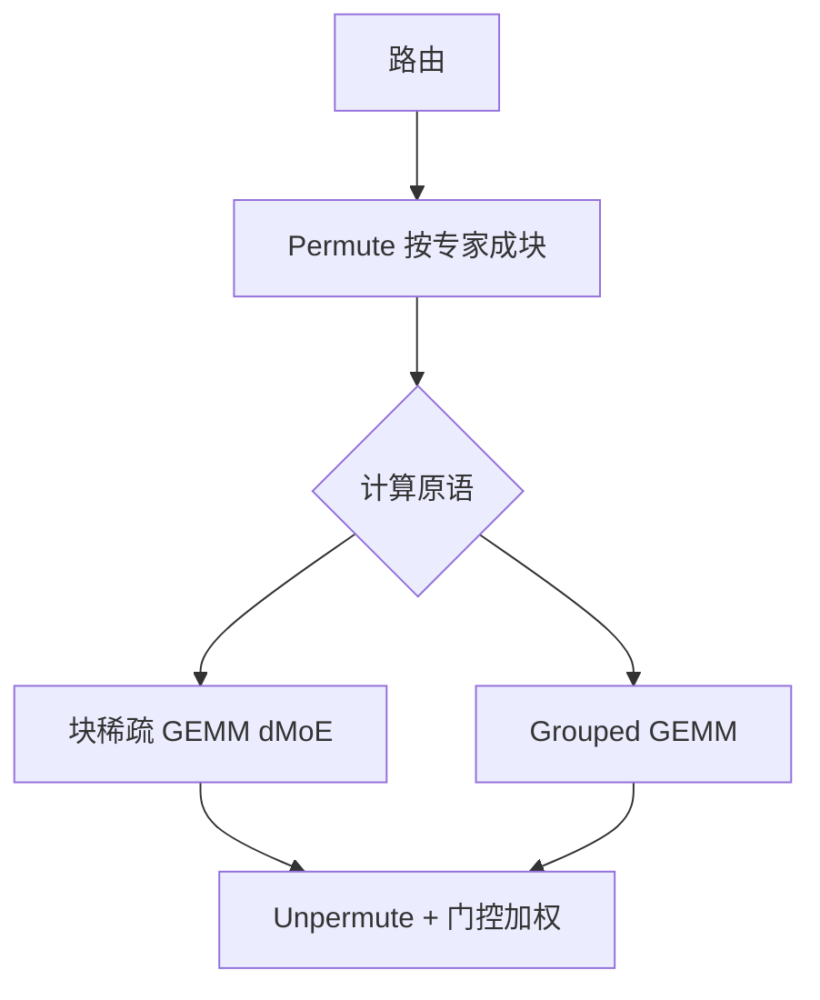

# MegaBlocks Grouped GEMM

现有框架把动态路由修剪或填充到用户指定的容量，用户必须在掉牌与为 padding 浪费算力、显存之间二选一。

<footer>—— Gale、Narayanan、Young、Zaharia，MegaBlocks，MLSys 2023，arXiv:2211.15841</footer>

GShard 与 Switch 把 MoE 写成「每个专家固定槽位」的稠密 batched GEMM：超容量掉牌，不足则 pad。这是为了迁就静态形状的编译器与现成 GEMM 库。Trevor Gale、Deepak Narayanan、Cliff Young 与 Matei Zaharia 的 MegaBlocks（Stanford / Microsoft Research / Google Research，MLSys 2023）把 MoE 重写成 **块稀疏矩阵乘**，后来库里又提供 `mlp_impl=grouped` 的 grouped GEMM 路径：一次核启动吃掉所有专家、每个问题的 $M_i$ 可以不同。卖点不是新的路由公式，而是取消 `capacity_factor` 这一超参，同时仍映射到 GPU 的 Tensor Core。论文报告相对当时最强的 Tutel 配置端到端最多约 **40%**，相对 Megatron-LM 稠密训练最多约 **2.4×**。

## 问题

MoE 的动态性有两层。第一层是 **哪些 token 去哪个专家**，每步都变。第二层是 **每个专家分到多少 token**，负载不均时 $M_i$ 可以差一个数量级。静态形状的栈要求事先声明 $M_i=c$。于是出现 Switch 式权衡：`capacity_factor` 小则掉牌伤质量，大则 padding 伤吞吐和显存。Tutel 把这条路做到很深，但仍在容量合同里调优。Gale 等人认为：掉牌与 padding 不是 MoE 数学的一部分，是软件原语不够用。

GPU 其实能跑不规则 GEMM，缺的是把「变长、按专家成块」的稀疏结构说给硬件听。细粒度 CSR 对 Tensor Core 不友好；完全稠密又回到 padding。需要一种 **块级** 稀疏：每个专家的 token 已经由 permute 聚成连续块，块内是稠密 GEMM，块间大小不同。

### 容量超参把质量与效率绑死

`capacity_factor` 进入训练配方之后，学习率、aux loss、专家数都要围着它转。换 GPU 数或 microbatch，最优容量会变。dropless 的目标是把这条超参从配方里删掉：所有被路由到的 token 都算，硬件效率靠核，而不是靠人为截断。

论文标题强调 sparse training。服务期 decode 的 grouped GEMM 是同一原语的另一工作点：$M_i$ 更小、更不均。不要用 Tutel 对比的 40% 去承诺 vLLM 上的 decode 加速。

## 方法

MegaBlocks 的计算图仍是标准四段：路由 → permute 按专家聚集 → 专家 FFN → unpermute 并按门控加权。与 Switch 的差别在第三段。把所有专家的输入行块在逻辑上看成一块大的块对角矩阵，乘以各专家的权重。对角块的行数就是 $M_i$，列数是隐藏维。他们为这种结构写了块稀疏 GPU 核，使用混合的 blocked-CSR/COO 描述动态、不均衡的块，并用转置索引支持反向。

库后来把专家 FFN 接到 **grouped GEMM**：给定一组问题 $\{(M_i,N_i,K_i)\}$ 和各矩阵指针，一次启动，持久化线程块轮询问题列表。对标准 MoE，$N_i,K_i$ 通常相同（同一张 FFN 形状），只有 $M_i$ 变——这是 grouped 相对 batched 的最小推广：batched 要求所有问题同形状。CUTLASS 的 `examples/24_gemm_grouped` 是同一问题的厂商实现；MegaBlocks 的贡献是证明 **dropless MoE 可以端到端训起来**，并把 permute 与这块计算接好。

### dMoE：不掉牌的块稀疏路径

论文中的 dMoE（dropless MoE）从不截断 token。专家过载时，$M_i$ 变大，该块的 GEMM 更胖，别的块更瘦。核必须在同一启动里处理这种不均，否则热专家单独一次启动、冷专家又一次，启动开销会吃掉稀疏收益。块稀疏格式保证 Tensor Core 看到的是对齐的稠密小块，而不是元素级稀疏。评测对照 Tutel 在其最佳 `capacity_factor` 下的配置——即对手已经为效率调过容量，MegaBlocks 仍能在 **不掉牌** 的前提下更快，这才是声明的强度。

相对 Megatron-LM 稠密基线的 2.4× 来自「同样质量预算下稀疏 FFN 少算」，不是来自「同一 FLOPs 算得更快」。读论文时应分开：对 Tutel 的 40% 是 MoE 实现之间的墙钟；对 Megatron 稠密的 2.4× 是模型类之间的墙钟。

## 机制

Grouped / 块稀疏 GEMM 能吃满 Tensor Core，是因为 **块内是规则的** $M_{\mathrm{tile}}\times N_{\mathrm{tile}}\times K_{\mathrm{tile}}$。不规则性被推到「下一个块是哪个专家、这个专家还剩多少行」。调度器（CUTLASS 里叫 problem visitor）让线程块以 round-robin 领取瓦片：大 $M_i$ 的专家占更多瓦片，自然多拿一些线程块。若按专家各启一次核，冷专家的 $M_i$ 可能小于一瓦片，占用率塌掉。

Permute 是前置条件。token 仍按原 batch 顺序时，专家 $e$ 的行在内存里不连续，块稀疏的「块」拼不出来，只能 gather 成连续缓冲——这就是 dispatch 的本地部分。MegaBlocks 并不取消置换，它取消的是置换之后的 **定长槽位**。

「Never drops tokens」指计算图不因容量截断而丢弃被路由的 token。数值上仍有 dropout、padding 文档边界等。不要写成「MoE 不再需要负载均衡」：不掉牌反而让热专家更热，aux loss 或偏置仍然要。

### 与 Tutel、Switch 容量公式的对照

Switch 的槽位 $c=\mathrm{capacity\_factor}\cdot kT/N$。Tutel 用高度优化的 permute 与分组 GEMM，但仍在 $c$ 上做文章。MegaBlocks 令有效 $c\to\infty$ 并把实现改成变长。质量上，掉牌在高负载专家处最严重，往往是模型最想用的那些；dropless 把这部分计算找回来。效率上，变长核的上界是「所有真实 token 都算」，没有 padding FLOPs；下界取决于调度能否避免热块把 SM 占满、冷块挨饿——持久化 grouped 核就是为这个下界准备的。

反向需要把 $dY$ 按同样的块结构乘权重转置。块稀疏核要维护转置索引，否则每步重建 CSR 太贵。Grouped GEMM 路径则再调一次不同形状的 grouped 乘。训练图里这两次和正向的 permute 对称。

## 边界与工程取舍

$M_i$ 极度不均时，即使 dropless，墙钟仍由最热专家决定——只是你不再用掉牌假装它不热。EPLB 一类部署均衡是另一层。MegaBlocks 解决的是 **层内核**，不是跨卡放置。

头很肥、$N$ 很小（Mixtral 8 专家）时，batched GEMM 加一点 padding 可能更快，因为形状稳、有现成库。细粒度 $N$ 到百、$M_i$ 差异大时，grouped / 块稀疏才明显。论文数字绑在 A100 一代与当时 Tutel；Hopper / Blackwell 上应改用对应架构的 grouped 核（CUTLASS SM90 / SM100），而不是假设 2022 年的 CUDA 核仍然是峰值。

动态形状与 CUDA Graph、torch.compile 冲突：每步 $M_i$ 变，图要重新捕获，或对 $M_i$ 做分桶。工程上常给 grouped 核传入「最大 $M$」的工作区，真实 $M_i$ 写在 device 侧数组里，避免 host 同步。$M_i=0$ 的专家应保留空问题并跳过，不要从列表里删掉导致网格大小抖动。

出处：Gale et al.，*MegaBlocks: Efficient Sparse Training with Mixture-of-Experts*，MLSys 2023，arXiv:2211.15841；实现见 Databricks `megablocks` 仓库。分组 GEMM 的硬件细节见 NVIDIA CUTLASS grouped scheduler 文档。对照：Hwang et al. Tutel；Fedus et al. Switch Transformers。

不要把 MegaBlocks 理解成「稀疏注意力」。它只加速 MoE FFN 的专家侧。注意力仍是稠密 SDPA 或 FlashAttention。与 DeepSeek 细粒度 MoE 搭配时，permute + grouped GEMM 几乎是必选项：没有它们，理论 FLOPs 优势兑现不成墙钟。

## 小结

- MegaBlocks 把 MoE 专家计算写成块稀疏或 grouped GEMM，取消容量因子带来的掉牌 / padding 权衡。
- 相对 Tutel 最佳容量配置最多约 40% 端到端加速；相对 Megatron 稠密最多约 2.4×，分母不同。
- Grouped GEMM 一次启动处理不同 $M_i$；permute 仍负责把 token 聚成专家块。
- 不掉牌不等于负载已均衡；热专家仍决定 step time。
- 小 $N$ 肥专家可能仍适合 batched GEMM；细粒度 MoE 才强依赖这条路径。
- 出处：Gale et al.，MLSys 2023，arXiv:2211.15841。
