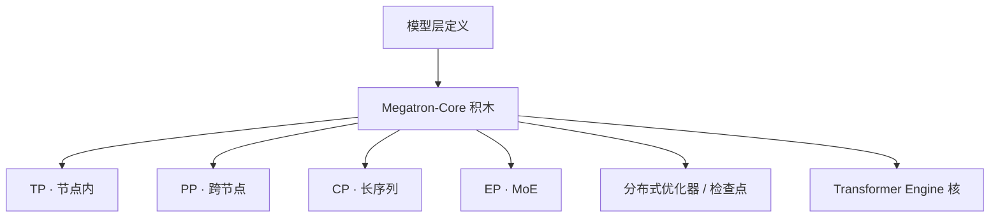

# Megatron-Core

    
把 2019 年那对列并行 / 行并行从研究代码里抽成可组合的 GPU 积木：张量、流水线、上下文、专家与分布式优化器按维开关，而不是再 fork 一份 Megatron-LM。

    <footer>—— NVIDIA Megatron Core 开发者文档：composable training library</footer>

[Megatron-LM](/llm/megatron-lm) 写的是 Shoeybi 等 1909.08053 的层内切法；[Megatron-DeepSpeed](/llm/megatron-deepspeed) 写的是 530B 上把 TP 与 DeepSpeed PP/ZeRO 焊在一起的历史接合。**Megatron-Core** 是 NVIDIA 后来抽出的**组合式训练库**：GPU 优化的 Transformer 积木、多维并行、激活检查点、分布式优化器与分布式检查点，供 NeMo、Megatron Bridge 以及自建训练系统调用。本篇写库的边界与并行维如何叠加，不重推导 $f$/$g$ 那对 All-Reduce，也不把开发者博客里某次弱扩展表抄成你机房的 SLA。未在公开文档给出的未发布内核尺寸、未公开的 MoE 路由硬件指令，不写。

## 问题

2019 的 Megatron-LM 证明：不必新编译器，就能在 Transformer 里插入成对 All-Reduce 做层内切分。2021 年后集群要把流水线、序列/上下文并行、专家并行、分布式 Adam 叠到同一份作业上。若每篇论文各 fork 一份训练脚本，检查点格式、数值对齐与 MoE dispatcher 会永久分叉。需要一层**稳定的并行原语**：模型作者写层；系统作者开 `tensor_model_parallel_size`、`pipeline_model_parallel_size`、`context_parallel_size`、`expert_model_parallel_size`；运行时负责进程网格、集合通信与分片状态字典。

第二问是生态。Hugging Face 权重进得来、推理引擎出得去，否则 Core 只是 NVIDIA 内部的更快 Megatron。Megatron Bridge 被写成 NeMo 框架里 HF ↔ Core 的双向检查点桥；Transformer Engine 提供 FP8 一类融合核。Core 不替代这些，它提供被加速的并行骨架。

### 库与 2019 论文不是同一份工件

论文给出 MLP 列切+行切、注意力按头切、词表并行；实现是若干 `autograd.Function`。Core 把这些收成 `ColumnParallelLinear` / `VocabParallelEmbedding` 一类模块，并加上后来才进入主线的东西：序列并行（Korthikanti 等，激活沿序列再切，减轻 LN/Dropout 复制）、上下文并行（沿序列切注意力 KV，服务长上下文）、流水线调度、专家并行与 **MoE Parallel Folding**（注意力与 MoE 使用不同并行映射，打破 $\mathrm{EP}\le\mathrm{DP}$ 一类旧约束）。分布式优化器按数据并行组切 Adam 状态；分布式检查点按网格保存，换卡数 resume 要按新网格重切。

NVIDIA 开发者页给出弱扩展叙述：GPT 式模型从约 2B 到约 462B，在最多 **6144** 张 H100 上展示超线性扩展，并附每卡 FLOP/s 与 MFU 表。那是厂商在指定模型与并行配置下的测量，用来说明库能撑到千卡以上，不能用来骂另一套栈的 MFU。

Megatron-LM 仓库今天往往是 Core 的宿主或示例层；引用「我用了 Megatron」时应写清是 2019 算法、Core API，还是 NeMo 配方。三者检查点不一定能直接互载。

## 方法

并行维按通信域放置，与 [3D/5D 组合](/llm/nd-parallel) 同一原则。

- **张量并行（TP）**：层内切矩阵，每层 All-Reduce 量级，应留在 NVLink / NVSwitch 域，见 [张量并行](/llm/tensor-parallel)。
- **流水线并行（PP）**：切层深，阶段间点对点传边界激活，适合跨节点，见 [流水线](/llm/pipeline-parallel)。
- **上下文并行（CP）**：沿序列切激活与 KV，注意力跨块用环形或 All-Gather/Reduce-Scatter 变体，见 [上下文并行](/llm/context-parallel)。
- **专家并行（EP）**：只切 MoE 专家层；注意力仍按自己的 TP/CP 走。Folding 让两套网格在层边界交接，dispatcher 必须处理动态 token 形状。
- **数据并行 + 分布式优化器**：副本间切优化器；也可与 Megatron-FSDP / 双 DeviceMesh 一类方案叠，使稠密层与 MoE 层走不同分片组——以当时文档为准，不要把 nightly API 当规范。

Transformer Engine 把 GEMM 与归一化收到 FP8/FP16 融合核；Core 负责在正确的并行组上调用这些核。激活检查点按层或按块选，和 PP 微批、CP 切段一起扫显存。NeMo `MegatronStrategy` 把上述尺寸暴露成配置项；自建系统则直接调 Core 的 parallel state。

### 并行维如何组合

头数必须能被 TP 整除；GQA 的 KV 头要能被 TP 整除或在组内复制。专家数与 EP 度对齐，否则有的 rank 空转。Folding 论文（arXiv:2504.14960）报告 Mixtral 8x22B 在 H100 上 MFU 约 49.3%、Qwen2-57B-A14B 约 39.0%，并写到 1024 GPU、序列至 128K——那是该文实验，不是 Core 对任意 MoE 的保证。token-dropless 与 token-dropping 两种 dispatcher 语义不同，混用检查点会 silently 改路由。

MoE Parallel Folding 的要点是：注意力与专家不必共享同一套 TP×DP 形状。强行让 EP 等于 DP，是旧 dispatcher 的约束，不是数学必然。换网格必须换 dispatcher 与检查点布局。

## 机制

正确性仍来自 2019：列切让非线性局部，行切用一次求和恢复线性层。序列并行把 LN 的统计从「TP 组上的完整序列」改成「本段序列」，通信从 All-Reduce 换成沿序列的 All-Gather 变体。CP 让每张卡只存一段 KV，跨段注意力用环形传递 K/V，用通信换激活内存。EP 的 All-to-All 体积随 token 与隐藏宽走，必须落在高带宽域；跨超节点做宽 EP 会把 decode 训练步打成网络步。

分布式检查点把每个 rank 的分片写成可聚合的 state dict。弹性换卡数等于换网格：TP 从 8 改到 4 要重切权重，不是改一个环境变量。这与 PyTorch DCP / TorchTitan 的目标相同，格式不自动兼容。

### 与 NeMo / Transformer Engine 的边界

Core 不管数据加载器里的 tokenizer 策略，也不管子进程启动器的全部运维。NeMo 加配方、日志、HF 桥；TE 加核。只装 Core 就能训，但生产上三者通常一起出现。不要把 Hugging Face `transformers` 的 `device_map` 理解成已经开了 Megatron TP。上下文并行与序列并行名字容易混：后者减轻 TP 组上的激活复制，前者为长序列切 KV；配置里两个 size 都开时，通信图案是两套，不能只抄其中一个论文的环。

## 边界与工程取舍

不要把 2019 的 8.3B / 76% 效率写成 Core 在 H100 上的 MFU。不要把 6144 GPU 弱扩展表外推到以太网机房的强扩展。检查点与并行度绑定。SwiGLU、GQA、MLA 要按模块是否已在 Core 实现来接，而不是假设 2019 的 GeLU MLP 切法自动覆盖。DeepSpeed ZeRO 与 Core 分布式优化器是两条切优化器的路，不要在同一作业里无文档地双开。

出处：NVIDIA Megatron Core 开发者页与 API 文档；层内切分 Shoeybi 等 arXiv:1909.08053；序列并行 Korthikanti 等 arXiv:2205.05198；MoE Folding arXiv:2504.14960。禁止给未单独发表的内部 SKU 编造算力。

## 小结

- Megatron-Core 是从 Megatron-LM 抽出的组合式 GPU 训练库，不是 2019 论文本身。
- 并行维包括 TP、PP、CP、EP（含 Folding）与分布式优化器；通信必须按域放置。
- 与 NeMo Bridge、Transformer Engine 分工：Core 管切分积木与网格。
- 出处：NVIDIA Megatron Core 公开文档；相关并行论文见上。
