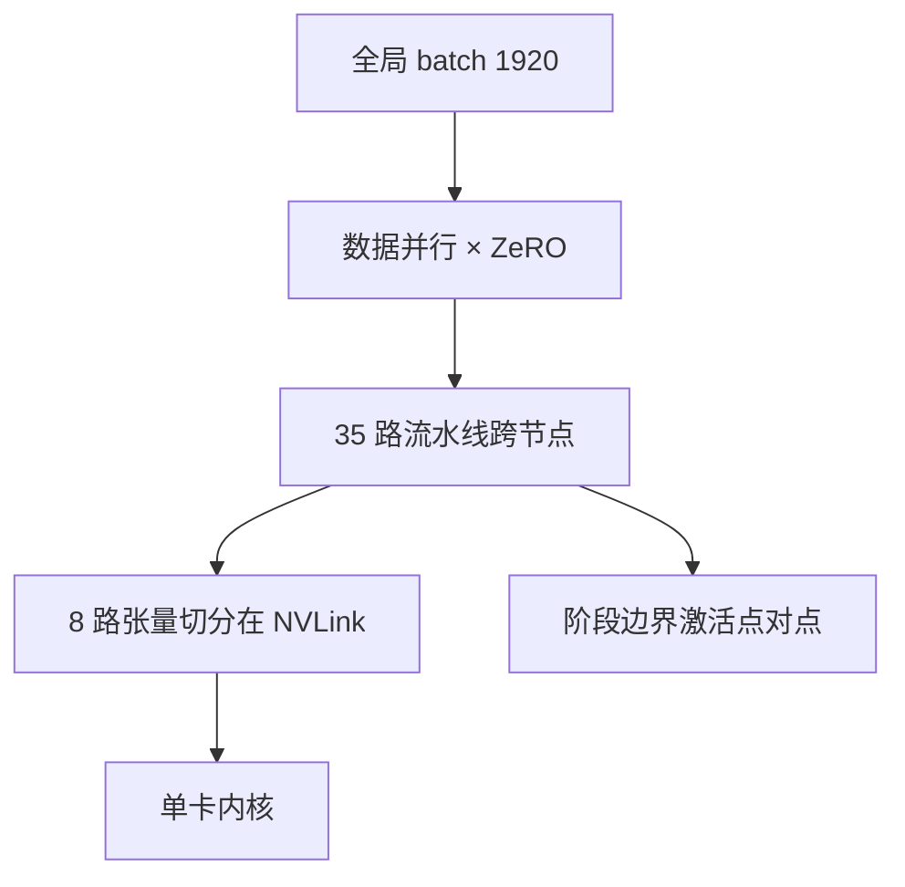

# Megatron-DeepSpeed

    
张量切分擅长节点内 NVLink，流水线擅长跨机点对点，数据并行擅长把副本铺到上千卡；三轴一起编，才能放下 5300 亿的稠密 Transformer。

    <footer>—— Smith 等，Megatron-Turing NLG 530B，arXiv:2201.11990</footer>

**Megatron-DeepSpeed** 指微软与 NVIDIA 把 [Megatron-LM](/llm/megatron-lm) 的张量切分和 DeepSpeed 的流水线、数据并行（含 [ZeRO](/llm/zero-stages)）焊成同一套运行时。公开证据有两条要分开：一是 2021–2022 年合训的稠密解码器 **Megatron-Turing NLG 530B（MT-NLG）**，论文 2201.11990；二是 GitHub 仓库 `microsoft/Megatron-DeepSpeed`，后来也被 BigScience 等用来训 BLOOM 一类开源大模型。本篇以 530B 论文讲 **3D 并行** 的工程语义，仓库功能（课程学习、MoE 等）只标「实现里有、论文未逐项当主结果」——不为仓库里每一项功能伪造 arXiv。

## 问题

5300 亿参数、混合精度 Adam，论文按约 20 字节/参数计，光权重、梯度与优化器状态就超过 **10 TB**；激活若按整 batch 驻留再加约 16.9 TB。单靠数据并行会复制整模；单靠张量并行跨节点通信太密；单靠流水线则微批与气泡、以及单层仍然太大。需要一张拓扑：哪些集合通信走 NVLink，哪些走 InfiniBand，以及 batch 大到 1920 时如何用微批把峰值激活打下来。

第二问是质量与稳定。千卡上的损失尖峰、数据清洗与偏见，和并行度同样决定「这个 530B 能不能当研究基线」。论文因此用整节写语料、社会偏见与 in-context 学习，而不是只报 TFLOP/s。

### 三维各管一段效率

- **张量并行（Megatron）**：层内切矩阵，省单层显存，通信是每层 All-Reduce，必须 **节点内 8 路**（一张 DGX 的 NVLink）。
- **流水线并行（DeepSpeed 侧实现）**：切层深，阶段间点对点传边界激活，适合 **跨节点**。530B 用 **35 路** 流水线。
- **数据并行 + ZeRO**：副本间切优化器状态等，用来把「一个 280 卡的模型副本」再复制到成百上千卡。

一个 530B 副本 = 8 路 TP × 35 路 PP = **280 张 A100**。再在 Selene / Azure NDv4 上用 DP 扩到更多节点。全局 batch **1920**，序列 2048。拓扑感知放置：把高频通信钉在最近的互连上，尤其避免 DP 的梯度同步走过最差的跳。

280 卡是「一份模型」不是「一次作业的全部卡」。作业规模是副本数 × 280。把 280 写成「只用 280 卡训完 530B」是把副本和集群混了。论文还强调稀疏 MoE 可以有更多总参数，但参数效率是否可比当时不清楚，故 MT-NLG 走稠密。

## 方法

模型：左到右 Transformer 解码器，**105 层**，隐藏 **20480**，**128** 头，序列 2048。学习率 $5\times 10^{-5}$，10 亿 token 线性预热，余弦在 3400 亿 token 量级降到 10%；前 120 亿 token 把 batch 从 32 爬到 1920。Adam $\beta_2=0.95$，梯度裁剪 1.0，weight decay 0.1。微批把峰值激活从数十 TB 量级打到个位数 GB 量级（论文例子：1920 微批相对「一个大微批」）。Selene 上 280/350/420 台 DGX A100、batch 1920 时，迭代约 60.1 / 50.2 / 44.4 秒，对应每卡约 126 / 121 / 113 TFLOP/s——扩卡后每卡效率略降，总吞吐仍升。

仓库侧把上述 3D 编成可配置网格，并接入 DeepSpeed 的 ZeRO、激活检查点、流水线调度。BLOOM 等公开训练日志表明这套栈能在异地多实验室协作；那是工程复用，不是 2201.11990 的实验章节。

### 微批、激活与「看似矛盾的大 batch」

大 batch 提高算术强度、摊通信；太大又伤泛化。论文的解是：优化器看见的全局 batch 可以很大，但流水线里流动的是微批，峰值激活跟微批走。梯度在微批上累积，等价于大 batch SGD，内存却像小 batch。这与 GPipe 的 batch splitting 同类，但叠在 TP+ZeRO 上之后，每一层的分片激活更小，调度参数（微批数、流水线度）要一起扫，不能只抄 35 和 8。

## 机制

3D 正交的意思是三组进程网格：[张量并行](/llm/tensor-parallel) 组做层内 All-Reduce，[流水线](/llm/pipeline-parallel) 组做发送/接收，数据并行组做梯度同步或 ZeRO 的 Reduce-Scatter/All-Gather。映射一旦把 TP 跨到 IB，每层通信延迟会吃掉 GEMM。35 路 PP 的气泡要用足够微批填；微批太多则流水线气泡小、但步内串行段变长、也可能改变数值（Dropout 粒度）。ZeRO 把 20 字节/参数的副本切薄，使 105×20480 的优化器状态能按 DP 度摊。

吞吐数字随节点数下降，说明通信与流水线气泡开始占更大比例——这是扩展曲线，不是实现回归。105 层被 35 段切，平均约 3 层一段，段间负载若不平衡，整条管道被最慢段钉住。128 头与 8 路 TP 整除，按头切干净。

MT-NLG 权重并未像 Llama 那样成为默认开源底座；论文的贡献首先是「稠密 530B 如何训得动」与评测/偏见分析。引用系统时写 3D 并行与 280 卡副本，不要暗示可以 wget 一份 530B 聊天模型。

### 和纯 Megatron、纯 DeepSpeed、Alpa

只用 NVIDIA Megatron Core 也能 3D（2021 年后的 Megatron 已含 PP）。Megatron-DeepSpeed 的历史意义是 **当时** 把 DeepSpeed 的 PP/ZeRO 与 Megatron TP 接上，并真训到 530B。纯 DeepSpeed 没有 Megatron 那套对 Transformer 最友好的列/行切分细节。 [Alpa](/llm/alpa) 用编译器搜层间/层内方案，目标是少手写网格；MT-NLG 是手写网格的高峰实例。

## 边界与工程取舍

2201.11990 的 SOTA 零/少样本是 2022 年初对照，稠密 530B 很快被更小但数据更多的模型在公开榜上追上。序列 2048 不是长上下文模型。论文的社会偏见章节说明放大不自动消除刻板印象。仓库与论文功能集不完全相等：看到 MoE、curriculum 要以对应 DeepSpeed/Megatron 文档为准，不要全部算进 530B 正文。

检查点与 8×35 网格绑定。混合精度下的损失缩放、流水线 flush 与 ZeRO 聚集顺序都会改数值，多实验室复现 BLOOM 时这些是真实故障源。不要把「3D 并行」写成 DeepSpeed 独创或 Megatron 独创——是组合。

### 爬 batch 与余弦终点是稳定旋钮

前 120 亿 token 把全局 batch 从 32 爬到 1920，与后来 Falcon 2 一类「中途加倍 batch 压尖峰」是同一家族：小 batch 噪声大，巨模初期更容易炸。余弦在 3400 亿 token 量级落到峰值的 10%，意味着论文并没有把「数据吃完」写成无限平台。语料清洗被作者当成质量的关键配料，与 3D 并行并列——只复制 8×35 网格、用脏网页硬训，得不到 MT-NLG 表上的零样本。Selene 与 Azure NDv4 的 A100+HDR IB 是实验平台；换到带宽更差的以太网，35 路 PP 的点对点与 DP 梯度同步都会重新成为瓶颈，需要减 PP 或加梯度累积来摊通信，而不是坚持 280 卡副本形状。

真实编号：Smith 等 *Using DeepSpeed and Megatron to Train Megatron-Turing NLG 530B*，arXiv:2201.11990。ZeRO 本体是 Rajbhandari 等 arXiv:1910.02054。Megatron 切分是 1909.08053。禁止给 `Megatron-DeepSpeed` 仓库本身编造论文号。

## 小结

- Megatron-DeepSpeed 把 Megatron 张量切分与 DeepSpeed 流水线/数据并行合成 3D 并行。
- MT-NLG 530B：105 层、$d=20480$、128 头；副本 8-TP × 35-PP = 280 A100。
- 微批降低激活峰值；拓扑感知映射保护 NVLink 上的 TP。
- 出处：Smith 等，arXiv:2201.11990，2022；实现另见 microsoft/Megatron-DeepSpeed。
