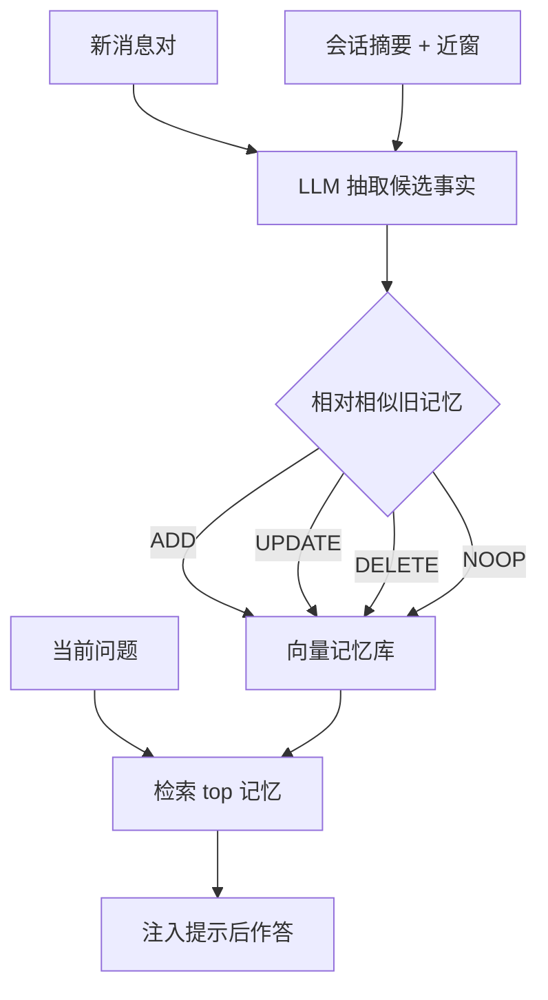

# Mem0 记忆层

    
从进行中的对话里动态抽取、合并并检索显著信息，用一层可扩展记忆补上固定窗口无法跨会话保持一致的缺口。

    <footer>—— Chhikara、Khant、Aryan、Singh、Yadav，Mem0: Building Production-Ready AI Agents with Scalable Long-Term Memory，arXiv:2504.19413</footer>

Mem0 团队 Prateek Chhikara、Dev Khant、Saket Aryan、Taranjeet Singh、Deshraj Yadav 把 **Mem0** 写成生产向记忆层：不是把全对话塞进窗口，而是增量抽事实、与旧记忆做 ADD/UPDATE/DELETE/NOOP，再在问答时检索。图变体 $\mathrm{Mem0}^{g}$ 用带类型的实体节点与关系边做关系推理。LOCOMO 上相对所列记忆系统、RAG、全文、开源与专有方案，四类题（单跳、时间、多跳、开放）整体更好；LLM-as-Judge 相对 OpenAI 记忆约 +26% 相对提升，图变体再高约 2 个总分点。相对全文，p95 延迟低约 91%、token 费用省 90% 以上。代码与研究页 `mem0.ai/research`。本篇写抽取—更新环与图层，对照 [A-MEM](/llm/amem-agent-memory)、[MemGPT](/llm/memgpt)。

## 问题

窗口延长只推迟遗忘：跨周对话仍会溢出；用户先说素食，中间数小时编程，再问晚餐，全文方法要在海量无关 token 里翻偏好，注意力还退化。无记忆的系统会在新会话推荐鸡肉。交互环境里，有记忆的代理更能用上「动作—结果」因果（论文引 Shinn Reflexion、Packer MemGPT、Xu A-Mem 等）。Mem0 要的是**会话级持久层**：对应用开发者像数据库，对模型像每次只注入少量相关事实。

LOCOMO（Maharana 等）10 段超长对话，每段约 600 轮、2.6 万 token，约 200 题/段，含单跳、多跳、时间、开放。对抗不可答题因缺标准答案未纳入。评测同时报质量与延迟/token，避免「更准但每次塞全文」。记忆层一旦进入生产，写入失败与检索失败的用户可见症状不同：前者表现为「我上周说过的偏好消失」，后者表现为「答非所问但日志里其实有这条事实」。运维要把抽取日志与检索命中分开打点，不能只看最终回复是否流畅。

### 增量抽取，而不是会话结束再索引

新消息对 $(m_{t-1},m_t)$ 到达即处理。上下文由全局摘要 $S$ 与最近 $m$ 条消息组成（实验 $m=10$）。抽取函数 $\phi$ 只从新交换出候选事实 $\Omega$，但看见全局主题。摘要模块异步刷新，以免阻塞写入。这与批处理 GraphRAG 索引不同：记忆层跟聊天走，延迟预算是秒级，不是分钟级离线作业。

[A-MEM](/llm/amem-agent-memory) 批评图数据库方案受预设 schema 约束，而 Mem0 基线是向量事实；$\mathrm{Mem0}^{g}$ 才上图。引用时不要把 A-Mem 对「预设 schema」的批评直接安在 Mem0 向量路径上。

## 方法

更新：每条候选 $\omega_i$ 与库中 top-$s$ 相似记忆比较（实验 $s=10$）。LLM 经 tool call 在四操作里选：ADD 无等价记忆；UPDATE 用互补信息增强；DELETE 新信息否定旧事实；NOOP 无需改。实验骨干 GPT-4o-mini，向量库用稠密嵌入。工作记忆不常驻窗口，检索时才注入——与 MemGPT 的可写 working context 不同。

$\mathrm{Mem0}^{g}$：记忆为有向标记图 $G=(V,E,L)$，节点含类型、嵌入、创建时间，边为 $(v_s,r,v_d)$。两阶段抽取：实体（人、地点、事件、属性）再关系。写入时按嵌入阈值对齐已有节点，冲突则 LLM 判定过时关系。论文描述将过时边标为无效而非物理删除，以支持时间推理。检索双路：实体中心（锚点邻域子图）与整句嵌入对三元组打分。实现用 Neo4j。开源仓后续曾出现硬 `DELETE` 与论文软删除不一致的问题，工程要以当前实现与论文对齐情况为准。

### LOCOMO 上的效率合同

卖点不只是 F1：全文 LOCOMO 对话可进现代窗口，但 p95 与费用不可接受。Mem0 用检索集代替 115k 级提示（Zep 文中全文基线量级；Mem0 文称相对全文 90%+ token 节省）。延迟 91% 来自更短前缀，不是更快的生成核。LLM-as-Judge 相对 OpenAI 记忆 +26% 是相对提升，分母是该对照的 Judge 分，转写绝对分要回表。图变体 +2 分是关系/多跳上的边际，不是全面翻倍。

基线类别写得很满：记忆增强系统、不同块大小与 $k$ 的 RAG、全文、开源记忆、专有模型记忆、专用记忆平台。复现应跟论文附录的具体名称与日期，产品默认配置会变。

## 机制

四操作把记忆当可变知识库：DELETE/UPDATE 对应信念修正，避免「只追加、矛盾并存」。NOOP 抑制同义重复膨胀。向量相似做候选，LLM 做语义判定，与 A-Mem 的「嵌入召回 + LLM 建链」同构，但 A-Mem 还演化旧笔记的标签与情境。Mem0 更新的是事实字符串或图边，不是任意原子笔记网络。

图层让「Alice lives_in SF」可走路径，时间边（若实现软删除）支持「以前住 X、现在住 Y」。硬删除会毁掉时间题——这正是实现与论文需要对齐的点。检索双路处理「问实体」与「问整句语义」两种查询。

写入通道是注入面：若用户或工具输出被原样写成记忆，错误偏好会跨会话持续。应对抽取做来源过滤，系统指令不得进入 $\Omega$。多租户按 user/agent_id 分库。

### 与操作系统式记忆的叠放

MemGPT 管窗口放置（RAM/磁盘/函数）。Mem0 管**跨会话事实库**。常见集成：MemGPT 的 archival 指向 Mem0 检索 API，working context 仍放当前人设。不要宣称 Mem0 替代了换页。Zep/Graphiti 在时序无效化与社区节点上更重；Mem0 更轻、更对话抽取优先。

## 边界与工程取舍

LOCOMO 是两人闲聊式长对话，不是 SWE 或浏览。Judge 与 F1 对开放题敏感。GPT-4o-mini 既做抽取又做更新，费用随消息对数线性，需批处理或跳过闲聊。图数据库运维成本高于纯向量。论文作者均 mem0.ai，引用时标明产品论文，对照数字仍以 arXiv 表为准。

出处：Chhikara, Khant, Aryan, Singh, Yadav，*Mem0: Building Production-Ready AI Agents with Scalable Long-Term Memory*，arXiv:2504.19413。LOCOMO：Maharana 等。对照含 Packer 等 MemGPT、OpenAI 记忆产品评测设定见原文表。

## 小结

- Mem0 是抽取—四操作更新—检索的记忆层，补跨会话一致性，而不是加长窗口。
- 图变体用实体关系做多跳；论文主张软无效化以保时间推理。
- LOCOMO 上相对所列系统与 OpenAI 记忆有 Judge 提升，且相对全文大幅降延迟与 token。
- 与 MemGPT/A-Mem/Zep 分层不同，可叠放不可替换。
- 出处：arXiv:2504.19413。
