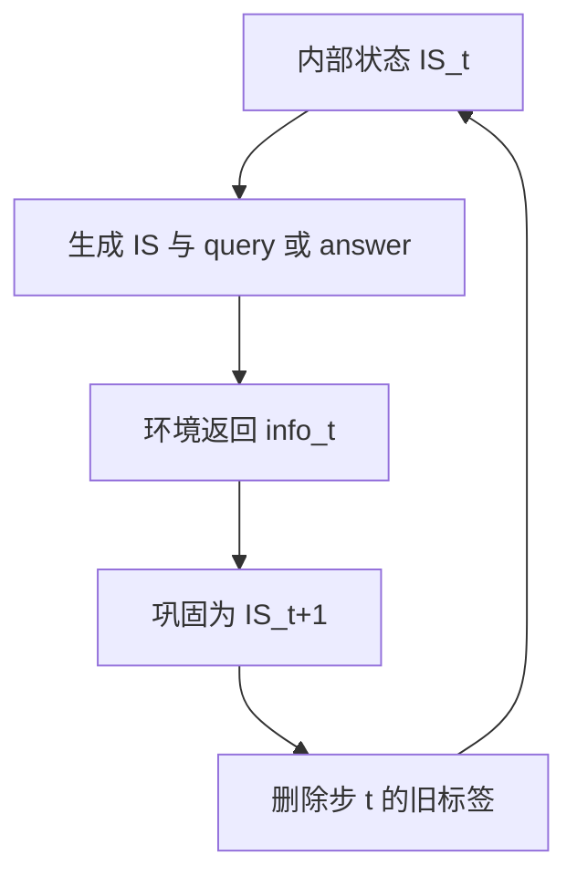

# Mem1 递归上下文重写

    
每一步把「上一内部状态 + 查询 + 新观察」折进一个共享内部状态，然后剪掉旧标签，使长程交互在近乎常数的记忆里继续推理。

    <footer>—— Zhou、Qu、Wu 等，MEM1: Learning to Synergize Memory and Reasoning for Efficient Long-Horizon Agents，arXiv:2506.15841 / ICLR 2026</footer>

Zijian Zhou、Ao Qu、Zhaoxuan Wu、Sunghwan Kim、Alok Prakash、Daniela Rus、Jinhua Zhao、Bryan Kian Hsiang Low、Paul Pu Liang 提出 **MEM1**（Memory-Efficient Mechanism via learning 1-step integrated reasoning and consolidation）：不外挂摘要器，而用强化学习让策略在推理的同一表示里完成巩固。每轮只保留最新的内部状态、查询与观察；上一步的 XML 标签从提示里删除。相对 Qwen2.5-14B-Instruct，在 16 目标多跳 QA 上性能约 $3.5\times$、记忆用量约 $3.7\times$ 更低（相对 14B 峰值 token 与准确率对照）。代码 `MIT-MI/MEM1`。用户口中的「递归上下文重写」就是这一逐步覆盖，而不是树搜索。本篇写常数记忆与 2D 掩码，不把剪枝写成攻击面。

## 问题

长程代理若把所有思维、动作、观察追加进窗口，会得到三条病：推理费用随 $N$ 涨、超出训练长度后分布外、无关 token 稀释注意力。外挂检索/摘要模块与策略分开训练，无法端到端对任务奖励负责。Search-R1、DeepResearcher 等 RL 代理仍常累加全文。MEM1 问：模型能否把巩固当成推理的一部分，使**保留内容由策略决定**，而模块边界消失？

公开多跳集（HotpotQA、2Wiki、Bamboogle）往往只有两跳，不够逼记忆管理。作者把现有 QA 题交错成 $N$ 目标复合题，强迫多次检索再汇总。另在 WebShop 上测购物导航。MEM1 从 Qwen2.5-7B **Base** 用 PPO 训，指令微调或 SFT 轨迹在他们的比较里更弱。复合题的意义是把「还记得第一个子问题的答案」变成拿分的必要条件：模型若在内部状态里丢掉槽位，后面的检索再准也拼不出满分。

### 内部状态是唯一常驻记忆

标注用 XML：内部状态 `<IS_t>`、环境查询 `<query_t>`、观察 `<info_t>`、最终 `<answer_t>`。步 $t+1$ 把 $(\texttt{IS}_t,\texttt{query}_t,\texttt{info}_t)$ 巩固成新的 `IS_{t+1}`，然后删除步 $t$ 的全部标签。任意时刻提示里大约只有有限个新标签，记忆近乎常数。这与 [AgentFold](/llm/agentfold) 保留多块摘要不同：MEM1 是单槽重写，更像覆盖工作记忆。

常数是提示长度的工程近似：内部状态文本仍可随任务变长，只是不再线性堆观察。16 目标上峰值仍略升（表 1：2 目标 $6.40\times10^2$ token 量级到 16 目标 $10.4\times10^2$），不是严格 $O(1)$ 比特。

## 方法

滚动时程序化截断：模型一产出查询或答案，宿主就按上一节剪上下文。为避免不知何时停，每轮在状态前插入剩余轮数提示，如 `[HINT: YOU HAVE {turns_left} TURNS LEFT]`。1–4 目标最多 6 轮，更难任务 20 轮。奖励是可验证的：QA 用精确匹配，WebShop 用环境奖励。**没有**把「短上下文」写进奖励；短是因为截断强迫模型把要的东西写进 `IS`，否则下一轮看不见，拿不到分。

训练难点：真实生成时上下文每步在变，PPO 若当一条静态轨迹算对数概率会错。MEM1 把各回合拼成逻辑全轨迹，再加 **2D 注意力掩码**：位置 $k$ 只能看见该步生成时仍保留的 token。另对检索来的外部信息加 1D 掩码，梯度只落在模型自己产生的 token 上。这样 $\rho_k(\theta)$ 仍对应「当时真正的条件前缀」。

### 2 目标训练，16 目标仍能用

在 2 目标增强 QA 上训练，测试 2/8/16 目标。表 1：2 目标 MEM1-QA EM 0.709、F1 0.838，峰值低于 14B 指令模型；8 与 16 目标上 14B 与若干 RL 基线崩溃（红字极低 EM），MEM1 EM 升至 1.97（多目标计数），峰值 $10.4\times10^2$，时间 8.70s，而 14B 16 目标 EM 0.567、峰值 $38.4\times10^2$、时间 29.7s。文中 $3.5\times$ / $3.7\times$ 即此类对照。仅套 MEM1 截断模板而不 RL 的 7B 指令模型，16 目标 EM 仅 0.396——**截断本身不够，要学写状态**。外挂 A-MEM 检索则延迟显著变差（16 目标 91s 级）。

单目标多跳与 WebShop 上也报了相对 Agent-FLAN、Agent-R、AgentLM 的准确与效率。泛化叙述：训练视野之外的目标数仍升，而全文基线在长度外崩溃。

## 机制

推理即记忆：chain-of-thought 被当成工作记忆，从观察里抽出以后还要用的槽。截断把「偷懒依赖全文」从可行集里拿掉，RL 只能把信息搬进 `IS`。这与人类用填字游戏练选择注意的类比是教学性的，不是神经科学主张。掩码保证优化与推断一致：若训练能看见已剪掉的观察，模型会学一种生产时不存在的捷径。

失败模式：状态写丢一个约束，后续不可恢复——单槽覆盖没有 [ACM](/llm/acm-context) 的 `query_memory`。状态写入指令式内容会变成持久前缀注入，宿主应对 `IS` 做长度与内容校验。剩余轮数提示是元数据，换预算要重训或至少重评估。

MEM1 优化的是**题内**工作记忆，不是跨会话用户画像。跨会话应叠加 [Mem0](/llm/mem0-layer) / [Zep](/llm/zep-graphiti)。ACM 表 1 把 MEM1 标成不可压缩工作上下文、非无损，指的是它不保留原始观察供回查。

### 复合题的评测陷阱

多目标 EM 是「答对了多少个子问题」一类计数，跨论文比较时要看分母。16 目标上部分基线「峰值不再涨」是因为模型已经崩溃、提前停，不是压缩成功。引用效率必须并列准确率。

## 边界与工程取舍

PPO + 2D 掩码对基础设施有要求，不是改一条 prompt。骨干 7B Base，迁到指令模型或别的族要重做。Web QA 从本地 Wikipedia RAG 训、开放网络测，检索器差异会动数字。HINT 轮数泄漏了预算，真实产品若没有硬顶，策略可能不会适时作答。把 MEM1 接到需要引用原始网页片段的合规场景时，必须另存观察日志，因为策略在下一步已经看不见那些标签。

出处：Zhou, Qu, Wu, Kim, Prakash, Rus, Zhao, Low, Liang，*MEM1: Learning to Synergize Memory and Reasoning for Efficient Long-Horizon Agents*，arXiv:2506.15841，ICLR 2026。https://github.com/MIT-MI/MEM1 与 https://mit-mi.github.io/mem1-site/。

## 小结

- MEM1 每步把状态、查询、观察巩固成新内部状态并删除旧标签，近乎常数上下文。
- 用 RL（PPO）+ 2D 掩码使训练时的条件前缀与推断截断一致。
- 2 目标训练可泛化到 16 目标；相对更大指令模型在长程上又准又省。
- 单槽覆盖不可回查原文；需要无损外存时不要单独依赖 MEM1。
- 出处：arXiv:2506.15841。
