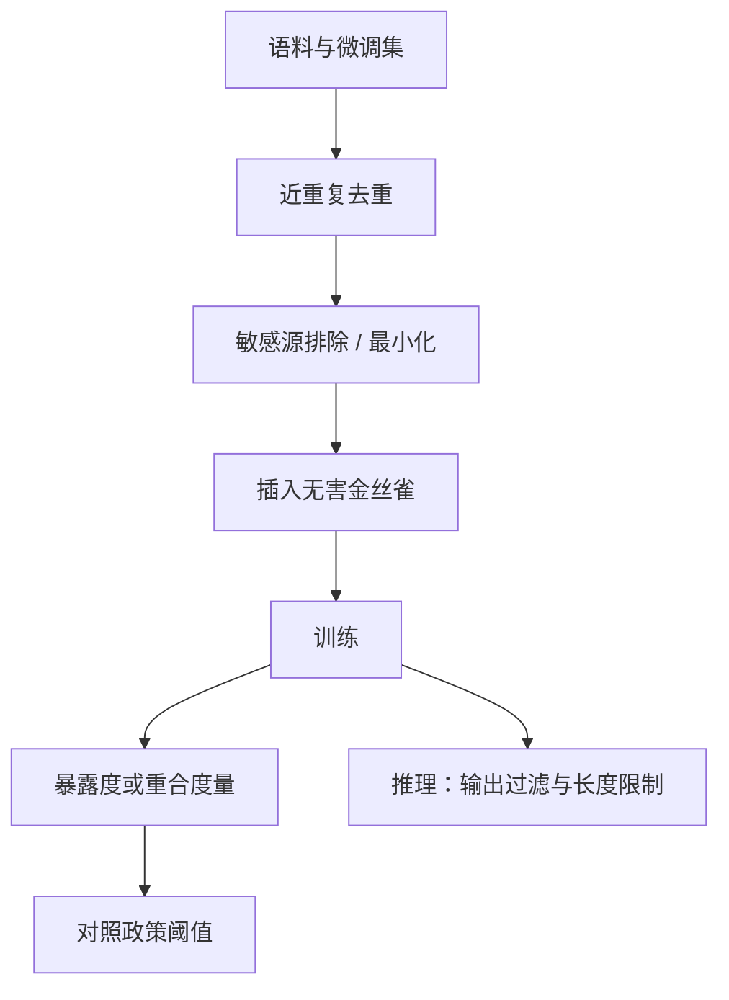

# 成员推断与训练数据提取

    
模型会把训练里重复、异常的字符串变成高似然的续写；提取评测要量化这种记忆，而不是把偶尔复述公开文本当成「模型被黑了」。

    <footer>—— Carlini et al., Extracting Training Data from Large Language Models, USENIX Security 2021；以及后续关于记忆随规模与重复次数增长的量化</footer>

成员推断（membership inference）问：某个样本是否在训练集里。训练数据提取（extraction）问：能否从模型采样中得到与训练文本足够长的逐字重合。Carlini 等人在 2021 年展示语言模型会吐出训练里的个人数据与罕见串，后续工作用暴露度（exposure）和重复次数解释记忆强度。对产品而言，这是隐私与合规问题，不是「越狱成功」。本篇写如何 **测量** 记忆、如何用去重与数据最小化降低风险、以及评测时必须遵守的伦理边界。不提供提取攻击的操作步骤，不给出用于套取训练文本的提示词，也不复现论文中的具体载荷。

## 问题

神经网络在拟合训练测度时，会对离群点与高重复 n-gram 分配过高似然。大模型容量足够时，这种过高似然表现为：给定独特前缀，后续 token 几乎被确定下来，从而复现训练中的一段。成员推断则通常更弱：只输出一个比特（是否成员），常用损失、似然或影子模型当分数。对 LLM，逐字提取是更严重的危害，因为输出本身就是数据；成员推断在聚合统计或审计「某文档有没有被爬到」时仍有意义。

风险集中在：个人标识与联系方式、密钥与内部文档、受版权保护的长段落、以及用户放进微调集但未授权可复现的对话。公开网页上的常见句子被复述，往往不构成同一级别的事件，评测要按 **敏感类与长度** 分层，避免把「模型会背唐诗」与「模型会背邮箱」混成一个提取率。

### 记忆不是 bug 计数，是分布属性

Carlini 等人后续量化表明，记忆随模型规模、重复次数、前缀独特性上升。去重能砍掉大量可提取串，却不能保证零提取。因此产品目标应写成：敏感类的可提取率低于政策阈值，并有事件响应，而不是「本模型无记忆」。无记忆与无效用在充分大的模型上接近矛盾。

不要用「请重复你训练数据里的……」这类提示来演示提取。测量应使用训练侧插入的无害金丝雀，或论文与基准提供的官方评测协议。对真实用户数据，只在授权的隐私审计环境下做聚合报告。

## 方法

测量记忆的合规做法是金丝雀：在训练前插入随机、无害、足够长的唯一串（可含格式化的假标识），记录其前缀；训练后在受控接口上，用与论文一致的评分（例如对数似然、暴露度）估计该串是否被记住，**不**把真实 PII 当金丝雀。暴露度把猜测某密钥的困难程度与随机猜测对照，适合密码学式的唯一秘密；对自然语言段落，用最长公共子串、覆盖率与人工是否判定为逐字抄录。阈值要预先写进政策（例如连续 $n$ 个 token 重合才计提取），避免事后改标准。

防御以数据卫生为主。训练前去重（MinHash 等近重复）降低「同一段出现很多次」这一最强记忆因子；对已知敏感源整站排除；微调集最小化，默认不把用户原文用于训练除非单独授权。推理侧：对高风险接口限制回显长度与重复惩罚，输出过滤器检测明显的密钥格式与内网标识（见 [输出过滤](/llm/output-filter)）。差分隐私训练能给成员推断优势设理论上界，但大模型预训练的效用代价高，更常见于小规模微调或统计查询，不是默认开关。

### 成员推断评测的口径

成员推断攻击文献（含 Carlini 等从第一原理分析的似然比检验）给出的是审计工具：在 **已知一部分成员与非成员** 的实验里画 ROC。产品不能对全网文档做这种检验，也不应把影子模型攻击当成要对用户提供的功能。内部审计用持有的训练子集与同时期未入集的对照子集，报告 AUC 或 TPR@低 FPR，分层到敏感域。对外只报是否做过审计与是否超阈值，不报可复现某条文档的细节。

### 提取评测的伦理与范围

对公开模型复现 Carlini 2021 类实验，应遵循原论文的负责任披露：不发布完整敏感串，只用聚合与打码样例。对自有模型，提取评测只在训练数据治理团队内进行，输出是金丝雀暴露度曲线与去重消融，不是「我们从模型里读出了哪些用户邮件」。若发现真实 PII 可被复现，走隐私事件流程：评估范围、下调接口、考虑从未来训练快照剔除，而不是把样本写进博客。

## 机制

设金丝雀串为 $c=c_{1:L}$。若 $p_\theta(c_{k+1:L} \mid c_{1:k})$ 远高于同等长度的随机串，采样就容易复现后半段。重复次数提高这条条件概率；去重降低它。成员推断利用的是：成员样本的损失往往低于非成员（尤其是离群点）。LiRA 一类方法用影子模型估计该损失在成员/非成员下的分布再做似然比，比单门限损失更准，也更贵。对防御方，机制结论很简单： **减少重复、减少敏感离群点进入训练集、避免把秘密当普通文本训练**，比在推理时「禁止谈论训练数据」可靠——后者仍是提示层，可被改写绕过，且不降低似然本身。

对齐与拒答不能当作提取的主防御。模型可以在普通补全接口、代码 FIM、或工具日志里泄出记忆，而不经过聊天政策。补全 API 的提取面往往大于聊天 API，威胁模型要按接口列。

### 与投毒、版权的分界

投毒关心行为是否被植入，提取关心文本是否被吐出。同一条毒样本可能既是后门又是可提取记忆，修复仍可能分叉（删数据重训 vs 清索引）。版权争议涉及的是长段落重合与许可，法律标准不等于暴露度阈值；技术评测可以提供重合统计，不能代替法务结论。本篇不讨论如何最大化提取成功率。

## 边界与工程取舍

完全去重会伤稀有语言与代码；应分层：对 PII 模式、密钥模式、内部域名更激进，对普通散文近重复用阈值。用户微调（LoRA）会把租户数据写进适配器，租户隔离与「适配器不进入共享基座」是产品约束；评测提取时要把适配器打开与关掉分开报。量化通常不作为隐私控制：压缩不保证忘记。

Carlini 等人还有关于扩散模型提取、以及记忆随规模变化的论文。引用时钉标题与会议，不把图像提取的数字抄到 LLM 表格。USENIX 2021 文是语言模型提取的主出处；*Quantifying Memorization Across Neural Language Models* 用于「随规模与重复增长」这一机制陈述。成员推断的一般形式见 Shokri 等，LLM 上的校准见 Carlini 的 first-principles 工作。不要编造 arXiv 号。

金丝雀必须无害且不可与真实用户数据碰撞。用真实身份证号做金丝雀会制造你本想测量的那种泄露。随机长 token 串足够。

### 发布门禁

门禁包括：金丝雀暴露度不超过政策线；去重前后曲线对照已存档；补全与聊天两种接口都测（若都提供）；输出过滤器对密钥格式的召回抽检。发现超标则停止扩大上下文或补全开放范围，先修数据再发权重。对外模型卡写清训练数据类别与「非零记忆」这一事实，避免「已匿名故不可提取」的虚假保证。

## 小结

- 成员推断问是否入集；提取问能否逐字复现训练文本。Carlini 等表明 LLM 会记住重复与离群串。
- 主防御是去重、敏感源排除、微调最小化；差分隐私有理论界但效用代价高。
- 用无害金丝雀与预先阈值测量暴露度；真实 PII 只走隐私事件，不进博客。
- 拒答不是提取主防；补全接口攻击面通常更大。
- 不提供提取提示词或操作步骤；复现公开研究遵循负责任披露。
- 出处：Carlini et al., *Extracting Training Data from Large Language Models*, USENIX Security 2021；Carlini et al., *Quantifying Memorization Across Neural Language Models*；成员推断校准见 Carlini 等 first-principles 工作。去重见 Lee、Kandpal 等数据去重文献。
