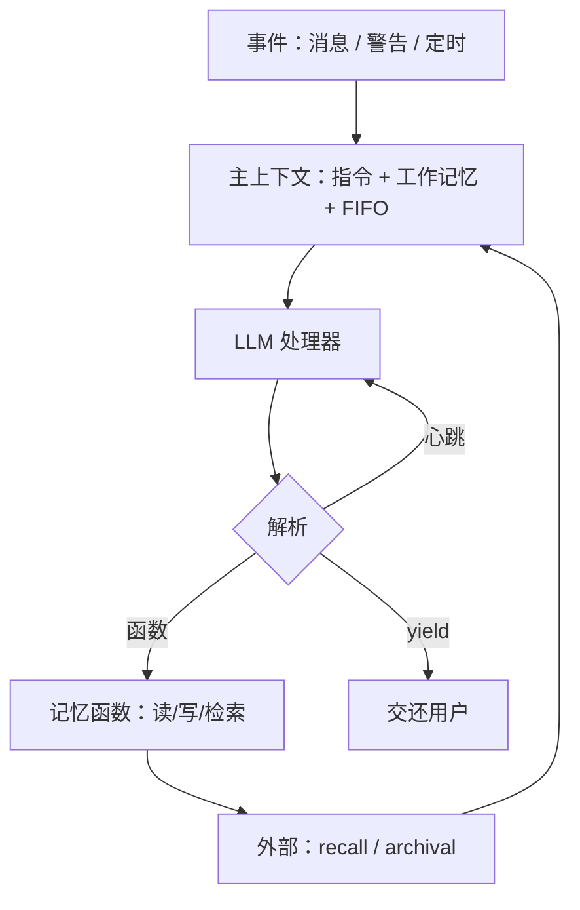

# MemGPT

    
把有限上下文当成物理内存，把外部存储当成磁盘：模型通过函数调用自己决定什么进窗口、什么换出，从而在固定窗口上获得虚拟上下文的假象。

    <footer>—— Packer 等，MemGPT: Towards LLMs as Operating Systems，arXiv:2310.08560</footer>

2023 年 Charles Packer、Sarah Wooders、Kevin Lin、Vivian Fang、Shishir G. Patil、Ion Stoica、Joseph E. Gonzalez 提出 **MemGPT**：不训练更长注意力，而是给固定窗口 LLM 一套操作系统式的分层记忆与中断。主上下文（RAM）里是系统指令、可写工作记忆、近期事件的 FIFO；外部上下文（磁盘）里是完整回忆库与档案库。模型用 function calling 把事实写入工作记忆、检索档案、在压力警告到来之前换页。评测放在超长文档问答与跨会话聊天。本篇写分层与控制流，不把「无限上下文」写成已解决的注意力问题。

## 问题

窗口耗尽时，朴素做法是递归摘要。摘要有损，人格、用户偏好、文档里的嵌套键会在多轮压缩后消失——论文把这当作要对照的基线，而不是可接受的长期记忆。另一方面，把整段历史或整份文档塞进当时的 4k–32k 窗口，很快就会只剩系统提示加几十轮对话（论文表 1：1k 提示下 llama-2 / gpt-3.5-turbo 约 60 条消息量级）。加长窗口既贵，也仍有中间丢失。MemGPT 问的是：能否让**模型自己**管理页，而不是每次由人截断。

控制流必须能在一次用户回合里多次修改上下文。只检索一次再生成，等于单跳 RAG，做不了「先搜 A、再根据 A 去档案里搜 B」的多跳。因此需要函数链式调用：一次函数返回后，若模型举起「心跳」标志，处理器继续跑，直到它主动 yield 把控制交还用户或定时中断。

### 主上下文的三分法

系统指令只读，钉死在窗口前部，描述记忆层级与函数 schema。对话 / 事件队列 FIFO，满则截断或压缩队头。工作上下文（working context）由模型通过 `append` / `replace` 改写，相当于便签与人设事实。三者之和不得超过底层 LLM 的最大输入。外部再分 **recall**（完整事件日志，可按时间或文本搜）与 **archival**（只读写的溢出知识与文档块，可向量检索）。聊天场景里档案存关于用户的长期事实；文档场景里档案就是语料库。

论文实验时主流窗口仍是 4k–32k；今天 128k 窗口并不取消分层。更长窗口会推迟换页，但不提供「跨月对话的无损日志」或「20M 篇文档的随机访问」。MemGPT 管的是放置策略，不是注意力核。

## 方法

事件（用户消息、容量警告、定时中断、文档上传完成）被解析成纯文本，追加进 FIFO，触发一次推理。模型输出被解析为函数调用或对用户的回复。合法函数包括改工作记忆、检索 recall/archival、分页取回，以免一次检索撑爆窗口。若调用请求链式控制，宿主把函数结果写回主上下文并立即再推理；否则 yield，等待下一外部事件。容量将满时系统插入警告，促使模型在截断前把关键事实写入工作记忆或档案——论文用对话片段说明生日蛋糕偏好被 `working_context_append` 掉。

评测两个域。多会话聊天：扩展 Xu 等人 Multi-Session Chat，检查一致性（新陈述是否与旧事实冲突）与参与度（是否主动调用长期用户信息）。文档分析：Liu 等人长文档 QA 与键值检索，外加需要跨源拼合的嵌套键值任务。骨干是当时的函数调用模型（如 GPT-4 类 API）。基线包括无记忆的固定窗口与递归摘要。论文释放代码、增强 MSC、嵌套 KV 与两千万维基嵌入，地址在 memgpt.ai。后续产品线演变成 Letta 等，**引用实验数字仍以 arXiv:2310.08560 的设定为准**，不要把产品默认提示写成论文表。

### 虚拟内存类比的边界

操作系统的页错误是硬件陷阱，MemGPT 的「缺页」是模型**决定去搜**。搜错、不搜、写错工作记忆，都不会有内核纠正。警告提示是软中断，不是 MMU。档案检索质量取决于嵌入与切分，失败模式与普通 RAG 相同，只是发起检索的是代理而非固定流水线。因此 MemGPT 是记忆操作系统加 RAG 工具，不是替代检索模型。检索侧升级应换嵌入 / 重排，见 [BGE-M3](/llm/bge-m3) 与 [重排序](/llm/rerank)，而不是只加长 FIFO。

## 机制

自导编辑的机制是：工作记忆里的句子每次推理都在窗口里，等于把「用户过生日、不喜欢恐怖片」从日志提升为常驻前缀，无需每次检索。Replace 允许纠正错误人格事实。Recall 提供无损回放，避免摘要把日期抹掉。Archival 提供可扩展知识。链式函数让单回合多跳成为可能。分页与 token 警告把「别撑爆窗口」写成可执行约束。

A-MEM 后来批评：MemGPT 仍依赖预设的存储结构与工作流里的读写点，图数据库式系统则受预设 schema 限制。这是公平对照——MemGPT 的灵活性在于模型何时调用哪一个**已定义**函数，不在于笔记结构自己演化。需要动态链接与笔记进化时读 [A-MEM](/llm/amem-agent-memory)。需要把记忆当操作系统的论文源头，仍是 Packer 等人这篇。

函数解析失败、工作记忆写满、检索返回空，都会作为运行时错误文本喂回模型。这是反馈环，不是训练时的梯度。宿主必须校验参数，防止模型把整份档案一次性读进 FIFO。

## 边界与工程取舍

### 无限上下文是假象，日志才是真无限

外部库可以无限长，但每步能读的仍是窗口。检索漏召回时，模型会像短窗口模型一样瞎编，只是带着一份过期人设。工作记忆若写入指令式内容（「忽略系统提示」），会变成持久注入面：写入通道需要过滤。多租户必须隔离档案索引。定时中断让代理在用户离线时「自己想」——产品上要有开关，以免静默外发工具。

长上下文模型出现后，有人宣称 MemGPT 过时。更准确的说法是：窗口变长改变了换页频率，不改变「完整交互日志 + 可查询档案 + 常驻人设」这三层需求。与 [长上下文是否取代 RAG](/llm/long-context-vs-rag) 同一逻辑。工程上常把 working context 做成版本化事实表（追加 + 作废），而不是原地 replace 无审计。

出处：Packer, Wooders, Lin, Fang, Patil, Stoica, Gonzalez，*MemGPT: Towards LLMs as Operating Systems*，arXiv:2310.08560。代码与数据：memgpt.ai / research.memgpt.ai。不要把后续 Letta 产品文档里的默认工具表写回这篇实验。

## 小结

- MemGPT 用 OS 分层把固定窗口当成 RAM，外部库当成磁盘，由模型经函数换页。
- 主上下文 = 只读指令 + 可写工作记忆 + FIFO；外部 = recall 日志 + archival 档案。
- 事件驱动推理；心跳允许函数链；yield 把控制交还用户。
- 评测在多会话聊天与超长 / 多跳文档任务；递归摘要是有损基线。
- 「无限上下文」是检索与放置的假象，不是注意力长度。
- 出处：Packer et al.，arXiv:2310.08560。
